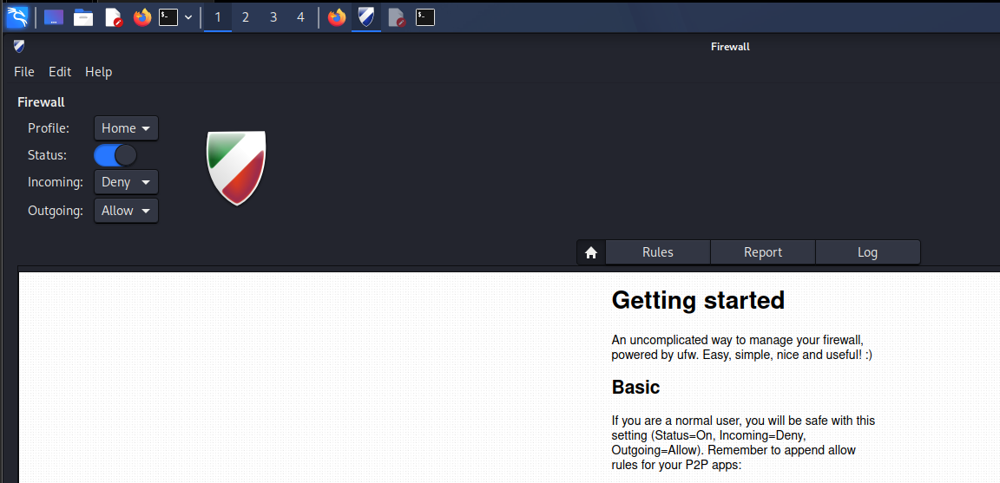
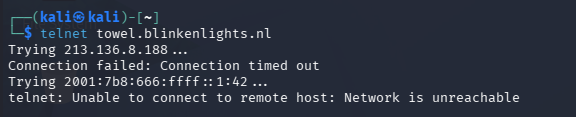
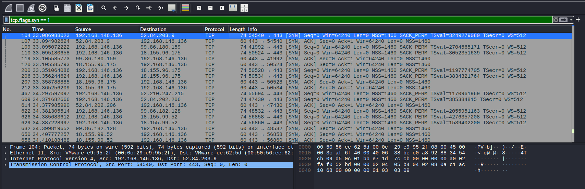

# Firewall Fundamentals using GUFW (60 Minutes)

> Lab Type: Firewall Configuration and Traffic Filtering
>
> Tool: GUFW (Graphical Uncomplicated Firewall)
>
> Duration: 60 Minutes
>
> System: Kali Linux (Ubuntu/Debian compatible)

---

## Scenario

You are a Security Analyst at a growing startup. The organization has asked you to enforce a basic firewall policy on all workstations. The policy requires that:

- Web browsing must be permitted.
- Legacy and insecure services must be blocked.
- Specific ports must be explicitly allowed or denied.

In this module, you will configure GUFW to implement these policies and observe the impact on network traffic using Wireshark.

---

## Launching and Enabling GUFW

### Objective

Install and enable the GUFW firewall on Kali Linux, and understand the concept of default deny policies.

### Install GUFW

If GUFW is not already installed, run the following command in a terminal:

```bash
sudo apt update && sudo apt install gufw -y
```

### Launch GUFW

```bash
sudo gufw
```

The GUFW graphical interface will open.



### Enable the Firewall

1. Locate the **Status** toggle at the top of the window.
2. Click it to switch the firewall **ON**.
3. The status indicator should turn green.

### Configure Default Policies

Set the following default policies using the dropdown menus:

- **Incoming: Deny**
- **Outgoing: Allow**

!!! warning "Why Default Deny?"
Setting incoming traffic to **Deny** by default means no unsolicited inbound connections are permitted unless explicitly allowed. This follows the **Principle of Least Privilege** — only what is necessary is permitted. Everything else is blocked.

### Discussion Questions

??? question "What is the difference between a stateful and stateless firewall?"

    A stateful firewall tracks the state of active connections and allows return traffic for established sessions automatically. A stateless firewall evaluates each packet independently based on rules, without any knowledge of connection context. GUFW uses UFW, which sits on top of iptables and supports stateful filtering.

??? question "Why is Default Deny considered a security best practice?"

    Default Deny ensures that any traffic not explicitly permitted is blocked. This reduces the attack surface significantly because attackers cannot reach services that are not intentionally exposed, even if those services are running on the machine.

??? question "What is the Principle of Least Privilege and how does it apply to firewalls?"

    The Principle of Least Privilege means granting only the minimum access necessary to perform a task. Applied to firewalls, it means only opening ports that are absolutely required for legitimate operations, and denying everything else by default.

---

## Allowing Web Traffic

### Objective

Configure GUFW rules to explicitly permit HTTP and HTTPS traffic so that normal web browsing functions correctly.

### Add Firewall Rules

1. In GUFW, click the **Rules** tab.
2. Click the **+** button at the bottom left to add a new rule.

**Rule 1 — Allow HTTP:**

| Field     | Value |
| --------- | ----- |
| Policy    | Allow |
| Direction | In    |
| Protocol  | TCP   |
| Port      | 80    |

Click **Add**.

**Rule 2 — Allow HTTPS:**

| Field     | Value |
| --------- | ----- |
| Policy    | Allow |
| Direction | In    |
| Protocol  | TCP   |
| Port      | 443   |

Click **Add**.

### Verify Web Access

Open Firefox and navigate to `https://www.amazon.in`. The website should load successfully, confirming that ports 80 and 443 are now permitted through the firewall.


### Discussion Questions

??? question "Why do we need to allow both port 80 and port 443?"

    Port 80 is used for HTTP traffic and port 443 is used for HTTPS traffic. Even though modern websites primarily use HTTPS, some resources, redirects, and older services may still use HTTP. Allowing both ensures complete web browsing functionality.

??? question "What would happen if only port 443 was allowed and port 80 was blocked?"

    Websites that rely on HTTP or that redirect from HTTP to HTTPS might fail to load initially. The browser would receive no response on port 80, causing a timeout or connection error before the redirect to HTTPS can occur.

---

## Blocking an Insecure Service (Telnet)

### Objective

Add a firewall rule to block Telnet, a legacy protocol that transmits data including credentials in plain text, and verify that the rule is working.

### Why Block Telnet?

Telnet (port 23) is an outdated remote access protocol that provides no encryption. Any credentials or commands sent over Telnet can be intercepted by an attacker on the same network. Modern environments replace Telnet with SSH (port 22), which encrypts all communication.

### Add the Block Rule

In GUFW, click **+** to add a new rule:

| Field     | Value |
| --------- | ----- |
| Policy    | Deny  |
| Direction | Out   |
| Protocol  | TCP   |
| Port      | 23    |

Click **Add**.

### Verify the Block

Open a terminal and attempt to connect via Telnet:

```bash
telnet towel.blinkenlights.nl
```

The connection should fail or hang without establishing a session. Press `Ctrl+C` to cancel.



!!! info "Expected Result"
A blocked connection may result in a "Connection refused" message, a timeout, or no output at all depending on how the firewall drops the packet. All of these outcomes confirm the rule is working.

### Discussion Questions

??? question "What is the difference between blocking a port and closing a service?"

    Closing a service means the application is not running and nothing is listening on that port. Blocking a port with a firewall means the service may still be running, but the firewall intercepts and drops packets before they reach it. Both approaches prevent access, but firewall rules provide an additional layer of control even if a service unexpectedly starts.

??? question "Why is SSH preferred over Telnet in modern environments?"

    SSH encrypts all communication between the client and the server, including credentials, commands, and responses. Telnet transmits everything in plain text, making it trivial for an attacker with network access to intercept sensitive information using a tool like Wireshark.

??? question "What other legacy protocols should typically be blocked in a secure environment?"

    Protocols such as FTP (port 21), TFTP (port 69), SNMP v1/v2 (port 161), and rlogin (port 513) are commonly blocked in secure environments because they lack encryption or have known vulnerabilities. Modern equivalents such as SFTP, HTTPS, and SNMPv3 should be used instead.

---

## Observing Firewall Impact in Wireshark

### Objective

Use Wireshark to observe the difference between allowed and blocked traffic at the packet level.

### Start a Wireshark Capture

```bash
sudo wireshark
```

Select your active interface (`eth0` or `wlan0`) and start capturing. Apply the following filter:

```
tcp
```

### Test Allowed Traffic

Open Firefox and load `https://www.amazon.in`. Observe in Wireshark:

- TCP packets flow normally.
- The three-way handshake (SYN → SYN-ACK → ACK) completes successfully.
- Data is exchanged between your machine and the server.

### Test Blocked Traffic

In a terminal, attempt the Telnet connection again:

```bash
telnet towel.blinkenlights.nl
```

Observe in Wireshark:

- SYN packets may be sent but no SYN-ACK is received.
- The connection never completes.
- RST (reset) packets may appear depending on the firewall drop method.



### Mini Challenge

Without assistance, configure the following and verify each:

1. Allow HTTPS (port 443) — confirm a website loads.
2. Block Telnet (port 23) — confirm the connection fails.
3. Capture the difference in Wireshark and take a screenshot showing both outcomes.

### Discussion Questions

??? question "What is a TCP RST packet and when does it appear?"

    A TCP RST (Reset) packet is sent to abruptly terminate a TCP connection. It appears when a host receives a connection attempt for a port that is closed or actively refused. Some firewalls send RST packets when blocking traffic, while others silently drop packets without any response.

??? question "What is the difference between a firewall that drops packets and one that rejects them?"

    A firewall configured to **drop** packets silently discards them without sending any response. The sender receives a timeout. A firewall configured to **reject** packets sends back a TCP RST or ICMP Port Unreachable message. Drop provides less information to an attacker, while reject gives faster feedback to legitimate users.

---
