# Linux OS Hardening Lab — Operation Fortress Ledger

---

> Lab Type: Hands-on System Hardening  
> Tool: UFW, Fail2Ban, auditd  
> Framework: CIS Linux Hardening Benchmarks  
> System: Meridian Trust (Ubuntu Server 24.04 LTS)

---

## Lab Overview

---

This lab simulates a real-world post-deployment security audit on a Linux host codenamed **Meridian Trust**. Starting from an unhardened baseline — plaintext remote services, root-accessible SSH, no password policy, and zero log visibility — you will systematically reduce the attack surface, deploy active defense tooling, and validate every change against a measurable checklist.

The exercise is split into four phases: reconnaissance, hardening operations, incident-response drills, and a timed practical assessment. Each phase builds on evidence captured in the one before it, so missions must be completed in order.

!!! info "Environment"
This lab was performed on **Ubuntu Server 24.04 LTS** (not Desktop — no GUI is needed or used anywhere in this lab) running in a VMware VM. Several steps disable services and change the SSH listening port — never run this against a production host.

!!! tip "Work over SSH, not the VMware console"
The VMware console window has very limited scrollback and unreliable copy-paste. As soon as your VM is up, find its IP from the console login screen (shown under "IPv4 address for ens33") and connect from your host machine's terminal instead:
`     ssh ubuntu@<your-vm-ip>
    `
Do all lab work from this SSH session. If you ever need the console's own scrollback, use **Shift + Page Up** / **Shift + Page Down** — but switching to SSH avoids needing it at all.

!!! tip "Long command output opens a pager"
Commands like `systemctl status <service>` and `journalctl -xe` can open a scrolling pager instead of printing and returning to the prompt. If your terminal looks "stuck," press **`q`** to quit the pager and get your prompt back — nothing is broken.

---

## Learning Objectives

By the end of this lab, you will be able to:

- Baseline a Linux host and identify its real attack surface using native recon tools
- Apply core OS hardening controls: patch management, service minimization, SSH lockdown, firewalling, password policy, account hygiene, and file-permission control
- Deploy and verify active defense tooling (Fail2Ban, auditd) and centralized logging
- Diagnose and remediate realistic incident scenarios under time pressure
- Independently pass a practical, checklist-graded security validation

---

## Prerequisites

- Ubuntu Server 24.04 LTS VM with `sudo` access ([download](https://ubuntu.com/download/server))
- A second terminal/SSH session available before Mission 6
- Basic familiarity with `nano` or `vi`

---

## Rules of Engagement

1. Work on a disposable VM or snapshot — never a production host.
2. Every mission ends with a **Verify** step — confirm it before moving on.
3. Every mission has a 🚩 flag captured below as evidence.

---

## Phase 1 — Recon & Baseline Assessment

### Mission 1 — Fingerprint the Host

```bash
cat /etc/os-release
uname -a
```

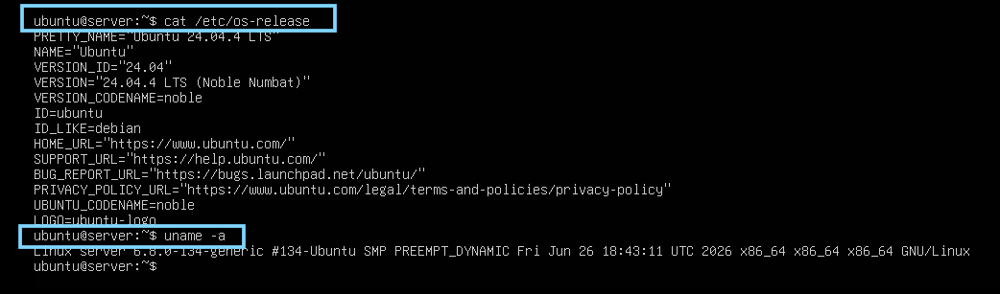
_Figure 1: Confirming OS distribution, version, and kernel release before making any changes._

---

### Mission 2 — Map the Attack Surface

```bash
ss -tuln
systemctl list-units --type=service
```

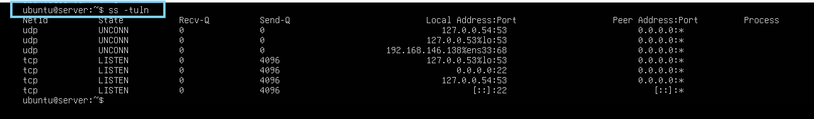
_Figure 2: Listening ports at baseline — note any unexpected service exposed here._

---

### Mission 3 — Audit the Human Attack Surface

```bash
cat /etc/passwd
awk -F: '($3>=1000)&&($1!="nobody"){print $1}' /etc/passwd
```

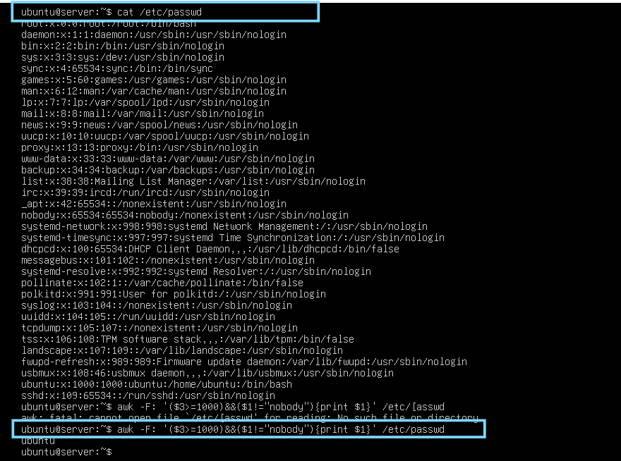
_Figure 3: All accounts with UID ≥ 1000 and a valid login shell — the candidate list for Mission 9._

!!! note "A clean result is a valid result"
On a fresh install, this will likely return only your own login (e.g. `ubuntu`). That's not a failed check — it means the baseline has no unrecognized accounts, which you'll confirm again in Mission 9.

---

## Phase 2 — Hardening Operations

### Mission 4 — Patch the Foundation

```bash
sudo apt update && sudo apt upgrade -y
```

**Verify**

```bash
apt list --upgradable
```

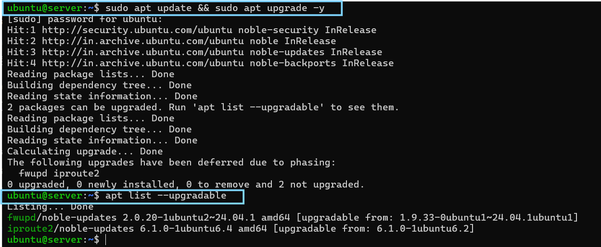
_Figure 4: No pending updates after patching._

---

### Mission 5 — Shut the Unnecessary Doors

```bash
sudo systemctl disable telnet
sudo systemctl stop telnet
```

!!! note "Telnet may not be installed at all"
Ubuntu Server doesn't ship Telnet by default. You may see `Failed to stop telnet.service: Unit telnet.service not loaded`. That's expected — it confirms the service isn't present rather than indicating an error. Screenshot the output as-is; it's still valid evidence.

**Verify**

```bash
systemctl status telnet
```

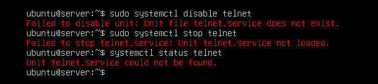
_Figure 5: Telnet confirmed inactive (or absent) on the host._

---

### Mission 6 — Lock Down SSH

```bash
sudo nano /etc/ssh/sshd_config
```

Set these three lines (remove any leading `#`):

```
PermitRootLogin no
PasswordAuthentication no
Port 2222
```

```bash
sudo systemctl restart ssh
```

!!! danger "Field Warning — set up an SSH key before disabling password login"
`PasswordAuthentication no` with no key configured will lock you out of SSH entirely (console access still works, SSH does not). Before editing the config, set up key auth from your **host machine**:

    ```
    ssh-keygen -t ed25519
    ```
    (If a key already exists, keep it — don't overwrite.)

    Copy it to the VM. In **Command Prompt** (not PowerShell — the syntax differs):
    ```
    type %USERPROFILE%\.ssh\id_ed25519.pub | ssh ubuntu@<your-vm-ip> "cat >> ~/.ssh/authorized_keys"
    ```
    In **PowerShell**, the equivalent is:
    ```
    type $env:USERPROFILE\.ssh\id_ed25519.pub | ssh ubuntu@<your-vm-ip> "cat >> ~/.ssh/authorized_keys"
    ```
    Then confirm key login works — you should **not** be asked for a password:
    ```
    ssh ubuntu@<your-vm-ip>
    ```
    Only proceed to edit `sshd_config` once this succeeds.

!!! warning "Known issue on Ubuntu 24.04 — ssh.socket overrides your port"
Ubuntu 24.04 uses **socket activation** for SSH by default. Even after setting `Port 2222` in `sshd_config` and restarting, you may find `sshd` still logs `Server listening on 0.0.0.0 port 22` and `ss -tuln | grep 2222` returns nothing. This is because `ssh.socket` — a separate unit — controls the listening port and overrides your config. Check:
`bash
    sudo systemctl status ssh.socket
    `
Fix by disabling the socket unit and letting the service itself bind the port from your config:
`bash
    sudo systemctl disable --now ssh.socket
    sudo systemctl enable --now ssh.service
    sudo systemctl restart ssh
    `
Then re-verify — `sudo systemctl status ssh` should log `Server listening on 0.0.0.0 port 2222`.

!!! tip "Restarting ssh does not drop your current session"
`sudo systemctl restart ssh` only affects _new_ connections — your already-open session stays alive. This is exactly why you test from a **second** window before closing the first: if the new port/key login fails, your original session is still there to fix it.

**Verify**

```bash
grep PermitRootLogin /etc/ssh/sshd_config
grep PasswordAuthentication /etc/ssh/sshd_config
ss -tuln | grep 2222
```

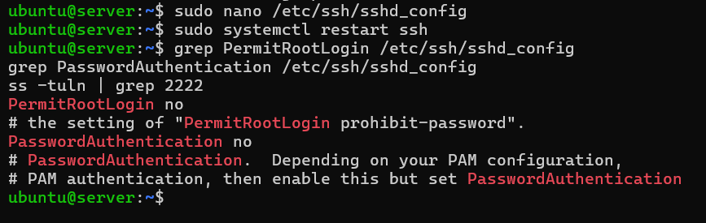
_Figure 6: Root login and password auth disabled; new port live._

From a **second, new terminal window** (don't close the first):

```
ssh -p 2222 ubuntu@<your-vm-ip>
```

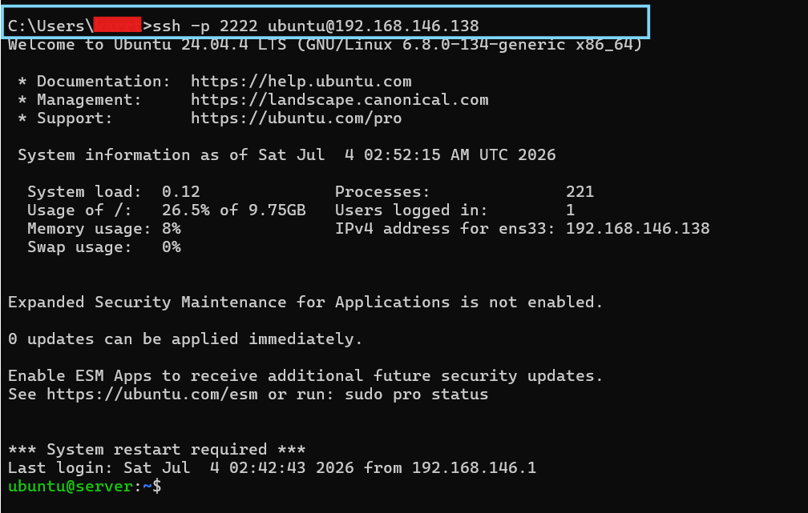
_Figure 7: Key-based login confirmed working on port 2222 from a second session._

---

### Mission 7 — Raise the Wall

```bash
sudo ufw allow 2222/tcp
sudo ufw enable
sudo ufw deny 23
```

**Verify**

```bash
sudo ufw status verbose
```

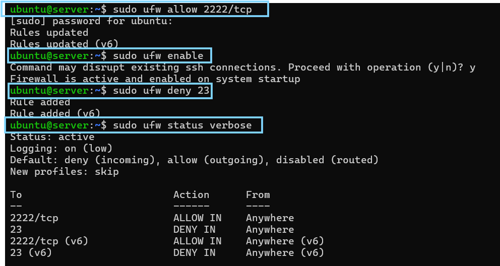
_Figure 8: UFW active, only port 2222 permitted._

---

### Mission 8 — Enforce Password Discipline

```bash
sudo nano /etc/login.defs
```

Set:

```
PASS_MAX_DAYS 90
PASS_MIN_DAYS 10
PASS_MIN_LEN 12
```

**Verify**

```bash
grep -E "PASS_MAX_DAYS|PASS_MIN_DAYS|PASS_MIN_LEN" /etc/login.defs
```

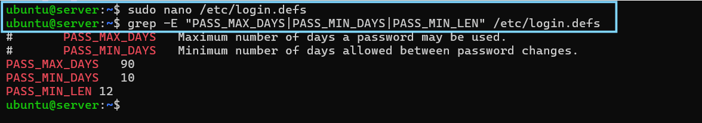
_Figure 9: Password aging and length policy applied._

---

### Mission 9 — Neutralize Ghost Accounts

Using your Mission 3 suspect list:

```bash
sudo userdel testuser
# or, if the account might be needed later:
sudo usermod -L testuser
```

!!! note "No suspect accounts found"
If Mission 3 turned up no unrecognized accounts, `userdel: user 'testuser' does not exist` is the expected, correct result — not an error. Document it as "baseline already clean" rather than as a remediation.

**Verify**

```bash
cat /etc/passwd
```

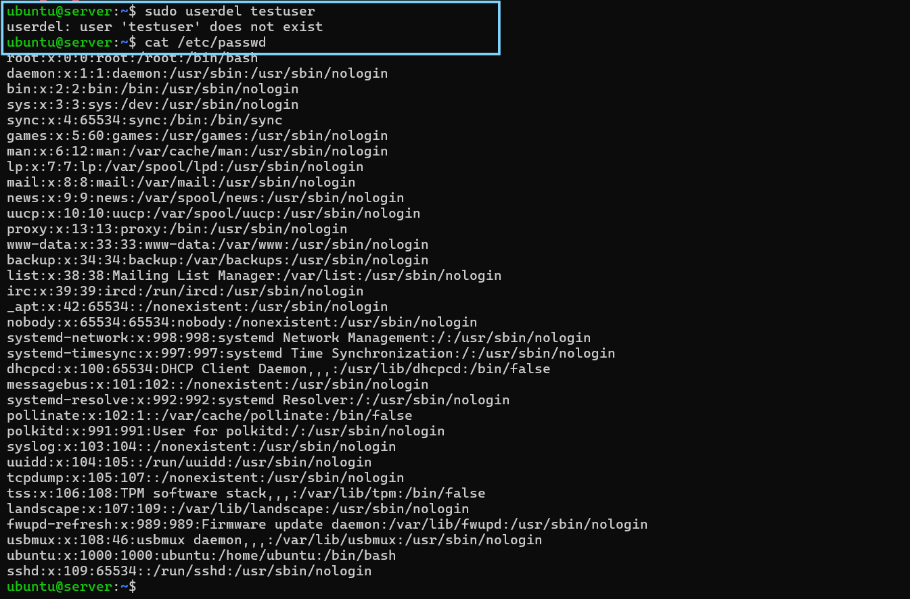
_Figure 10: Unrecognized accounts from Mission 3 removed or locked (or confirmed absent)._

---

### Mission 10 — Seal the Crown Jewels

```bash
sudo chmod 600 /etc/shadow
```

**Verify**

```bash
ls -l /etc/shadow
```

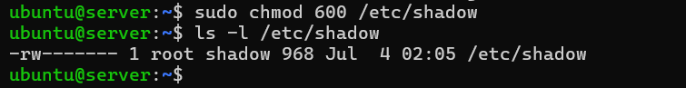
_Figure 11: `/etc/shadow` locked to root-only access._

---

### Mission 11 — Deploy Active Defense

```bash
sudo apt install fail2ban -y
sudo systemctl enable --now fail2ban

sudo apt install auditd -y
sudo systemctl enable --now auditd
```

!!! note "Already installed?"
Some Ubuntu Server images ship with Fail2Ban and/or auditd pre-installed — `apt install` will report `is already the newest version` in that case. That's fine; the `systemctl enable --now` step still matters, since a package being installed doesn't guarantee the service is enabled and running.

**Verify**

```bash
systemctl status fail2ban
systemctl status auditd
```

(Press **`q`** to exit each status view.)

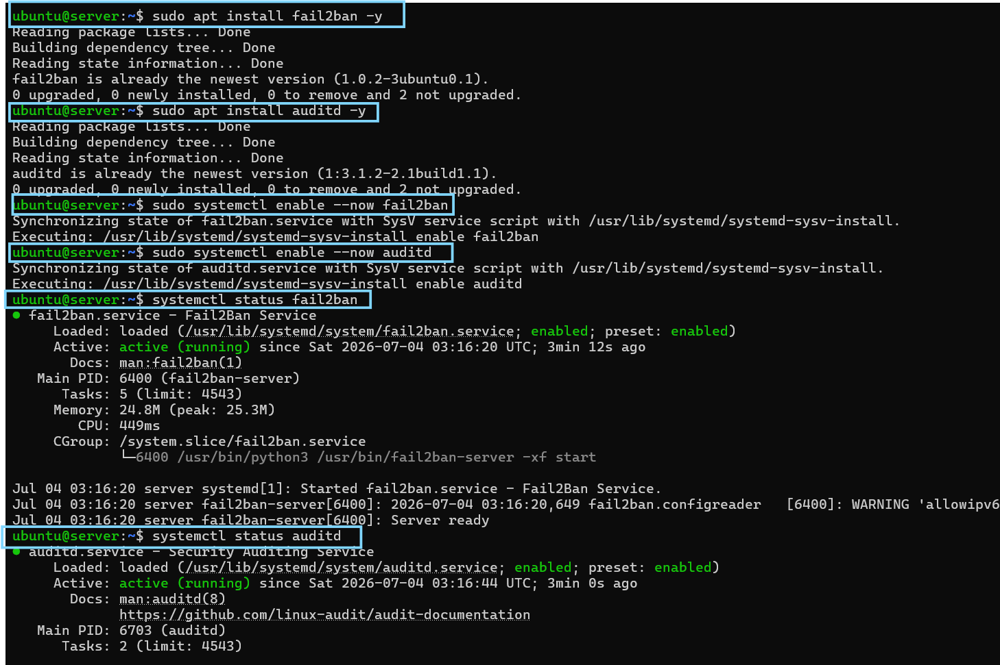
_Figure 12: Both active-defense services confirmed running._

---

### Mission 12 — Turn On the Cameras

```bash
sudo cat /var/log/auth.log
journalctl -xe
```

!!! tip "Filter instead of scrolling the whole log"
`/var/log/auth.log` fills up fast with routine cron and session noise. Filter for the signal that actually matters — SSH authentication events:
`bash
    grep "Accepted" /var/log/auth.log
    `
Look specifically for a line like `Accepted publickey for ubuntu from ... ED25519 ...` — this proves your Mission 6 hardening is actually working (key-based login), as opposed to an earlier `Accepted password` line from before you locked SSH down.

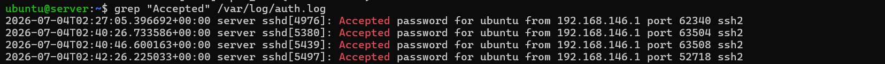
_Figure 13: A real authentication event (key-based login) captured, confirming logging is active and SSH hardening took effect._

---

## Phase 3 — Incident Response Drills

### Drill A — The Open Port

**Symptom**

```bash
ss -tuln
# 0.0.0.0:23 LISTEN  <- unexpected
```

**Remediation**

```bash
sudo systemctl stop telnet
sudo ufw deny 23
ss -tuln
```

!!! note "Verified-absent is still a valid drill outcome"
If Telnet was never installed on your host, you'll see `Unit telnet.service not loaded` and `Skipping adding existing rule` (UFW rule already present from Mission 7). This confirms port 23 has no listener — document it as "verified absent" rather than "actively remediated."

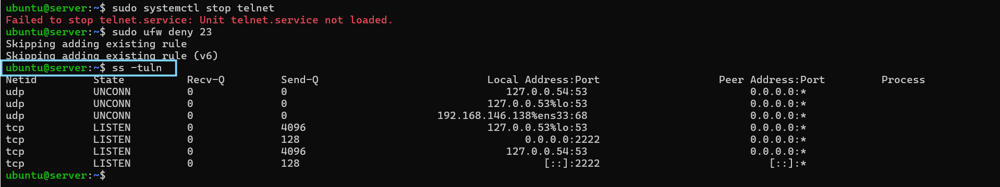
_Figure 14: Port 23 confirmed closed / never exposed, port 2222 the only SSH listener._

---

### Drill B — The Weak SSH Config

**Symptom:** root login enabled over SSH, default port.

**Remediation:** disable root login and change the listening port (see Mission 6).

!!! tip "Reflection"
Changing the port alone does not fix this — an attacker who finds the new port still has an unauthenticated path to root unless password auth and root login are also disabled properly.

---

## Phase 4 — Practical Assessment

| Task   | Requirement                                  | Points |
| ------ | -------------------------------------------- | ------ |
| Task 1 | Identify and close all unused/at-risk ports  | 20     |
| Task 2 | Harden SSH (root login, password auth, port) | 20     |
| Task 3 | Enable firewall; allow only required ports   | 15     |
| Task 4 | Implement password policy                    | 15     |
| Task 5 | Verify system logs for unauthorized attempts | 15     |
| Task 6 | Deploy Fail2Ban and confirm it's running     | 15     |

**Scoring:** 90–100 audit-ready · 70–89 solid, revisit gaps · below 70 repeat Phase 2.

---

## Final Validation Checklist

```bash
sudo ufw status
grep PermitRootLogin /etc/ssh/sshd_config
ss -tuln
apt list --upgradable
grep PASS_MIN_LEN /etc/login.defs
ls -l /etc/shadow
systemctl status fail2ban
systemctl status auditd
```

| Check               | Expected Result            |
| ------------------- | -------------------------- |
| Firewall active     | `active`                   |
| SSH hardened        | `PermitRootLogin no`       |
| Ports minimized     | only required ports listed |
| Updates applied     | no pending updates         |
| Password policy set | `PASS_MIN_LEN` = 12        |
| Shadow file locked  | `-rw------- root root`     |
| Fail2Ban active     | `active (running)`         |
| Auditd active       | `active (running)`         |

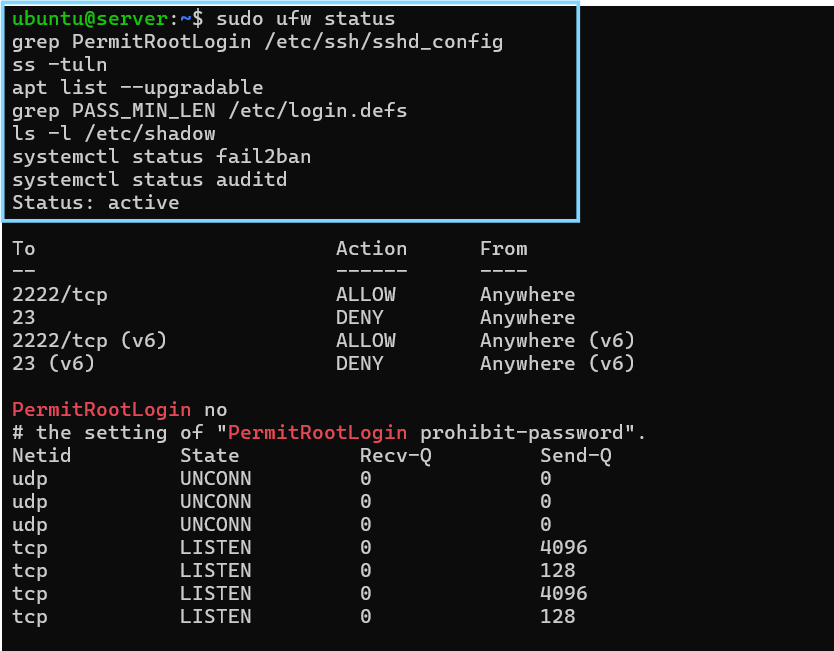
_Figure 15: All eight hardening controls verified in a single session._

---

## Test Your Understanding

??? question "1. Why is Mission 4 (patching) done before any other hardening step?"
Unpatched packages are the most commonly exploited weakness on any server. Hardening a service (SSH, firewall, accounts) on top of unpatched software still leaves known CVEs open — patching first ensures every later control is built on a clean foundation.

??? question "2. Why does disabling password authentication in Mission 6 require setting up an SSH key _first_?"
If `PasswordAuthentication no` is applied before a working key is confirmed, there is no remaining way to authenticate over SSH — you'd be locked out of remote access entirely (console access would still work, but not SSH). Testing key login from a second session before closing the first prevents this.

??? question "3. In Drill B, why doesn't changing the SSH port alone fix a weak SSH config?"
Changing the port only hides the service from casual/default scans — it doesn't remove the underlying exposure. If root login and password authentication are still enabled, an attacker who finds the new port still has an unauthenticated path to root.

??? question "4. What does a `PASS_MIN_LEN` policy in `/etc/login.defs` actually protect against, and what other control does it depend on?"
It enforces a minimum password length, raising the cost of brute-force and dictionary attacks. It's only meaningful if `/etc/shadow` is also locked down (Mission 10) — otherwise the password hashes it's meant to protect are readable by any local user.

??? question "5. Why is 'no listener found on port 23' still valid evidence for Drill A, even if Telnet was never installed?"
The drill is testing whether the _current state_ of the host is secure, not whether a specific remediation action was performed. A host that never exposed the service is at least as secure as one where the service was actively closed — the verification step (`ss -tuln`) is the same either way.

---

## Bonus Round — Advanced Hardening

- Enforce AppArmor in enforcing mode
- Deploy OSSEC or Wazuh and trigger a test alert
- Enable full-disk encryption with LUKS
- Disable USB mass storage via udev rules

---

## Learning Outcomes

By completing this lab, you have:

- Reduced a host's attack surface using measurable, verifiable controls rather than a checklist run blind
- Practiced recon-before-action, verify-after-every-change, evidence-as-you-go discipline
- Converted an unhardened host into one with a minimal attack surface, key-only access, active brute-force defense, and a real audit trail
- Diagnosed and worked around a real platform quirk (Ubuntu 24.04 socket-activated SSH) rather than following steps blindly
- Built the muscle memory to diagnose a live misconfiguration under time pressure
