# Threat Modeling Using Microsoft Threat Modeling Tool (MTMT)

> Beginner Friendly • 2 Hours • Hands-on Security Lab    
> Framework: STRIDE    
> Tool: Microsoft Threat Modeling Tool (MTMT)    
> System: Online Exam System    


---

## Lab Overview

In this hands-on lab, you will learn how to use Microsoft Threat Modeling Tool (MTMT) to identify potential security threats in an Online Exam System. You will begin by installing MTMT, understanding its interface, and designing a threat model based on a real-world university examination platform.

Using the STRIDE methodology, you will generate and analyze threats across the system architecture, explore the generated threat report, and use Generative AI as a Security Co-pilot to better understand vulnerabilities, their impact, and possible mitigations.

By the end of this lab, you will have practical experience creating a threat model, reviewing security findings, and interpreting threat reports from a beginner-friendly perspective.

---

## Learning Objectives

Upon completing this lab, you will be able to:

- Install and configure Microsoft Threat Modeling Tool (MTMT)
- Understand the basic components of a threat model, including processes, data flows, data stores, and trust boundaries
- Create a threat model for an Online Exam System using MTMT
- Generate and analyze threats using the STRIDE methodology
- Interpret threat reports and understand the associated security risks
- Use Generative AI to explain, analyze, and suggest remediations for identified threats
- Apply basic security recommendations to improve the security posture of a system

---

## Technologies Used

- Microsoft Threat Modeling Tool (MTMT)
- Microsoft Edge (or any modern web browser)
- Generative AI Assistant (Microsoft Copilot, ChatGPT, Gemini, etc.)
- Data Flow Diagrams (DFDs)
- STRIDE Threat Modeling Methodology

---

## Milestone 0 - Threat Modeling Fundamentals

Before building a Threat Model, it is important to understand why Threat Modeling is performed.

### What is Threat Modeling?

Threat Modeling is a structured approach used to identify potential security threats during the design phase of a system. Instead of discovering vulnerabilities after deployment, Threat Modeling helps security teams identify risks early and implement appropriate security controls.

In simple terms, Threat Modeling helps answer:

- What are we building?
- What can go wrong?
- How can the risks be reduced?

For this lab, we will create a Threat Model for an Online Exam System and analyze it for security threats.

### What is STRIDE?

STRIDE is a threat classification framework developed by Microsoft. It helps categorize potential threats found within a system.

| Category | Description |
|-----------|-------------|
| **S - Spoofing** | Pretending to be another user or system |
| **T - Tampering** | Unauthorized modification of data |
| **R - Repudiation** | Denying an action was performed |
| **I - Information Disclosure** | Exposure of sensitive information |
| **D - Denial of Service** | Making a service unavailable |
| **E - Elevation of Privilege** | Gaining unauthorized permissions |

### Why is STRIDE Important?

Microsoft Threat Modeling Tool uses STRIDE to automatically identify potential threats within a system architecture.

By understanding STRIDE, security analysts can:

- Identify security risks early
- Understand how attackers may target a system
- Recommend appropriate mitigations
- Improve the overall security posture of an application

In the next section, we will use these concepts to model and analyze an Online Exam System using Microsoft Threat Modeling Tool.

---

## Milestone 1 - Installing Microsoft Threat Modeling Tool

Follow the step by step guidelines below to install Microsoft Threat Modeling Tool

### Accessing the Right URL

1. Open any web browser and search Microsoft Threat Modeling Tool. Alternatively, you can also install by following this URL: https://www.microsoft.com/en-us/download/details.aspx?id=49168


    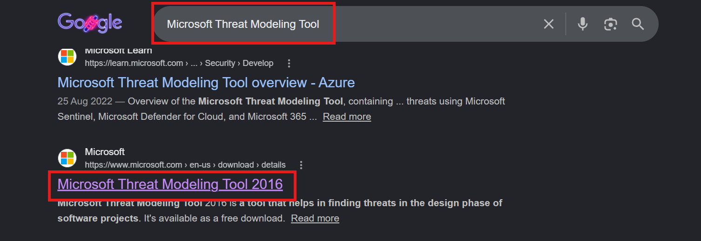

2. Make sure that your system meets the recommended requirements. Screenshot from 01/06/2026; requirements may be subject to change.


    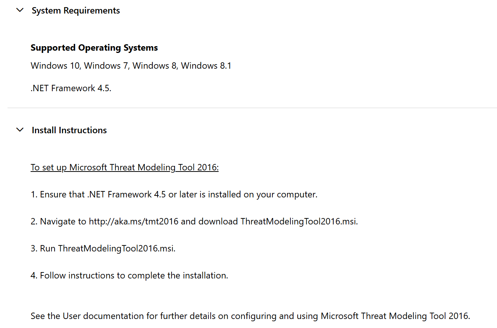

3. Select all three packages (or only the .msi if you are familiar with MTMT); and click Download. 

    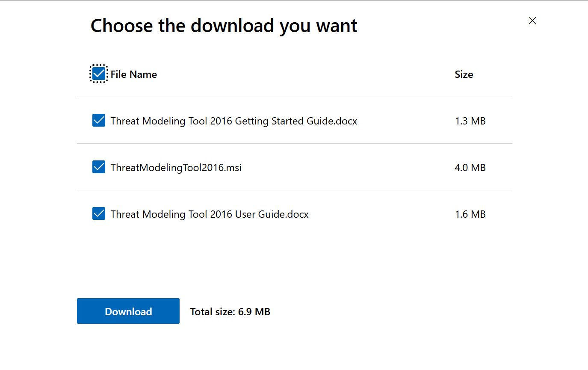

!!! warning
    Make sure your device meets the system requirements and you have atleast 500 MB of disk space available. Also make sure that your browser allows download of multiple files.

### Running the Install Wizard 

1. Run the installer, and choose options correctly in the wizard. 

2. Read the license agreement and choose **"I accept the license terms"**.

    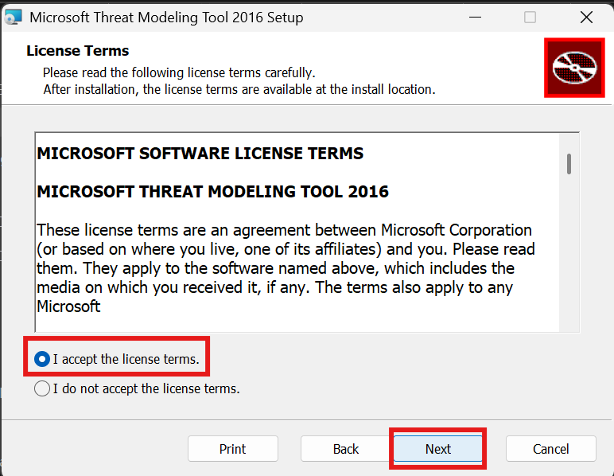

3. The tool will be installed in **Program Files** by default. Click **next** and click **"Install"** to finally install MTMT. 

    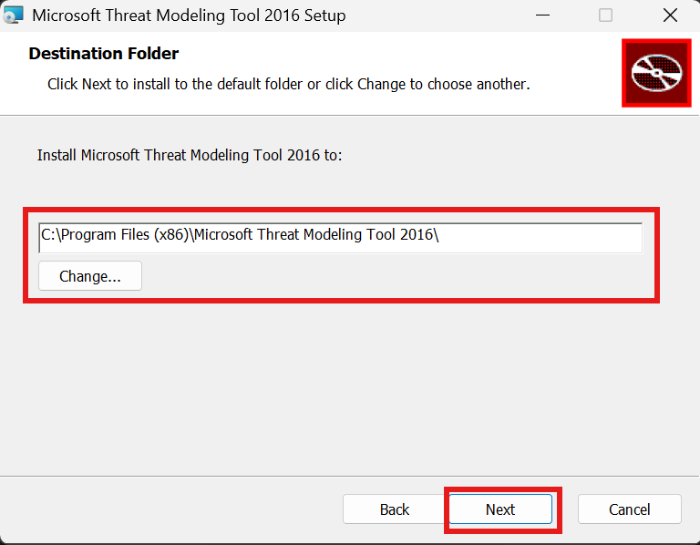

!!! tip "Installation Path"

    The default installation directory is recommended for most users. You may choose a custom installation path if required; however, if you do so, make sure to remember the selected location for future reference and troubleshooting.

4. This is how the interface of the MTMT looks when launched. Select Sample Threat Model.tm7 to view a sample threat model. 

    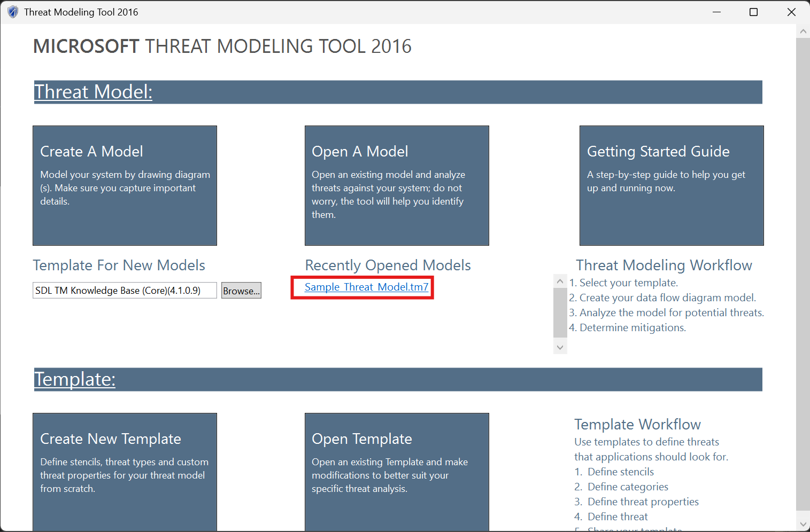

5. For this lab, we will be focused on modeling our system by drawing diagram(s) and capturing important details; however you are free to explore MTMT templates as well. 

6. This lab is focused on **SDL TM Knowledge Base**. MTMT also has *Azure Threat Model Template*, which is for the cloud related development, and *Medical Device Model*, which is community contributed, specifically for medical tools and devices specific development.

---

## Milestone 2 - Understanding the Problem Definition

### Problem Definition

ABC University conducts semester examinations for thousands of students through an online examination platform. Students log in to the portal using their university credentials, attempt examinations, and submit their answers electronically. Faculty members are responsible for creating and uploading question papers, while administrators manage users, schedules, and system configurations.

Since the platform handles sensitive information such as student records, examination questions, answers, and results, it is essential to identify potential security threats before the system is deployed.

As a Security Analyst, your task is to create a threat model for the Online Exam System using Microsoft Threat Modeling Tool. You will analyze the system architecture, identify trust boundaries and data flows, generate threats using the STRIDE methodology, and review possible security mitigations.

The high-level architecture can be visualized like this. We shall be using this architecture to implement the MTMT for this specific use case. 

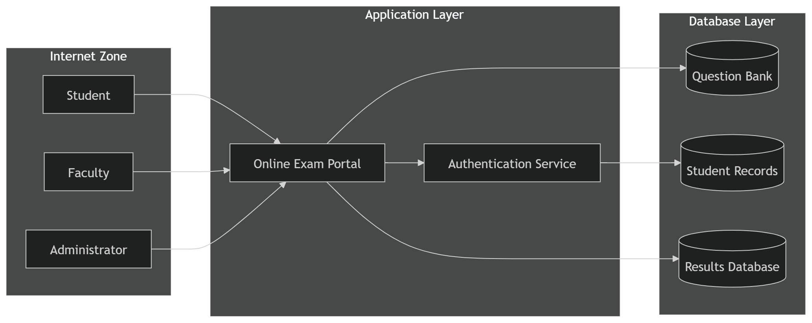

### Understanding MTMT Interface

Before we start building the Threat Model, we need to understand the MTMT interface. Look at the image below.

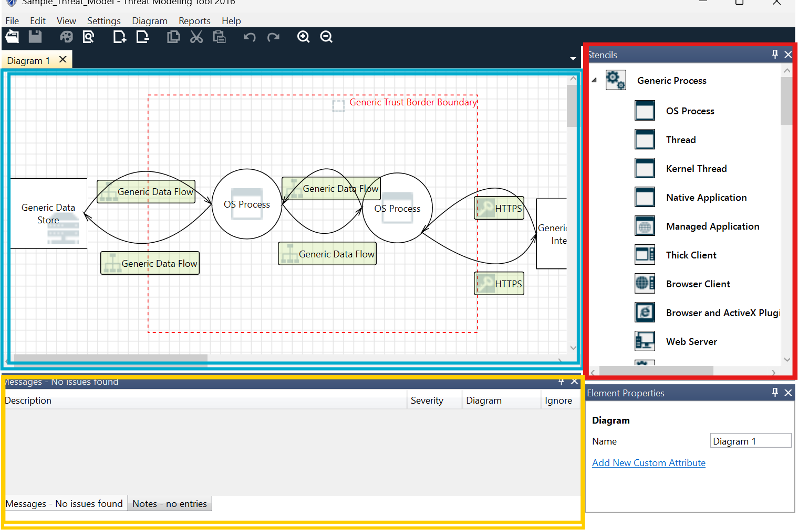

1. The area in blue is the canvas, where we will be drawing the model, which will later be analyzed for threats and vulnerabilities
2. The area in red is the collection of stencils. These elements will be dragged and dropped on the canvas to draw a threat model.
3. The area in yellow is where the analysis view opens up.

---

## Milestone 3 - Drawing the Threat Model

### Understanding the Structure

Drag and drop elements from the Stencils to the Canvas to draw the Threat Model. While drawing, it is necessary to keep the following in mind:

1. The Backend has 3 SQL Databases, to store Question Banks, Student Records and Results.
2. There are 3 different groups of human users; students, faculty and the administrators.
3. Since the data handled here is examination data, which is regarded as highly sensitive, authentication mechanisms are essential. 

### Drawing the Threat Model

Use the below diagram as reference to build the threat diagram. You are free to make it as simple or as complex as you wish. 

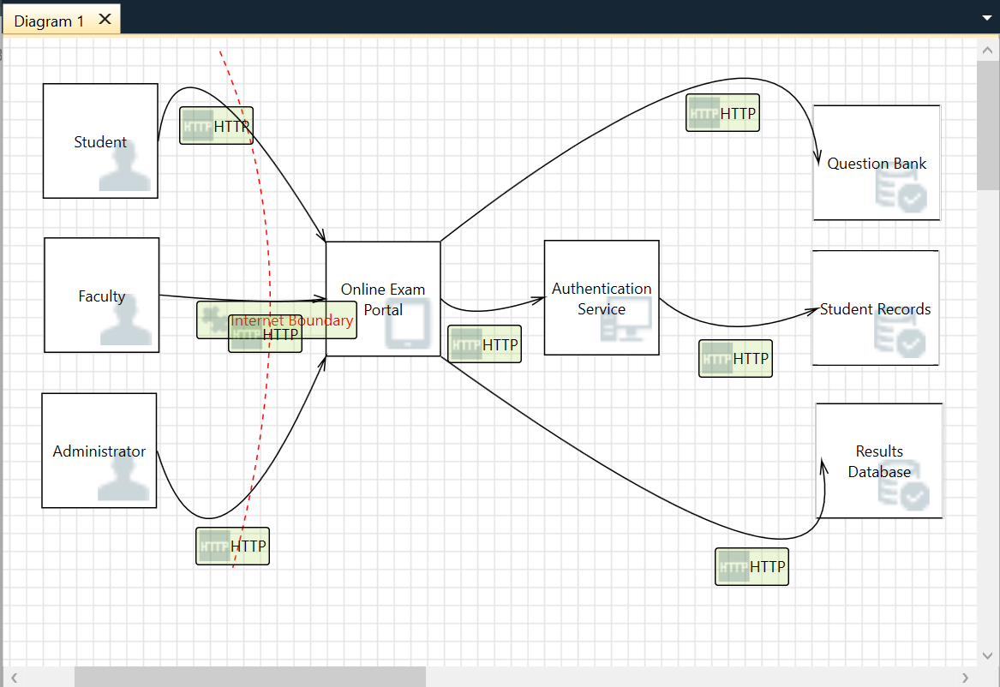

If you feel stuck anywhere, follow along using the video below.

<video controls width="100%">
    <source src="assets/model-5.mp4" type="video/mp4">
</video>

---

## Milestone 4 - Analysing the Threat Model for Vulnerabilities

Once the Threat Model is drawn, we will use the view tab to navigate to the analysis board to analyze for threats and vulnerabilities across the architecture. 

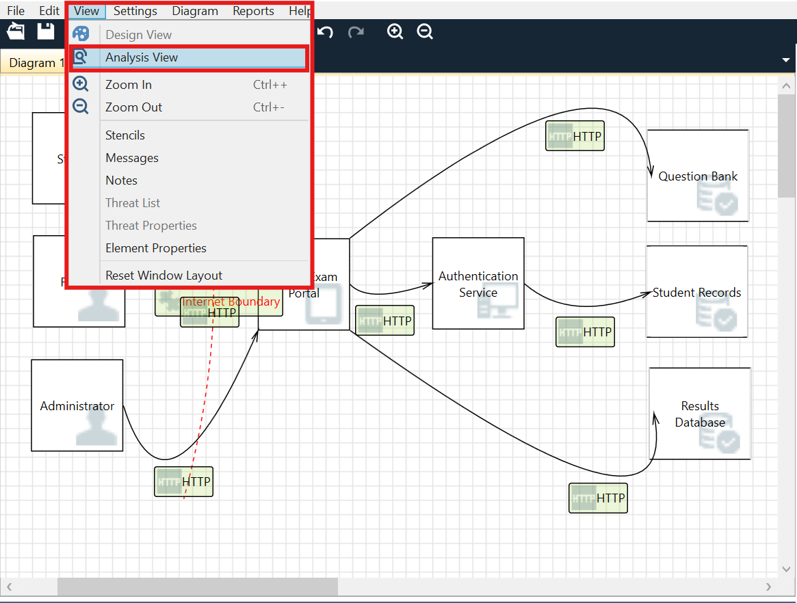

### Steps to view analysis on MTMT

1. Navigate to view > analysis view

2. This opens two sections: Threat List and Threat Properties

3. Threat List lists all the threats found in the model. This covers fields such as State, Title, Category, Description, Justification, etc. Click on each threat from the Threat List to view its properties. 

4. Threat Properties defines the above fields in much more detail. Users are expected to use the justification section to explain why the vulnerability exists and how it can remediated. 

5. The Category section deals with categorizing the vulnerabilities found into STRIDE. 

6. Overall, MTMT is a useful tool, which also keeps track of multiple collaborators working on the current model. This helps to maintain progress of work and non-repudiation. 

<video controls width="100%">
    <source src="assets/model-7.mp4" type="video/mp4">
</video>

---

## Milestone 5 - Using Generative AI as a Security Co-Pilot

### Generating a Report

1. Navigate to the Reports > Create Full Report

    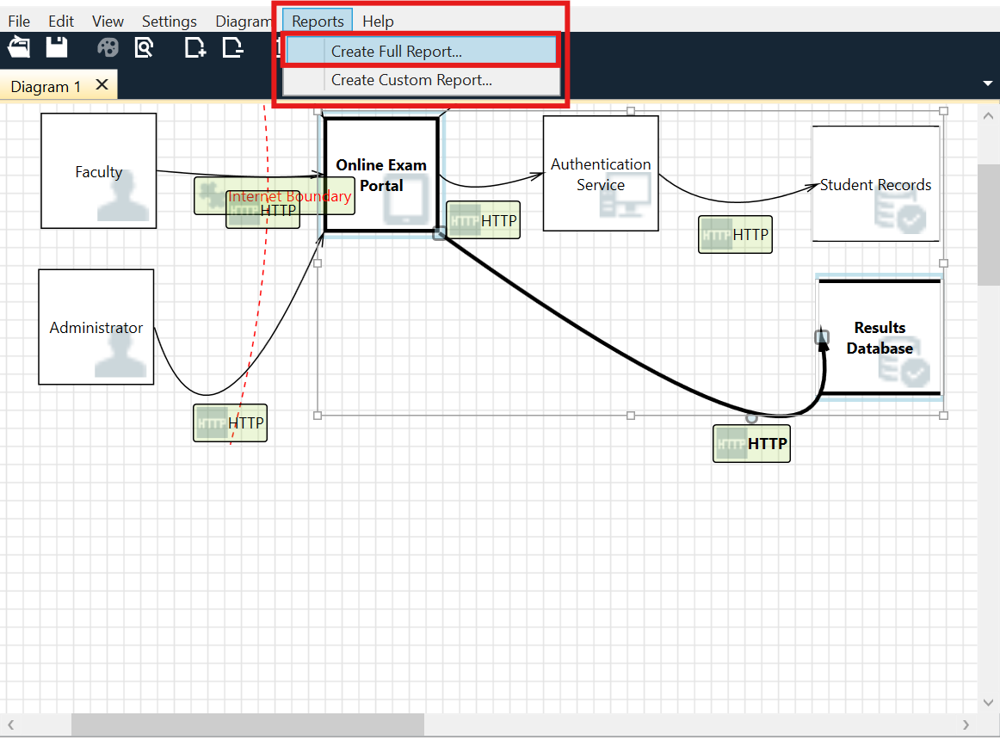

2. Click on Generate Report

    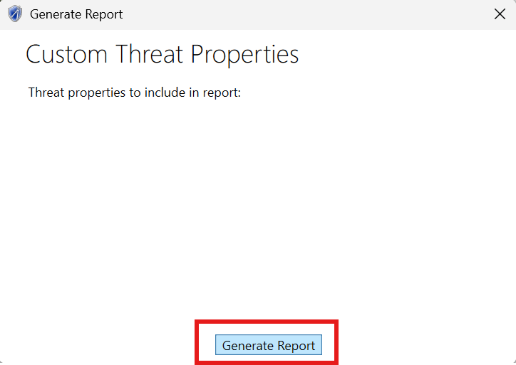

3. Save the report to your desired folder.

### Using Generative AI to Analyze, Understand, and Suggest Remediation for Vulnerabilities Found

1. Open the saved report using Microsoft Edge (or any other web browser)

2. Use any Generative AI model of your choice to help you navigate the report and understand critical technical findings. 

!!! tip "Suggested Prompt"

    ```text
    I am a beginner learning threat modeling and cybersecurity.

    I have generated a threat modeling report using Microsoft Threat Modeling Tool for an Online Exam System.

    Analyze the vulnerabilities and threats found in the report and explain:

    1. What the threat means in simple terms
    2. Why the threat exists
    3. What could happen if the threat is exploited
    4. The potential impact on the Online Exam System
    5. Recommended mitigations
    6. Security best practices to reduce the risk

    Present the results in a beginner-friendly table format and highlight the most critical findings first.
    ```


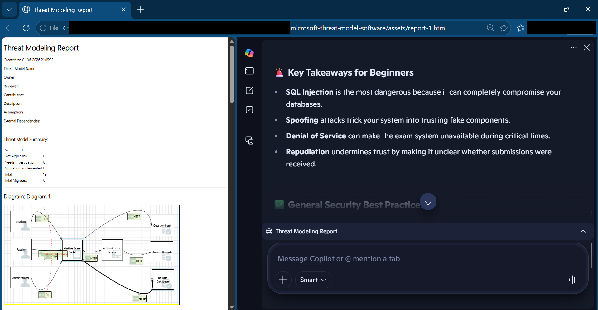

### Generative AI - Sample Result

```markdown
Here’s a beginner-friendly analysis of the threats and vulnerabilities identified in your **Online Exam System threat modeling report**. I’ve organized them in a table format, starting with the most critical findings.  

#### 🔐 Threat Analysis Table

| Threat | What it Means (Simple Terms) | Why It Exists | What Could Happen if Exploited | Impact on Online Exam System | Recommended Mitigations | Security Best Practices |
|--------|-------------------------------|---------------|--------------------------------|------------------------------|-------------------------|-------------------------|
| **SQL Injection – Question Bank, Results DB, Student Records** | Attackers insert malicious code into database queries | System accepts raw SQL queries without proper safeguards | Hackers can steal, change, or delete exam questions, student results, or personal data | Exam integrity destroyed, student privacy violated, legal consequences | Use **parameterized queries**, stored procedures, and input validation | Regular code reviews, automated vulnerability scanning, least privilege access |
| **Spoofing – Question Bank, Results DB, Student Records** | An attacker pretends to be a trusted database | Lack of authentication between system components | Data may be sent to attacker’s fake database instead of the real one | Loss of exam data, manipulation of results, exposure of student records | Implement **mutual authentication** (e.g., certificates, tokens) | Enforce strong identity verification, secure API endpoints |
| **Denial of Service (DoS) – HTTP Data Flow Interrupted** | Attackers flood or block communication so data can’t pass | No protection against traffic overload or malicious interruptions | Students may be unable to submit answers or access exams | Exams disrupted, reputation damage, possible financial loss | Use **rate limiting, firewalls, load balancing, DDoS protection** | Monitor traffic patterns, prepare incident response plans |
| **Repudiation – Portal Denies Receiving Data** | System claims it didn’t receive student submissions | No logging or auditing of transactions | Students may lose exam submissions or disputes arise | Trust issues, unfair grading, legal challenges | Implement **secure logging, auditing, and non-repudiation mechanisms** | Keep tamper-proof logs, enable monitoring and alerts |

#### 🚨 Key Takeaways for Beginners
- **SQL Injection** is the most dangerous because it can completely compromise your databases.  
- **Spoofing** attacks trick your system into trusting fake components.  
- **Denial of Service** can make the exam system unavailable during critical times.  
- **Repudiation** undermines trust by making it unclear whether submissions were received.  

#### ✅ General Security Best Practices
- **Encrypt all sensitive data** (student records, exam results).  
- **Use HTTPS everywhere** to secure communication.  
- **Apply least privilege**: give users and services only the access they need.  
- **Regularly patch and update** software to fix known vulnerabilities.  
- **Conduct penetration testing** before deploying the exam system.  
- **Train developers and admins** on secure coding and incident response.  

Would you like me to also create a **visual diagram of the threats and mitigations** (like a simplified threat map) to help you better understand how they connect?
```

---

## Lab Summary

In this lab, you installed Microsoft Threat Modeling Tool, created a threat model for an Online Exam System, generated STRIDE-based threats, and analyzed security findings. You also explored how Generative AI can be used as a Security Co-pilot to better understand vulnerabilities and recommend mitigations.

Threat Modeling is a proactive security practice that helps identify and address risks early in the software development lifecycle.

---

## Test Your Understanding

??? question "What is the primary goal of Threat Modeling?"

    To identify potential security threats and vulnerabilities during the design phase of a system so they can be addressed before deployment.

??? question "What is the purpose of the Internet Trust Boundary in this threat model?"

    The Internet Trust Boundary separates external users from the Online Exam System. It helps identify security risks that arise when data enters the system from an untrusted network.

??? question "What does STRIDE stand for?"

    S – Spoofing
    T – Tampering
    R – Repudiation
    I – Information Disclosure
    D – Denial of Service
    E – Elevation of Privilege

??? question "Which STRIDE category best describes an attacker stealing examination questions from the Question Bank Database?"

    **Information Disclosure**, because sensitive information is being exposed to unauthorized users.

??? question "The Online Exam System currently uses HTTP for communication between users and the portal. Which protocol can be used instead to improve security?"

    HTTPS (Hypertext Transfer Protocol Secure) can be used instead of HTTP. HTTPS encrypts data in transit using TLS, helping protect against eavesdropping, tampering, and credential theft.

??? question "Can implementing a security control such as HTTPS completely eliminate all threats from a system?"

    No. Security controls reduce risk but do not eliminate all threats. Threat modeling helps identify remaining risks and determine additional mitigations that may be required.
