# Module 1.0: Network Traffic Fundamentals using Wireshark (60 Minutes)

> Lab Type: Network Traffic Fundamentals  
> Tool: Wireshark  
> Duration: 3 Hours  
> System: Kali Linux (Ubuntu/Debian compatible)

---

## Learning Outcomes

By the end of the session, participants will be able to:

1. Understand packet flow in a network.

2. Capture and analyze network traffic using Wireshark.

3. Identify common protocols (ARP, DNS, ICMP, TCP, HTTP, HTTPS).

4. Understand the role of firewalls in network security.

5. Configure basic firewall rules in pfSense.

6. Understand VPN concepts and use cases.

7. Configure and test a basic VPN connection using pfSense.

8. Investigate traffic before and after firewall/VPN implementation.

---

## Scenario

You have recently joined the Security Operations Center (SOC) team of a startup organization. Before you can identify suspicious activity or investigate cyber incidents, you must first understand what legitimate network traffic looks like.

In this lab, you will capture and analyze various types of network traffic using Wireshark and learn how common protocols operate in real-world environments.

## Milestone 1: Capturing Your First Packets

### Objective

Learn how to capture network traffic and identify ICMP packets generated by the Ping utility.

### Launching Wireshark

1. Open Wireshark. For the sake of this lab, we will be using Kali Linux, which already has Wireshark installed. However, one can install Wireshark on Windows machine or even MacOS.

2. Select the active network interface (Wi-Fi or Ethernet).

   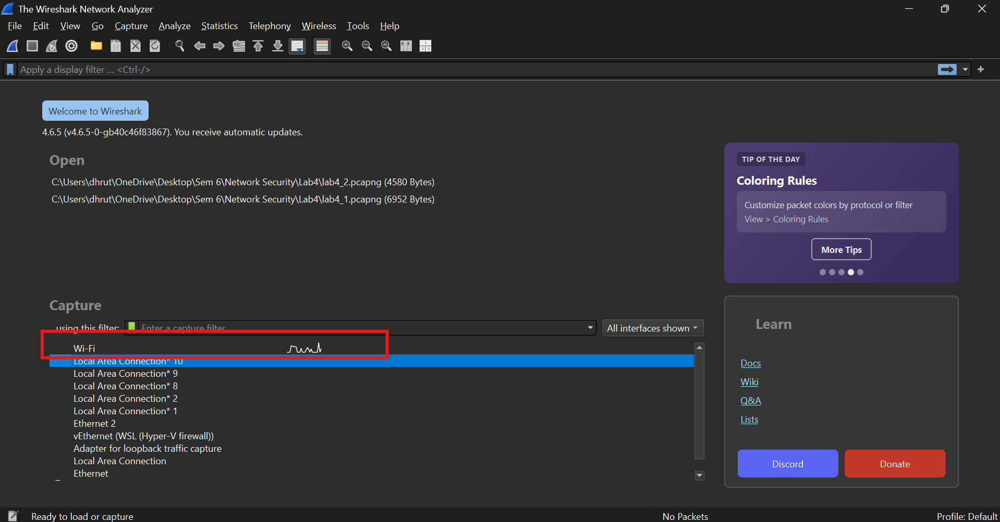

3. Click the Start Capture button. Usually, as soon as you start a new project on wireshark and select interface, capture starts automatically. If not, click the Start Capture button.

   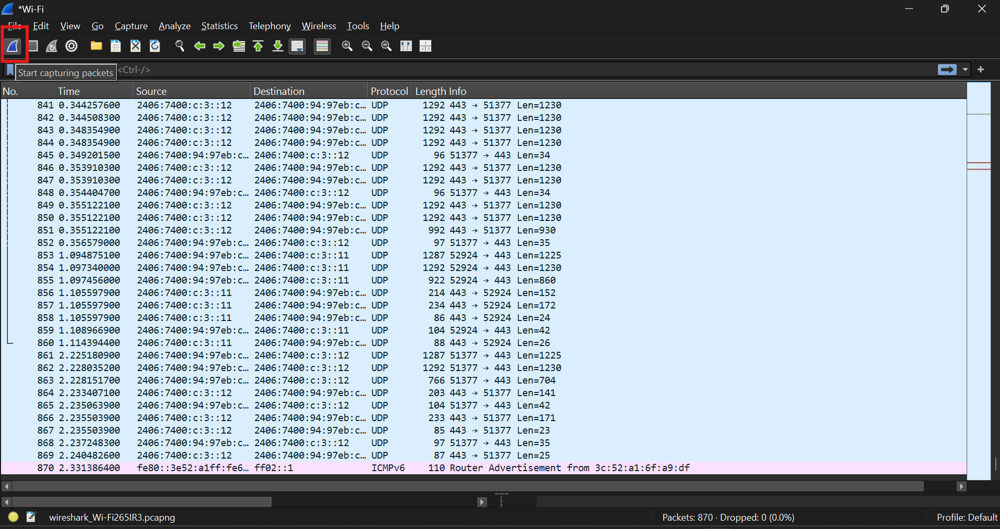

!!! warning
Run Wireshark on Windows as administrator, or launch from terminal in Kali Linux using sudo privileges.

### Generate Network Traffic

Open a terminal or command prompt and execute:

Windows
`ping google.com`
Linux
`ping -c 4 google.com`

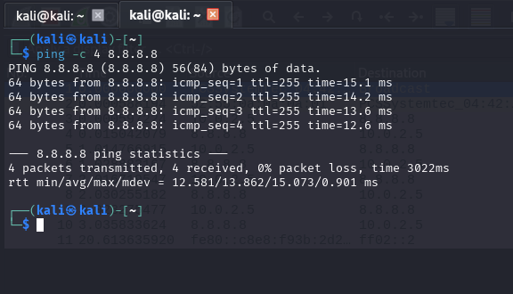

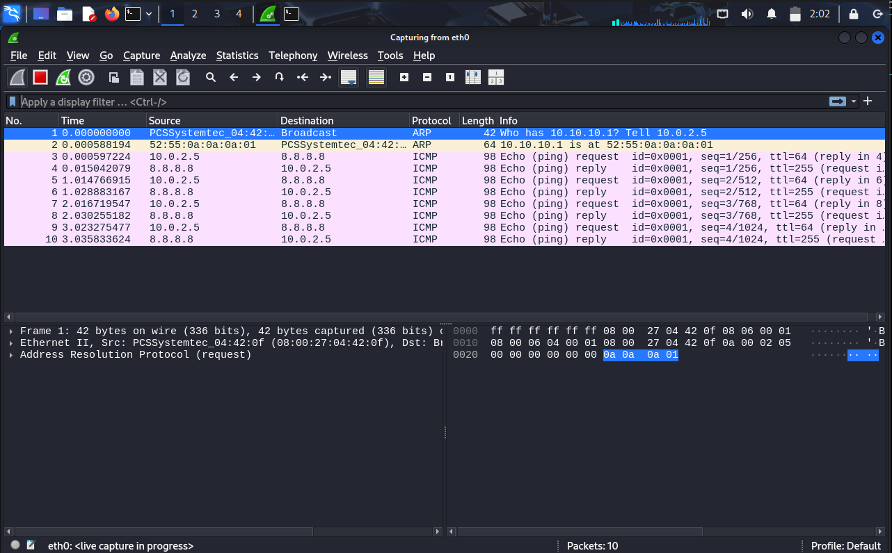

### Observe the Traffic

Return to Wireshark and locate the generated ICMP packets.
You may use the following display filter:

`icmp`

### Understanding the Results

When the ping command is executed:

1. Your system sends an ICMP Echo Request packet.
2. The destination system receives the request.
3. The destination replies with an ICMP Echo Reply packet.

This process verifies connectivity between two hosts.

### Discussion Questions

??? question "How many ICMP packets were generated?"

    The number of ICMP packets depends on how many ping requests were sent. Each ping generates one ICMP Echo Request and one ICMP Echo Reply. For example, if 4 ping requests are sent and all receive responses, a total of 8 ICMP packets will be captured.

??? question "What is the difference between an Echo Request and an Echo Reply?"

    An ICMP Echo Request is sent by a device to check whether another device is reachable on the network. An ICMP Echo Reply is the response sent back by the destination device to confirm that it received the request and is reachable.

??? question "What would happen if the destination system blocked ICMP replies?"

    If the destination system blocks ICMP replies, the source device will not receive any response to its ping requests. As a result, the ping command will show a timeout even though the destination system may still be online.

??? question "Can a host still be online if it does not respond to ping requests?"

    Yes. Many systems and firewalls are configured to block ICMP traffic for security reasons. A host can still be online and providing services such as web hosting or remote access even if it does not respond to ping requests.

---

## Milestone 2: Address Resolution Protocol (ARP) Analysis

### Objective

Understand how devices discover MAC addresses within a local network and examine why ARP is frequently abused by attackers. Many internal network attacks begin with ARP manipulation. Understanding legitimate ARP traffic helps analysts identify suspicious behavior such as Man-in-the-Middle (MITM) attacks, rogue devices, and ARP poisoning attempts.

### Clear Existing ARP Cache

Before beginning the capture, clear the ARP cache to force the system to generate fresh ARP requests.

On a Windows machine, use:
`arp -d *`

On Kali Linux VM, use:
`sudo ip neigh flush all`

### Generate ARP Traffic

1. Open Wireshark and click Start Capture

2. Ping your default gateway
   `ping 192.168.1.1`
   Replace the IP Address with your gateway address if different

3. Apply the following display filter:
   `arp`
   You should immediately observe ARP packets appearing in the capture.

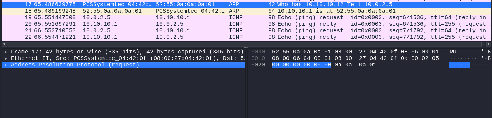


### Analyze the ARP Exchange

Locate a packet containing a message similar to:

```
Who has 192.168.1.1?
    Tell 192.168.1.100
```

This is an ARP Request.
The device is essentially asking, "Which device owns IP address 192.168.1.1? Please send me your MAC address." Shortly afterwards, locate the corresponding ARP Reply 192.168.1.1 is at 00:11:22:33:44:55. This response provides the MAC address associated with the requested IP address.


### Attacker Scenario

An attacker connected to the same network can send forged ARP replies claiming:

`192.168.1.1 is at AA:AA:AA:AA:AA:AA`

Victim devices update their ARP tables and begin sending traffic to the attacker's machine instead of the legitimate gateway.
This attack can be used for:

- Credential interception
- Session hijacking
- Network surveillance
- Man-in-the-Middle attacks

### Discussion Questions

??? question "Why does ARP use broadcast traffic?"

    ARP uses broadcast traffic because the sender knows the destination IP address but does not know its MAC address. The ARP request is sent to all devices on the local network, and the device with the matching IP address responds with its MAC address.

??? question "Why is ARP considered insecure by design?"

    ARP is considered insecure because it does not verify the authenticity of ARP messages. Any device on the local network can send forged ARP replies, which attackers can use to redirect or intercept network traffic.

??? question "How could a SOC analyst identify ARP poisoning attempts?"

    A SOC analyst can identify ARP poisoning attempts by looking for unusual ARP activity, such as multiple IP addresses associated with the same MAC address, unexpected changes in ARP tables, or a sudden increase in ARP traffic on the network.

??? question "What defensive technologies help mitigate ARP spoofing?"

    Technologies such as Dynamic ARP Inspection (DAI), DHCP Snooping, static ARP entries, and network intrusion detection systems can help prevent or detect ARP spoofing attacks by validating ARP communications and monitoring network activity.

---

## Milestone 3: DNS Traffic Investigation

### Objective

Understand how the Domain Name System (DNS) translates human-readable domain names into IP addresses and learn how to identify DNS queries and responses using Wireshark.

DNS is one of the most frequently used protocols on modern networks. Every time a user visits a website, sends an email, or accesses a cloud application, DNS is typically involved in resolving domain names to IP addresses. As a SOC analyst, understanding DNS traffic is essential because many attacks, including phishing, malware communication, and data exfiltration, often abuse DNS.

### Generate DNS Traffic

1. Ensure Wireshark is actively capturing traffic.
2. Open a web browser and visit:
   `www.google.com`
3. Allow the page to load completely.

### Analyze DNS Exchange

1. Apply the following display filter:

`dns`

You should now see DNS queries and responses generated by your system.

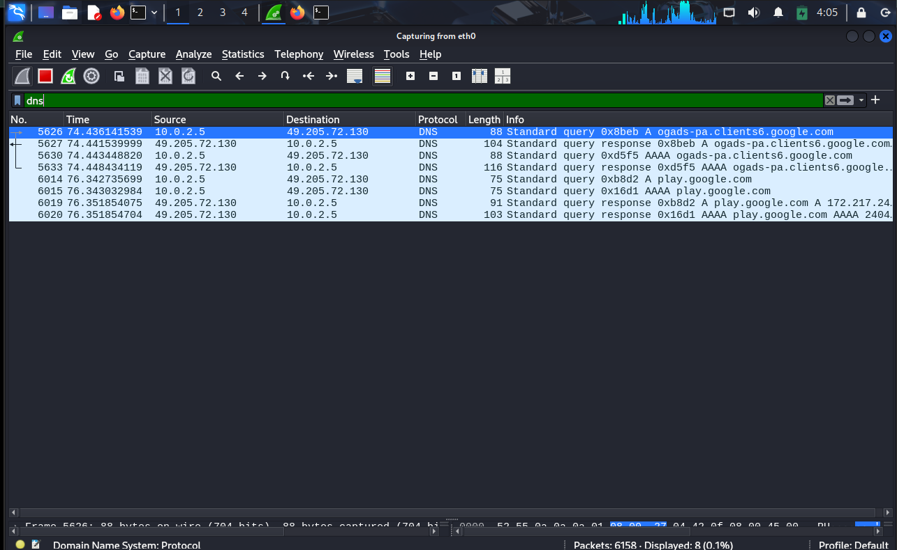

2. Locate a DNS query packet and examine the following fields:

- Source IP Address
- Destination IP Address
- Query Name
- Query Type

You should observe a query similar to:

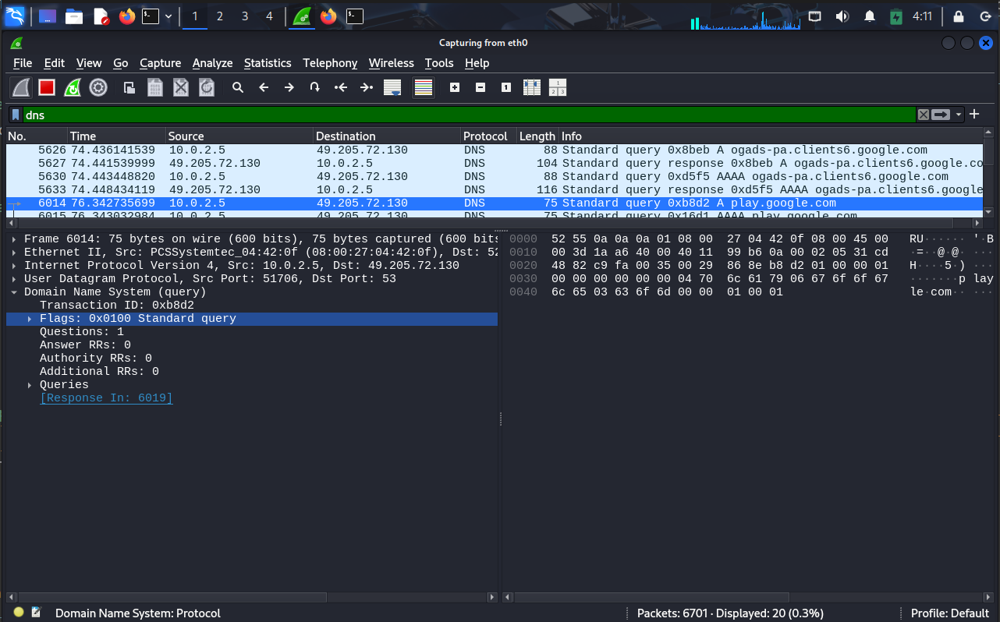

This packet represents your system asking a DNS server for the IP address associated with the Facebook domain.

3. Next, locate the corresponding DNS response packet.

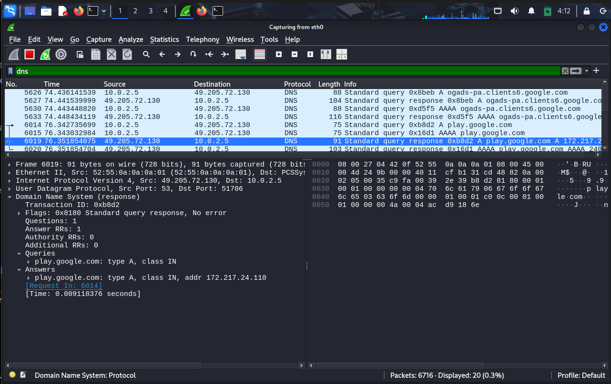

Observe:

- Response Code
- Returned IP Address
- Number of Answers

The DNS server responds with the IP address associated with the requested domain name.

### Understanding the Process

When a user enters a website address into a browser:

1. The browser requests the IP address associated with the domain.
2. A DNS query is sent to a DNS server.
3. The DNS server returns one or more IP addresses.
4. The browser connects to the destination server using the returned IP address.

Without DNS, users would need to remember numerical IP addresses instead of human-friendly domain names.

### Challenge Exercise

Using Wireshark, identify the IP addresses returned for:

- google.com
- amazon.com
- youtube.com

Record your observations.

### SOC Analyst Perspective

DNS traffic can reveal:

- Websites visited by users
- Malware command-and-control communication
- Suspicious domains
- Data exfiltration attempts

For this reason, DNS monitoring is a critical part of many SOC environments.

### Discussion Questions

??? question "Why is DNS necessary for Internet communication?"

    DNS allows users to access websites using easy-to-remember domain names instead of numerical IP addresses.

??? question "What would happen if DNS servers became unavailable?"

    Users would not be able to resolve domain names into IP addresses, making it difficult or impossible to access websites using their names.

??? question "Why do SOC analysts monitor DNS traffic?"

    DNS traffic often reveals user activity, malware communication, and connections to suspicious or malicious domains.

---

## Milestone 4: TCP Three-Way Handshake Analysis

### Objective

Understand how TCP connections are established and identify the TCP Three-Way Handshake in Wireshark captures.

Many Internet services such as web browsing, email, and file transfers rely on TCP. Before data can be exchanged, TCP performs a handshake process to establish a reliable connection between two devices.

### Generate TCP Traffic

1. Ensure Wireshark is capturing traffic.
2. Open a browser and visit any website.

3. Apply the following display filter to Filter TCP Packets

`tcp`

You should observe numerous TCP packets.

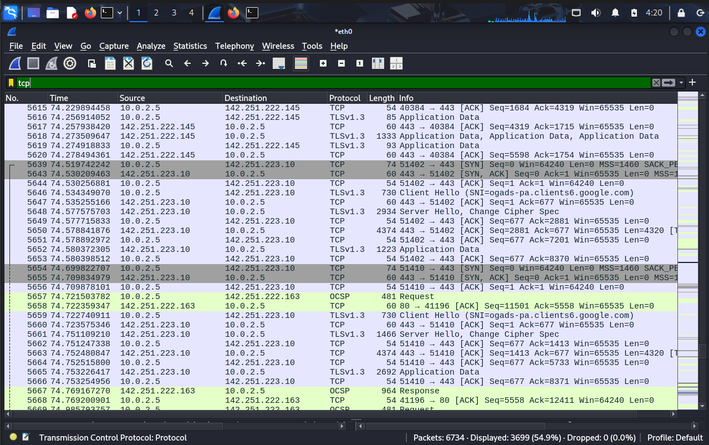

### Identify the Three-Way Handshake

Locate the following sequence of packets:

Step 1: SYN
The client initiates the connection by sending a SYN packet.

`SYN`

Step 2: SYN-ACK
The server acknowledges the request and indicates that it is ready to communicate.

`SYN ACK`

Step 3: ACK
The client acknowledges the server's response.

`ACK`

At this point, the TCP connection has been established and data transfer can begin.

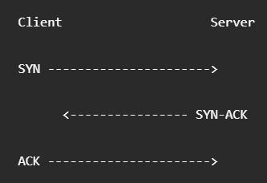

### Understanding the Process

The TCP handshake ensures:

- Both devices are reachable
- Communication parameters are synchronized
- Reliable communication can occur
- Both endpoints are prepared to exchange data

### Attacker Scenario

One common attack against TCP services is a SYN Flood attack.

In a SYN Flood:

1. The attacker sends a large number of SYN packets.
2. The attacker never completes the handshake.
3. The server allocates resources for each half-open connection.
4. Eventually the server becomes overwhelmed and legitimate users may be unable to connect.

This is a classic Denial-of-Service (DoS) attack.

### Discussion Questions

??? question "Why is the TCP handshake important?"

    The handshake ensures that both devices are reachable and ready to communicate before data transfer begins.

??? question "What happens during a SYN Flood attack?"

    An attacker sends large numbers of SYN packets without completing the handshake, causing the server to waste resources on incomplete connections.

??? question "Why is TCP considered a reliable protocol?"

    TCP verifies delivery, retransmits lost packets, and establishes connections before exchanging data.

---

## Milestone 5: HTTP vs HTTPS Analysis

### Objective

Compare unencrypted HTTP traffic with encrypted HTTPS traffic and understand how encryption protects sensitive information.

Many cyber attacks rely on intercepting network traffic. Understanding the difference between HTTP and HTTPS is fundamental for both defenders and attackers.

### Analyze HTTP Traffic

1. Open the following website:

http://neverssl.com

2. This website intentionally uses HTTP and does not redirect users to HTTPS.

3. Apply the following display filter:

`http`

4. Observe the Request

5. Select an HTTP packet and examine the packet details.

6. Observe:

- URI
- Host Header
- User-Agent
- Request Method

You should be able to read most of the information directly because HTTP traffic is transmitted in plain text.

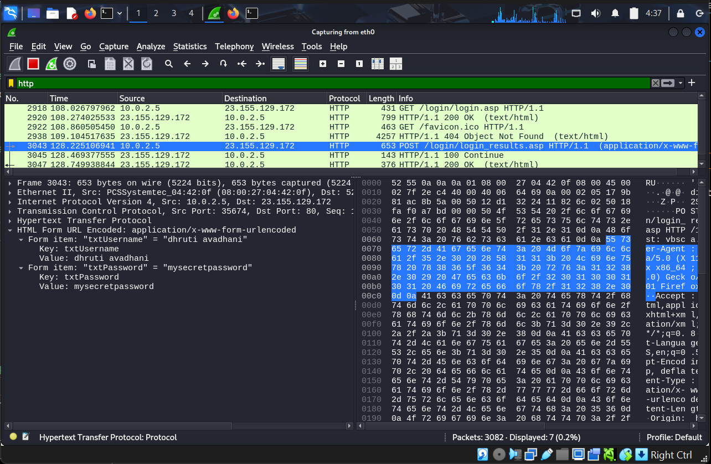

### Analyze HTTPS Traffic

1. Open:
   https://google.com

2. Filter TLS Traffic
   Apply the following display filter:

`tls`

You should now observe TLS packets rather than readable HTTP requests.

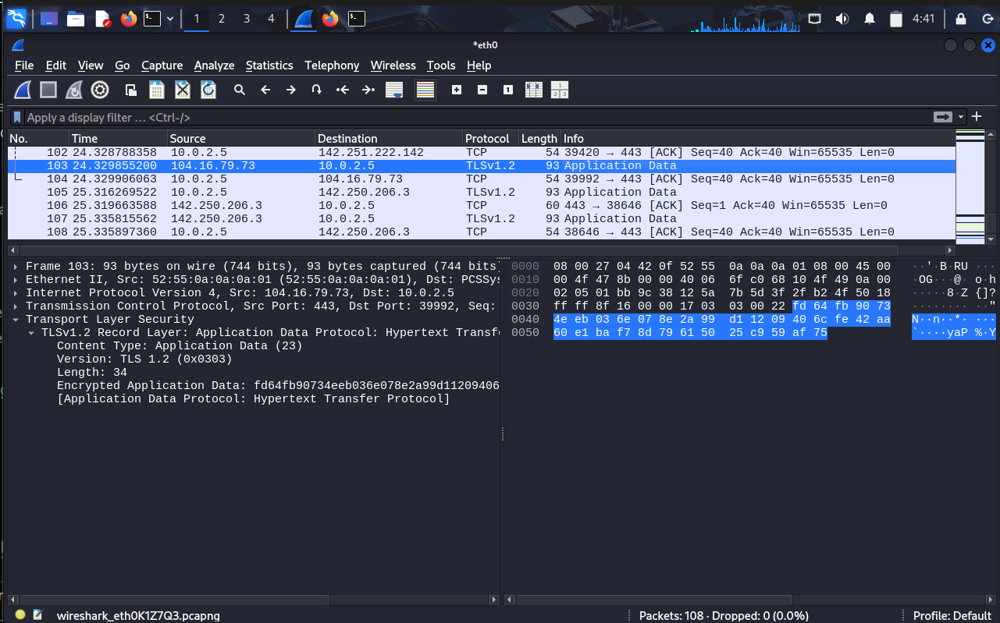

| Feature                      | HTTP                   | HTTPS                                               |
| ---------------------------- | ---------------------- | --------------------------------------------------- |
| Data Transmission            | Plain Text             | Encrypted                                           |
| Default Port                 | 80                     | 443                                                 |
| Packet Contents              | Visible in Wireshark   | Protected by Encryption                             |
| Security                     | No Encryption          | TLS Encryption                                      |
| Confidentiality              | Low                    | High                                                |
| Susceptible to Eavesdropping | Yes                    | No (without decryption)                             |
| Common Usage                 | Non-sensitive websites | Secure websites, banking, e-commerce, login portals |

Notice that the HTTP request contents are readable, while the HTTPS payload is encrypted and cannot be easily viewed.

### Understanding TLS

TLS (Transport Layer Security) encrypts data exchanged between the client and server.

This helps protect:

- Usernames
- Passwords
- Session Cookies
- Personal Information
- Financial Data

### SOC Analyst Perspective

When investigating network traffic, analysts can often view the full contents of HTTP communications. However, HTTPS traffic is encrypted, meaning analysts typically rely on metadata, certificates, logs, and endpoint telemetry during investigations.

### Discussion Questions

??? question "Why is HTTPS considered more secure than HTTP?"

    HTTPS encrypts data using TLS, making it difficult for attackers to read or modify information while it is being transmitted.

??? question "Can an attacker still observe anything when HTTPS is used?"

    Yes. Although the contents are encrypted, attackers can still see metadata such as IP addresses, connection timings, and certain TLS-related information.

??? question "Why do modern browsers mark HTTP websites as insecure?"

    HTTP traffic is transmitted in plain text and can be intercepted or modified by attackers, making it unsuitable for transmitting sensitive information.

---

# Module 2.0: Firewall Fundamentals using GUFW (60 Minutes)

> Lab Type: Firewall Configuration and Traffic Filtering
>
> Tool: GUFW (Graphical Uncomplicated Firewall)
>
> Duration: 60 Minutes
>
> System: Kali Linux (Ubuntu/Debian compatible)

---

## Scenario

You are a Security Analyst at a growing startup. The organization has asked you to enforce a basic firewall policy on all workstations. The policy requires that:

- Web browsing must be permitted.
- Legacy and insecure services must be blocked.
- Specific ports must be explicitly allowed or denied.

In this module, you will configure GUFW to implement these policies and observe the impact on network traffic using Wireshark.

---

## Milestone 6: Launching and Enabling GUFW

### Objective

Install and enable the GUFW firewall on Kali Linux, and understand the concept of default deny policies.

### Install GUFW

If GUFW is not already installed, run the following command in a terminal:

```bash
sudo apt update && sudo apt install gufw -y
```

### Launch GUFW

```bash
sudo gufw
```

The GUFW graphical interface will open.


### Enable the Firewall

1. Locate the **Status** toggle at the top of the window.
2. Click it to switch the firewall **ON**.
3. The status indicator should turn green.

### Configure Default Policies

Set the following default policies using the dropdown menus:

- **Incoming: Deny**
- **Outgoing: Allow**

!!! warning "Why Default Deny?"
    Setting incoming traffic to **Deny** by default means no unsolicited inbound connections are permitted unless explicitly allowed. This follows the **Principle of Least Privilege** — only what is necessary is permitted. Everything else is blocked.

### Discussion Questions

??? question "What is the difference between a stateful and stateless firewall?"

    A stateful firewall tracks the state of active connections and allows return traffic for established sessions automatically. A stateless firewall evaluates each packet independently based on rules, without any knowledge of connection context. GUFW uses UFW, which sits on top of iptables and supports stateful filtering.

??? question "Why is Default Deny considered a security best practice?"

    Default Deny ensures that any traffic not explicitly permitted is blocked. This reduces the attack surface significantly because attackers cannot reach services that are not intentionally exposed, even if those services are running on the machine.

??? question "What is the Principle of Least Privilege and how does it apply to firewalls?"

    The Principle of Least Privilege means granting only the minimum access necessary to perform a task. Applied to firewalls, it means only opening ports that are absolutely required for legitimate operations, and denying everything else by default.

---

## Milestone 7: Allowing Web Traffic

### Objective

Configure GUFW rules to explicitly permit HTTP and HTTPS traffic so that normal web browsing functions correctly.

### Add Firewall Rules

1. In GUFW, click the **Rules** tab.
2. Click the **+** button at the bottom left to add a new rule.

**Rule 1 — Allow HTTP:**

| Field     | Value |
|-----------|-------|
| Policy    | Allow |
| Direction | In    |
| Protocol  | TCP   |
| Port      | 80    |

Click **Add**.

**Rule 2 — Allow HTTPS:**

| Field     | Value |
|-----------|-------|
| Policy    | Allow |
| Direction | In    |
| Protocol  | TCP   |
| Port      | 443   |

Click **Add**.

### Verify Web Access

Open Firefox and navigate to `https://www.amazon.in`. The website should load successfully, confirming that ports 80 and 443 are now permitted through the firewall.

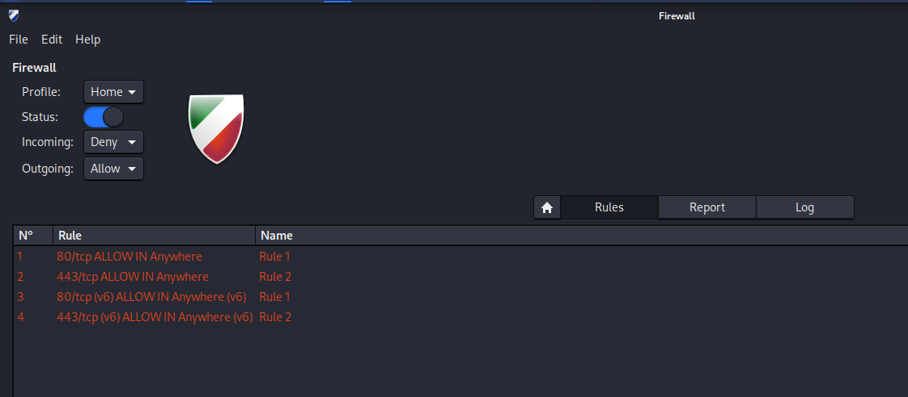

### Discussion Questions

??? question "Why do we need to allow both port 80 and port 443?"

    Port 80 is used for HTTP traffic and port 443 is used for HTTPS traffic. Even though modern websites primarily use HTTPS, some resources, redirects, and older services may still use HTTP. Allowing both ensures complete web browsing functionality.

??? question "What would happen if only port 443 was allowed and port 80 was blocked?"

    Websites that rely on HTTP or that redirect from HTTP to HTTPS might fail to load initially. The browser would receive no response on port 80, causing a timeout or connection error before the redirect to HTTPS can occur.

---

## Milestone 8: Blocking an Insecure Service (Telnet)

### Objective

Add a firewall rule to block Telnet, a legacy protocol that transmits data including credentials in plain text, and verify that the rule is working.

### Why Block Telnet?

Telnet (port 23) is an outdated remote access protocol that provides no encryption. Any credentials or commands sent over Telnet can be intercepted by an attacker on the same network. Modern environments replace Telnet with SSH (port 22), which encrypts all communication.

### Add the Block Rule

In GUFW, click **+** to add a new rule:

| Field     | Value |
|-----------|-------|
| Policy    | Deny  |
| Direction | Out   |
| Protocol  | TCP   |
| Port      | 23    |

Click **Add**.

### Verify the Block

Open a terminal and attempt to connect via Telnet:

```bash
telnet towel.blinkenlights.nl
```

The connection should fail or hang without establishing a session. Press `Ctrl+C` to cancel.


!!! info "Expected Result"
    A blocked connection may result in a "Connection refused" message, a timeout, or no output at all depending on how the firewall drops the packet. All of these outcomes confirm the rule is working.

### Discussion Questions

??? question "What is the difference between blocking a port and closing a service?"

    Closing a service means the application is not running and nothing is listening on that port. Blocking a port with a firewall means the service may still be running, but the firewall intercepts and drops packets before they reach it. Both approaches prevent access, but firewall rules provide an additional layer of control even if a service unexpectedly starts.

??? question "Why is SSH preferred over Telnet in modern environments?"

    SSH encrypts all communication between the client and the server, including credentials, commands, and responses. Telnet transmits everything in plain text, making it trivial for an attacker with network access to intercept sensitive information using a tool like Wireshark.

??? question "What other legacy protocols should typically be blocked in a secure environment?"

    Protocols such as FTP (port 21), TFTP (port 69), SNMP v1/v2 (port 161), and rlogin (port 513) are commonly blocked in secure environments because they lack encryption or have known vulnerabilities. Modern equivalents such as SFTP, HTTPS, and SNMPv3 should be used instead.

---

## Milestone 9: Observing Firewall Impact in Wireshark

### Objective

Use Wireshark to observe the difference between allowed and blocked traffic at the packet level.

### Start a Wireshark Capture

```bash
sudo wireshark
```

Select your active interface (`eth0` or `wlan0`) and start capturing. Apply the following filter:

```
tcp
```

### Test Allowed Traffic

Open Firefox and load `https://www.amazon.in`. Observe in Wireshark:

- TCP packets flow normally.
- The three-way handshake (SYN → SYN-ACK → ACK) completes successfully.
- Data is exchanged between your machine and the server.

### Test Blocked Traffic

In a terminal, attempt the Telnet connection again:

```bash
telnet towel.blinkenlights.nl
```

Observe in Wireshark:

- SYN packets may be sent but no SYN-ACK is received.
- The connection never completes.
- RST (reset) packets may appear depending on the firewall drop method.


### Mini Challenge

Without assistance, configure the following and verify each:

1. Allow HTTPS (port 443) — confirm a website loads.
2. Block Telnet (port 23) — confirm the connection fails.
3. Capture the difference in Wireshark and take a screenshot showing both outcomes.

### Discussion Questions

??? question "What is a TCP RST packet and when does it appear?"

    A TCP RST (Reset) packet is sent to abruptly terminate a TCP connection. It appears when a host receives a connection attempt for a port that is closed or actively refused. Some firewalls send RST packets when blocking traffic, while others silently drop packets without any response.

??? question "What is the difference between a firewall that drops packets and one that rejects them?"

    A firewall configured to **drop** packets silently discards them without sending any response. The sender receives a timeout. A firewall configured to **reject** packets sends back a TCP RST or ICMP Port Unreachable message. Drop provides less information to an attacker, while reject gives faster feedback to legitimate users.

---

# Module 3.0: VPN Fundamentals using OpenVPN (60 Minutes)

> Lab Type: VPN Configuration and Encrypted Tunnel Analysis
>
> Tool: OpenVPN
>
> Duration: 60 Minutes
>
> System: Kali Linux (Ubuntu/Debian compatible)

---

## Scenario

Employees at the startup are working remotely and need secure, encrypted access to company resources over the public internet. You have been asked to set up and verify a VPN connection and demonstrate the difference in network traffic visibility before and after the VPN is established.

---

## Milestone 10: Preparing for VPN — Baseline Observation

### Objective

Record your current public IP address and observe DNS traffic in plain text before any VPN is active. This creates a baseline for comparison after the VPN is connected.

### Check Your Public IP Address

Open a terminal and run:

```bash
curl ifconfig.me
```

Note the IP address returned. This is your real public IP assigned by your Internet Service Provider.


### Observe DNS Traffic Before VPN

Start a Wireshark capture on your active interface. Apply the filter:

```
dns
```

Open Firefox and visit the following sites one by one:

- `https://www.amazon.in`
- `https://www.google.com`
- `https://www.youtube.com`

Observe in Wireshark:

- DNS Query packets are visible in plain text.
- The domain names you are resolving are fully readable.
- The destination DNS server IP is visible.
- Anyone monitoring this network can see exactly which websites you are about to visit.

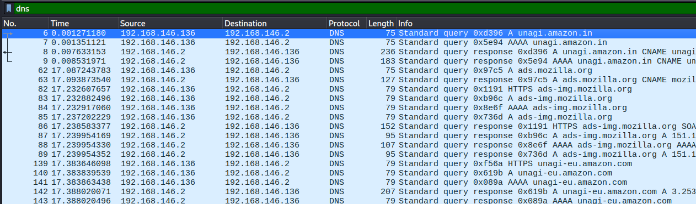

### Discussion Questions

??? question "What information can an attacker or ISP see from unencrypted DNS traffic?"

    Without a VPN, DNS queries are transmitted in plain text. An attacker or ISP can see every domain name you resolve, which reveals the websites you are visiting, the services you are using, and potentially sensitive information about your activity — even if the website itself uses HTTPS.

??? question "Why does using HTTPS not fully protect your privacy without a VPN?"

    HTTPS encrypts the content of your communication with a website, but DNS queries used to resolve the website's domain name are typically sent in plain text. An observer on the network can still see which domains you are connecting to, even though they cannot read the actual content of the HTTPS session.

---

## Milestone 11: Obtaining and Connecting to OpenVPN

### Objective

Obtain a VPN configuration profile and establish an encrypted VPN tunnel using OpenVPN.

### Obtain a Free VPN Profile

For this lab, use a free VPN profile from VPNBook:

1. Open Firefox and go to `https://www.vpnbook.com`
2. Scroll down to the **Free VPN** section.
3. Download any available `.zip` bundle (for example, Euro1 or US).
4. Note the **username** and **password** displayed on that page.
5. Extract the zip file to get the `.ovpn` configuration files.

```bash
cd ~/Downloads
unzip vpnbook-*.zip
```

!!! tip "Which .ovpn file to use?"
    Use a TCP-based profile (filename contains `tcp`) if UDP is blocked on your network. For example: `vpnbook-euro1-tcp443.ovpn`

### Connect to the VPN

```bash
cd ~/Downloads
sudo openvpn vpnbook-euro1-tcp443.ovpn
```

When prompted, enter the VPNBook credentials. Wait until the terminal displays:

```
Initialization Sequence Completed
```


!!! warning "Keep this terminal open"
    The VPN connection is active only while this terminal is running. Do not close it. Open a new terminal for all subsequent steps.

### Discussion Questions

??? question "What is a .ovpn file and what does it contain?"

    A `.ovpn` file is an OpenVPN configuration file. It contains the VPN server address, port, protocol, encryption settings, and the certificates or keys needed to authenticate with the server. It is the complete set of instructions that OpenVPN needs to establish a tunnel.

??? question "What is the difference between a TCP and UDP OpenVPN connection?"

    OpenVPN over UDP is faster and has lower overhead, making it the preferred option when available. OpenVPN over TCP is more reliable in restrictive network environments because TCP traffic on port 443 is typically allowed through firewalls, as it resembles normal HTTPS traffic.

---

## Milestone 12: Verifying the VPN Tunnel

### Objective

Confirm that the VPN tunnel has been established by checking for the tunnel network interface and verifying that your public IP address has changed.

### Check for the Tunnel Interface

Open a new terminal and run:

```bash
ip addr
```

Look for an interface named `tun0` or `tun1` in the output. It will have an IP address assigned by the VPN server, typically in the range `10.x.x.x` or `172.x.x.x`.


The presence of a `tun` interface confirms that an active VPN tunnel exists. All traffic routed through this interface is encrypted before leaving your machine.

### Verify Your Public IP Has Changed

```bash
curl ifconfig.me
```

Compare this output to the IP address recorded in Milestone 10. It should now show the VPN server's IP instead of your real IP.

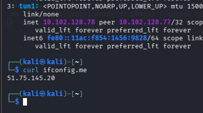

### Verify Browsing Still Works

Open Firefox and navigate to `https://www.amazon.in`. The website should load normally, confirming traffic is flowing correctly through the VPN tunnel.

### Discussion Questions

??? question "What is a tunnel interface (tun0) and how does it work?"

    A tunnel interface is a virtual network adapter created by OpenVPN. When traffic is sent through the tunnel interface, OpenVPN intercepts it, encrypts it, and forwards it to the VPN server over the physical network interface. The VPN server decrypts the traffic and forwards it to the actual destination. From the destination's perspective, the traffic appears to originate from the VPN server, not your machine.

??? question "Why does your public IP address change when connected to a VPN?"

    When connected to a VPN, your traffic exits the internet through the VPN server rather than your own router. The destination websites see the VPN server's IP address as the source of the request, not your real IP address.

??? question "Can a VPN provider see your traffic?"

    Yes. A VPN provider can see your traffic because they operate the server that decrypts your data before forwarding it to the internet. A VPN protects you from ISP surveillance and local network eavesdropping, but it shifts trust to the VPN provider.

---

## Milestone 13: Analyzing VPN Traffic in Wireshark

### Objective

Use Wireshark to observe encrypted VPN tunnel traffic and compare DNS visibility before and after the VPN is connected.

### Capture VPN Tunnel Traffic

Start a new Wireshark capture on your physical interface (`eth0` or `wlan0`). Apply the filter:

```
udp.port == 1194
```

Or if connected via TCP:

```
tcp.port == 443
```

Browse several websites while the VPN is active. Observe in Wireshark:

- All traffic flows to a **single destination IP** — the VPN server.
- The payload of each packet is **completely encrypted and unreadable**.
- The actual destination websites are no longer visible.

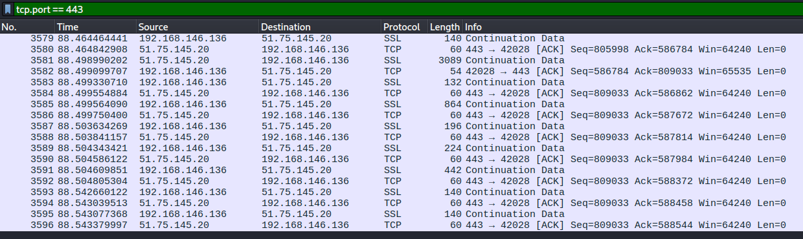

### Compare DNS Traffic After VPN

Change the filter to:

```
dns
```

Browse the same websites as Milestone 10. Observe:

- DNS queries are no longer visible in plain text.
- DNS resolution is happening inside the encrypted VPN tunnel.
- An observer on your local network can no longer see which websites you are visiting.


### Before and After VPN Comparison

| Observation | Before VPN | After VPN |
|---|---|---|
| Public IP visible to websites | Your real IP | VPN server IP |
| DNS queries in Wireshark | Fully visible in plain text | Hidden inside encrypted tunnel |
| Traffic destinations visible | Yes — multiple server IPs | No — only VPN server IP |
| Payload readable in Wireshark | Partially (HTTP) | No — fully encrypted |
| Network interface used | eth0 / wlan0 directly | tun interface → encrypted → eth0 / wlan0 |

### Discussion Questions

??? question "What are the three core security principles that a VPN provides?"

    A VPN provides **Confidentiality** by encrypting traffic so it cannot be read by third parties, **Integrity** by using cryptographic mechanisms to ensure traffic is not tampered with in transit, and **Authentication** by verifying the identity of the VPN server before establishing a tunnel.

??? question "If a VPN encrypts everything, why can Wireshark still see packets on the physical interface?"

    Wireshark captures packets at the network adapter level. The encrypted VPN packets are visible because they still travel over the physical network — the encryption has already been applied by OpenVPN before the packets leave the machine. Wireshark can see the encrypted packets but cannot read their contents.

??? question "What is split tunneling and when would an organization use it?"

    Split tunneling is a VPN feature that routes only specific traffic through the encrypted tunnel while sending other traffic directly to the internet. An organization might use it to ensure internal resources are accessed securely while reducing bandwidth load on the VPN server for general browsing.

---

# Capstone Investigation Challenge (20 Minutes)

## Scenario

A user reports: *"I cannot access any websites after enabling the firewall and connecting to the VPN."*

As a SOC analyst, your task is to diagnose the issue using the tools covered in this lab.

## Step 1 — Diagnose with Wireshark

Start a capture and apply these filters one at a time:

```
dns
```

Are DNS queries getting responses? If not, DNS may be blocked.

```
tcp
```

Are TCP connections completing? Or are they being reset?

```
openvpn
```

Is VPN traffic flowing? If nothing appears, the VPN is not connected.

## Step 2 — Review Firewall Rules

```bash
sudo ufw status verbose
```

Verify these ports are permitted:

| Port | Protocol | Purpose |
|------|----------|---------|
| 80   | TCP      | HTTP web traffic |
| 443  | TCP      | HTTPS web traffic |
| 1194 | UDP      | OpenVPN (UDP profile) |
| 53   | UDP      | DNS resolution |

If missing, add via terminal:

```bash
sudo ufw allow out 1194/udp
sudo ufw allow out 53/udp
```

## Step 3 — Verify the VPN Tunnel

```bash
ip addr | grep tun
```

If no `tun` interface appears, reconnect:

```bash
cd ~/Downloads
sudo openvpn your-profile.ovpn
```

## Step 4 — Restore Connectivity

- Missing firewall rule → add it in GUFW
- VPN dropped → reconnect with OpenVPN command
- DNS broken → test with `nslookup google.com`, ensure port 53 outbound is allowed
- Retest by loading a website in Firefox

---

## Expected Deliverables

| # | Deliverable | How to Obtain |
|---|---|---|
| 1 | Screenshot of DNS packet capture | Wireshark filter `dns` during browsing |
| 2 | Screenshot of TCP three-way handshake | Wireshark filter `tcp.flags.syn == 1` |
| 3 | Screenshot of GUFW rules window | Rules tab inside GUFW |
| 4 | Screenshot of tunnel interface | `ip addr` output showing tun0 or tun1 |
| 5 | Screenshot of OpenVPN connection | Terminal showing "Initialization Sequence Completed" |
| 6 | Written comparison of traffic before and after VPN | Based on Wireshark DNS observations in Milestones 10 and 13 |

---

## Wireshark Filter Reference

| Filter | Purpose |
|--------|---------|
| `icmp` | ICMP ping traffic |
| `dns` | DNS queries and responses |
| `tcp` | All TCP traffic |
| `http` | Plain HTTP traffic (readable) |
| `tls` | Encrypted HTTPS traffic |
| `udp.port == 1194` | OpenVPN tunnel traffic (UDP) |
| `tcp.port == 443` | OpenVPN tunnel traffic (TCP) or HTTPS |
| `tcp.flags.syn == 1` | TCP handshake SYN packets |
| `ip.addr == x.x.x.x` | Traffic to or from a specific IP address |
| `tcp.port == 80` | HTTP port traffic |
