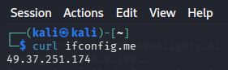
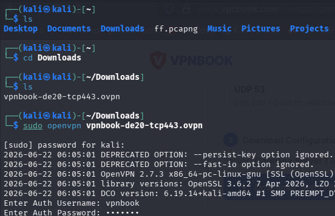
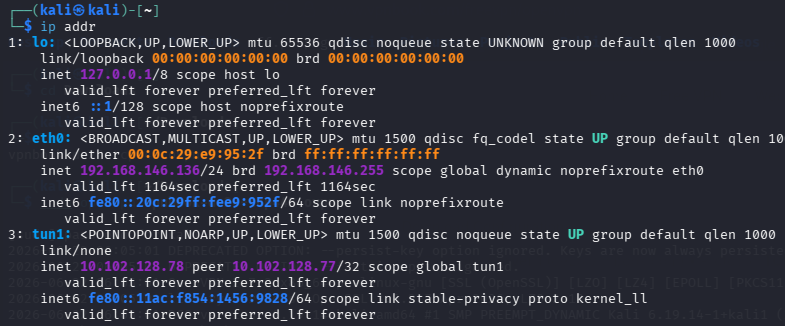
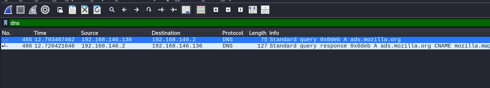

# VPN Fundamentals using OpenVPN (60 Minutes)

> Lab Type: VPN Configuration and Encrypted Tunnel Analysis  
> Tool: OpenVPN  
> Duration: 60 Minutes  
> System: Kali Linux (Ubuntu/Debian compatible)

---

## Lab Overview

Employees at the startup are working remotely and need secure, encrypted access to company resources over the public internet. You have been asked to set up and verify a VPN connection and demonstrate the difference in network traffic visibility before and after the VPN has been established.

---

## Learning Objectives

By the end of this lab you will be able to:

- Explain how a VPN creates an encrypted tunnel over a public network
- Record a baseline of DNS and IP traffic before a VPN is active
- Connect to an OpenVPN server using a `.ovpn` configuration profile
- Verify VPN connectivity by confirming a changed public IP address
- Compare network traffic in Wireshark before and after VPN activation
- Configure GUFW firewall rules to allow VPN traffic through

---

## Preparing for VPN — Baseline Observation

### Objective

Record your current public IP address and observe DNS traffic in plain text before any VPN is active. This creates a baseline for comparison after the VPN is connected.

### Check Your Public IP Address

Open a terminal and run:

```bash
curl ifconfig.me
```

Note the IP address returned. This is your real public IP assigned by your Internet Service Provider.



### Observe DNS Traffic Before VPN

Start a Wireshark capture on your active interface. Apply the filter:

```
dns
```

Open Firefox and visit the following sites one by one:

- `https://www.amazon.in`
- `https://www.google.com`
- `https://www.youtube.com`

Observe in Wireshark:

- DNS Query packets are visible in plain text.
- The domain names you are resolving are fully readable.
- The destination DNS server IP is visible.
- Anyone monitoring this network can see exactly which websites you are about to visit.


### Discussion Questions

??? question "What information can an attacker or ISP see from unencrypted DNS traffic?"

    Without a VPN, DNS queries are transmitted in plain text. An attacker or ISP can see every domain name you resolve, which reveals the websites you are visiting, the services you are using, and potentially sensitive information about your activity — even if the website itself uses HTTPS.

??? question "Why does using HTTPS not fully protect your privacy without a VPN?"

    HTTPS encrypts the content of your communication with a website, but DNS queries used to resolve the website's domain name are typically sent in plain text. An observer on the network can still see which domains you are connecting to, even though they cannot read the actual content of the HTTPS session.

---

## Obtaining and Connecting to OpenVPN

### Objective

Obtain a VPN configuration profile and establish an encrypted VPN tunnel using OpenVPN.

### Obtain a Free VPN Profile

For this lab, use a free VPN profile from VPNBook:

1. Open Firefox and go to `https://www.vpnbook.com`
2. Scroll down to the **Free VPN** section.
3. Download any available `.zip` bundle (for example, Euro1 or US).
4. Note the **username** and **password** displayed on that page.
5. Extract the zip file to get the `.ovpn` configuration files.

```bash
cd ~/Downloads
unzip vpnbook-*.zip
```

!!! tip "Which .ovpn file to use?"
Use a TCP-based profile (filename contains `tcp`) if UDP is blocked on your network. For example: `vpnbook-euro1-tcp443.ovpn`

### Connect to the VPN

```bash
cd ~/Downloads
sudo openvpn vpnbook-euro1-tcp443.ovpn
```

When prompted, enter the VPNBook credentials. Wait until the terminal displays:

```
Initialization Sequence Completed
```



!!! warning "Keep this terminal open"
The VPN connection is active only while this terminal is running. Do not close it. Open a new terminal for all subsequent steps.

### Discussion Questions

??? question "What is a .ovpn file and what does it contain?"

    A `.ovpn` file is an OpenVPN configuration file. It contains the VPN server address, port, protocol, encryption settings, and the certificates or keys needed to authenticate with the server. It is the complete set of instructions that OpenVPN needs to establish a tunnel.

??? question "What is the difference between a TCP and UDP OpenVPN connection?"

    OpenVPN over UDP is faster and has lower overhead, making it the preferred option when available. OpenVPN over TCP is more reliable in restrictive network environments because TCP traffic on port 443 is typically allowed through firewalls, as it resembles normal HTTPS traffic.

---

## Verifying the VPN Tunnel

### Objective

Confirm that the VPN tunnel has been established by checking for the tunnel network interface and verifying that your public IP address has changed.

### Check for the Tunnel Interface

Open a new terminal and run:

```bash
ip addr
```

Look for an interface named `tun0` or `tun1` in the output. It will have an IP address assigned by the VPN server, typically in the range `10.x.x.x` or `172.x.x.x`.



The presence of a `tun` interface confirms that an active VPN tunnel exists. All traffic routed through this interface is encrypted before leaving your machine.

### Verify Your Public IP Has Changed

```bash
curl ifconfig.me
```

Compare this output to the IP address recorded in Milestone 10. It should now show the VPN server's IP instead of your real IP.


### Verify Browsing Still Works

Open Firefox and navigate to `https://www.amazon.in`. The website should load normally, confirming traffic is flowing correctly through the VPN tunnel.

### Discussion Questions

??? question "What is a tunnel interface (tun0) and how does it work?"

    A tunnel interface is a virtual network adapter created by OpenVPN. When traffic is sent through the tunnel interface, OpenVPN intercepts it, encrypts it, and forwards it to the VPN server over the physical network interface. The VPN server decrypts the traffic and forwards it to the actual destination. From the destination's perspective, the traffic appears to originate from the VPN server, not your machine.

??? question "Why does your public IP address change when connected to a VPN?"

    When connected to a VPN, your traffic exits the internet through the VPN server rather than your own router. The destination websites see the VPN server's IP address as the source of the request, not your real IP address.

??? question "Can a VPN provider see your traffic?"

    Yes. A VPN provider can see your traffic because they operate the server that decrypts your data before forwarding it to the internet. A VPN protects you from ISP surveillance and local network eavesdropping, but it shifts trust to the VPN provider.

---

## Analyzing VPN Traffic in Wireshark

### Objective

Use Wireshark to observe encrypted VPN tunnel traffic and compare DNS visibility before and after the VPN is connected.

### Capture VPN Tunnel Traffic

Start a new Wireshark capture on your physical interface (`eth0` or `wlan0`). Apply the filter:

```
udp.port == 1194
```

Or if connected via TCP:

```
tcp.port == 443
```

Browse several websites while the VPN is active. Observe in Wireshark:

- All traffic flows to a **single destination IP** — the VPN server.
- The payload of each packet is **completely encrypted and unreadable**.
- The actual destination websites are no longer visible.


### Compare DNS Traffic After VPN

Change the filter to:

```
dns
```

Browse the same websites as Milestone 10. Observe:

- DNS queries are no longer visible in plain text.
- DNS resolution is happening inside the encrypted VPN tunnel.
- An observer on your local network can no longer see which websites you are visiting.



### Before and After VPN Comparison

| Observation                   | Before VPN                  | After VPN                                |
| ----------------------------- | --------------------------- | ---------------------------------------- |
| Public IP visible to websites | Your real IP                | VPN server IP                            |
| DNS queries in Wireshark      | Fully visible in plain text | Hidden inside encrypted tunnel           |
| Traffic destinations visible  | Yes — multiple server IPs   | No — only VPN server IP                  |
| Payload readable in Wireshark | Partially (HTTP)            | No — fully encrypted                     |
| Network interface used        | eth0 / wlan0 directly       | tun interface → encrypted → eth0 / wlan0 |

### Discussion Questions

??? question "What are the three core security principles that a VPN provides?"

    A VPN provides **Confidentiality** by encrypting traffic so it cannot be read by third parties, **Integrity** by using cryptographic mechanisms to ensure traffic is not tampered with in transit, and **Authentication** by verifying the identity of the VPN server before establishing a tunnel.

??? question "If a VPN encrypts everything, why can Wireshark still see packets on the physical interface?"

    Wireshark captures packets at the network adapter level. The encrypted VPN packets are visible because they still travel over the physical network — the encryption has already been applied by OpenVPN before the packets leave the machine. Wireshark can see the encrypted packets but cannot read their contents.

??? question "What is split tunneling and when would an organization use it?"

    Split tunneling is a VPN feature that routes only specific traffic through the encrypted tunnel while sending other traffic directly to the internet. An organization might use it to ensure internal resources are accessed securely while reducing bandwidth load on the VPN server for general browsing.

---

# Capstone Investigation Challenge (20 Minutes)

## Scenario

A user reports: _"I cannot access any websites after enabling the firewall and connecting to the VPN."_

As a SOC analyst, your task is to diagnose the issue using the tools covered in this lab.

## Step 1 — Diagnose with Wireshark

Start a capture and apply these filters one at a time:

```
dns
```

Are DNS queries getting responses? If not, DNS may be blocked.

```
tcp
```

Are TCP connections completing? Or are they being reset?

```
openvpn
```

Is VPN traffic flowing? If nothing appears, the VPN is not connected.

## Step 2 — Review Firewall Rules

```bash
sudo ufw status verbose
```

Verify these ports are permitted:

| Port | Protocol | Purpose               |
| ---- | -------- | --------------------- |
| 80   | TCP      | HTTP web traffic      |
| 443  | TCP      | HTTPS web traffic     |
| 1194 | UDP      | OpenVPN (UDP profile) |
| 53   | UDP      | DNS resolution        |

If missing, add via terminal:

```bash
sudo ufw allow out 1194/udp
sudo ufw allow out 53/udp
```

## Step 3 — Verify the VPN Tunnel

```bash
ip addr | grep tun
```

If no `tun` interface appears, reconnect:

```bash
cd ~/Downloads
sudo openvpn your-profile.ovpn
```

## Step 4 — Restore Connectivity

- Missing firewall rule → add it in GUFW
- VPN dropped → reconnect with OpenVPN command
- DNS broken → test with `nslookup google.com`, ensure port 53 outbound is allowed
- Retest by loading a website in Firefox

---

## Expected Deliverables

| #   | Deliverable                                        | How to Obtain                                               |
| --- | -------------------------------------------------- | ----------------------------------------------------------- |
| 1   | Screenshot of DNS packet capture                   | Wireshark filter `dns` during browsing                      |
| 2   | Screenshot of TCP three-way handshake              | Wireshark filter `tcp.flags.syn == 1`                       |
| 3   | Screenshot of GUFW rules window                    | Rules tab inside GUFW                                       |
| 4   | Screenshot of tunnel interface                     | `ip addr` output showing tun0 or tun1                       |
| 5   | Screenshot of OpenVPN connection                   | Terminal showing "Initialization Sequence Completed"        |
| 6   | Written comparison of traffic before and after VPN | Based on Wireshark DNS observations in Milestones 10 and 13 |

---

## Wireshark Filter Reference

| Filter               | Purpose                                  |
| -------------------- | ---------------------------------------- |
| `icmp`               | ICMP ping traffic                        |
| `dns`                | DNS queries and responses                |
| `tcp`                | All TCP traffic                          |
| `http`               | Plain HTTP traffic (readable)            |
| `tls`                | Encrypted HTTPS traffic                  |
| `udp.port == 1194`   | OpenVPN tunnel traffic (UDP)             |
| `tcp.port == 443`    | OpenVPN tunnel traffic (TCP) or HTTPS    |
| `tcp.flags.syn == 1` | TCP handshake SYN packets                |
| `ip.addr == x.x.x.x` | Traffic to or from a specific IP address |
| `tcp.port == 80`     | HTTP port traffic                        |

---

## Learning Outcomes

Having completed this lab, you have:

- Captured and documented DNS traffic in plain text before VPN activation as a baseline
- Obtained an OpenVPN `.ovpn` profile and established an encrypted tunnel
- Verified the VPN connection by confirming a new public IP address via `curl ifconfig.me`
- Observed that DNS queries are no longer visible in plain text after VPN activation
- Configured GUFW rules to permit OpenVPN traffic on port 1194 (UDP) and port 443 (TCP)
- Produced a written comparison of network traffic behaviour before and after the VPN
