# Zero Trust & Identity Lab

> Lab Type: Hands-on Security Implementation  
> Tool: Tailscale, Linux sudoers, journalctl  
> Framework: NIST SP 800-207 (Zero Trust Architecture)  
> System: Kali Linux (Ubuntu/Debian compatible)

---

## What This Lab Is About

Traditional network security works like a building with one front door — if you're inside, you're trusted. Once someone gets past the firewall, they can move freely through the network. This model is called **perimeter security**, and it's dangerously outdated.

**Zero Trust Architecture (ZTA)** replaces this with a simple principle: _never trust, always verify_ — regardless of where a request comes from. Every resource has its own lock. Every access request must prove who is making it, what they are allowed to do, and whether the request is legitimate.

This lab is grounded in **NIST SP 800-207** — the US government's official Zero Trust standard — and builds a real, working Zero Trust setup across three layers: network identity, micro-segmentation, and least privilege.

---

## Learning Objectives

By the end of this lab you will be able to:

- Explain the difference between perimeter security and Zero Trust Architecture
- Set up identity-based network access using Tailscale
- Write ACL rules to enforce micro-segmentation at the port level
- Apply the Principle of Least Privilege using Linux sudoers
- Use Generative AI to analyse authentication logs as a security co-pilot

---

## Tools and Prerequisites

| Requirement      | Details                                         |
| ---------------- | ----------------------------------------------- |
| OS               | Kali Linux (Ubuntu/Debian also works)           |
| Network tool     | Free [Tailscale account](https://tailscale.com) |
| Identity         | Personal GitHub or Google account               |
| Knowledge needed | Basic Linux terminal usage                      |
| Time required    | ~2 hours                                        |

!!! warning "Use a personal account"
Use a **personal** Google or GitHub account for Tailscale — not a university or corporate one. University accounts may not have admin access to the Tailscale dashboard. If you are on a university or corporate WiFi, Tailscale may be blocked — switch to a mobile hotspot if you experience connection issues.

---

## What You Will Build

| Component           | Tool            | Purpose                                            |
| ------------------- | --------------- | -------------------------------------------------- |
| Identity network    | Tailscale       | Replace IP-based access with identity-based access |
| Micro-segmentation  | Tailscale ACLs  | Restrict access to port 8080 only                  |
| Least privilege     | Linux sudoers   | Junior admin can only restart one service          |
| Security monitoring | journalctl + AI | Audit logs using an LLM                            |

---

## The Traditional vs Zero Trust Comparison

|                  | Traditional Perimeter | Zero Trust                    |
| ---------------- | --------------------- | ----------------------------- |
| Trust model      | Trust everyone inside | Trust no one by default       |
| Access control   | IP address based      | Identity based                |
| Lateral movement | Freely possible       | Blocked by micro-segmentation |
| Privilege        | Broad permissions     | Least privilege enforced      |
| Monitoring       | Perimeter logs only   | Every action logged           |

---

## Lab Architecture

```
Your Linux Machine (Kali VM)
│
├── Tailscale installed
│     └── Connected to your personal tailnet
│           └── Identity: your GitHub/Google account
│
├── Python web server
│     └── Running on port 8080
│           └── Protected by Tailscale ACL rules
│
├── junior-admin user
│     └── sudoers rule: can ONLY restart ssh service
│           └── blocked from everything else
│
└── auth logs (journalctl)
      └── Records every sudo action
            └── Analysed by Claude/ChatGPT
```

---

## Milestone 1 — Identity-Centric Connectivity

### What This Milestone Covers

In traditional networks, access is granted based on IP addresses — `192.168.1.5 is allowed in`. The problem is that IP addresses can be spoofed, shared, or reassigned. They tell you **where** a request came from, not **who** made it.

In this milestone we replace IP-based access with **identity-based access** using Tailscale. After this milestone, your machine is accessible only to authenticated users — not to anyone who simply knows an IP address.

---

### Step 1 — Update your system

Before installing anything, make sure your system is up to date:

```bash
sudo apt update
```

```bash
sudo apt upgrade -y
```

> ⏱️ This may take 5–10 minutes depending on how many updates are pending.

Expected output after `apt update`:

```
Reading package lists... Done
Building dependency tree... Done
All packages are up to date.
```

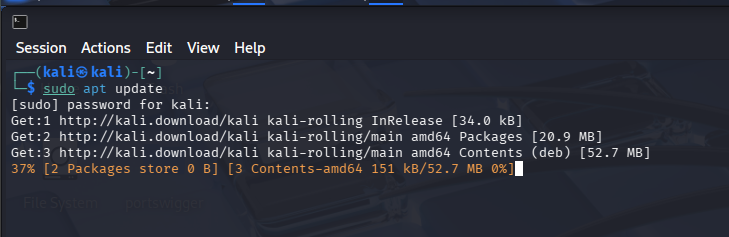

---

### Step 2 — Enable IP Forwarding

Tailscale requires IP forwarding to be enabled on your machine:

```bash
echo 'net.ipv4.ip_forward = 1' | sudo tee -a /etc/sysctl.conf
sudo sysctl -p
```

Expected output:

```
net.ipv4.ip_forward = 1
```

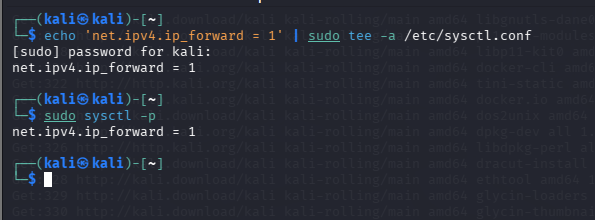

!!! info "What is IP forwarding?"
It allows your machine to forward network packets between interfaces — required for Tailscale to route traffic correctly.

---

### Step 3 — Install Tailscale

Run this single command to install Tailscale from their official repository:

```bash
curl -fsSL https://tailscale.com/install.sh | sh
```

Expected output at the end:

```
Installation complete! Log in to start using Tailscale by running:
sudo tailscale up
```

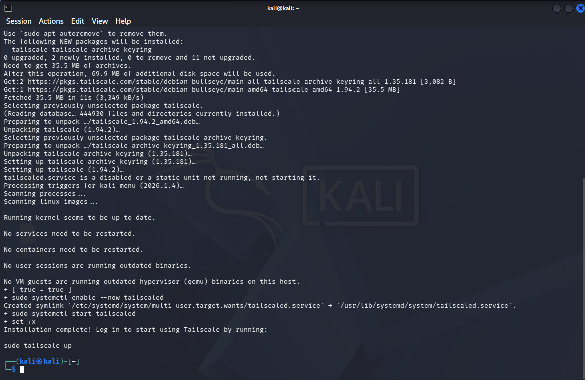

---

### Step 4 — Log in with your identity

This is the key step — connecting your machine to your personal identity:

```bash
sudo tailscale up --operator=$USER
```

Tailscale will output a URL like:

```
To authenticate, visit:
https://login.tailscale.com/a/xxxxxxxxxxxxxxx
```

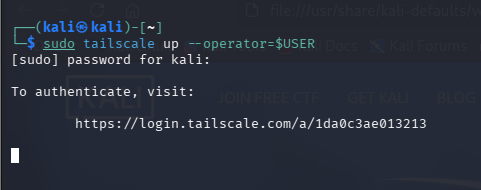

1. Copy that URL and open it in your browser
2. Click **Sign in with GitHub** or **Sign in with Google**
3. Use your **personal** account (not university)
4. Click **Connect** when prompted

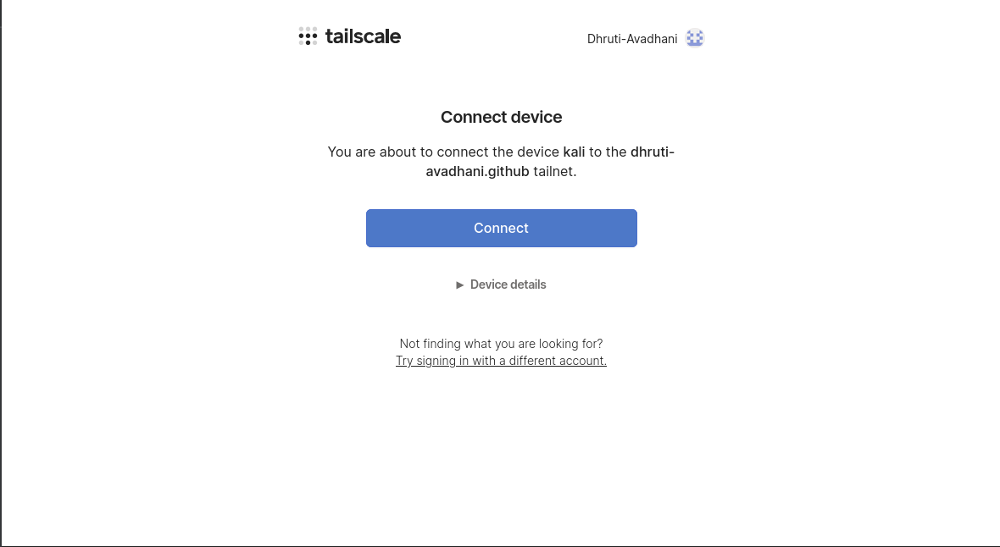

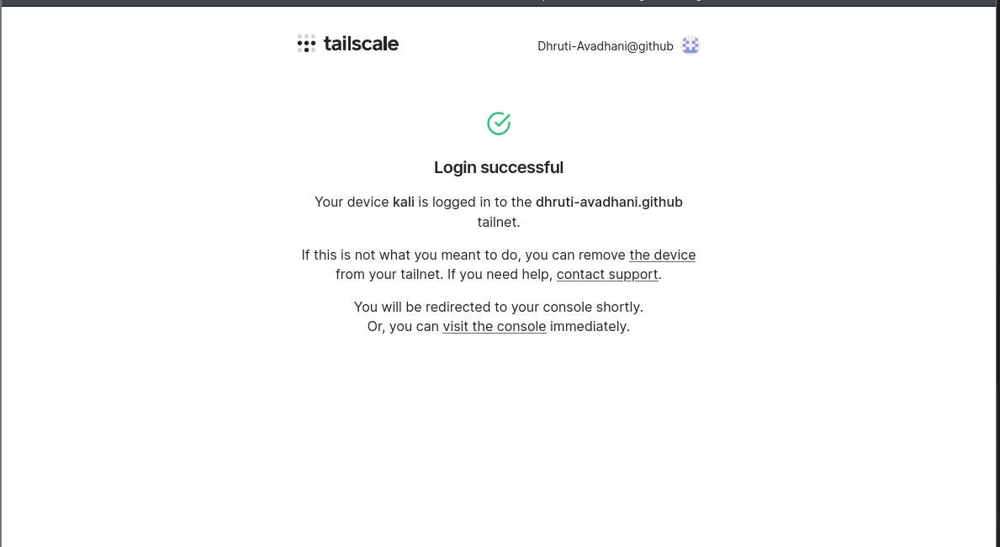

---

### Step 5 — Verify the connection

```bash
tailscale status
```

Expected output:

```
100.x.x.x    kali    yourname@gmail.com    linux    -
```

```bash
tailscale ip
```

Expected output:

```
100.x.x.x
```

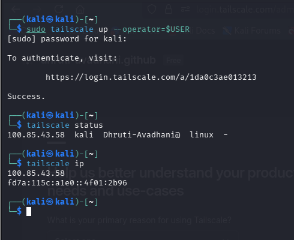

!!! info "What is the 100.x.x.x address?"
This is your Tailscale IP — a private address tied to your identity, not your physical network location. Anyone who wants to reach your machine must be authenticated on your tailnet.

---

### Step 6 — Verify the admin dashboard

Open your browser and go to:

```
https://login.tailscale.com/admin/machines
```

You should see your Kali machine listed with its Tailscale IP and your account identity next to it.

.png>)

---

### What You Just Proved

| Before                                     | After                                                |
| ------------------------------------------ | ---------------------------------------------------- |
| Machine accessible by IP address           | Machine accessible by verified identity only         |
| Anyone who knows the IP can try to connect | Only authenticated users on your tailnet can connect |
| No record of who accessed what             | Every connection tied to a named identity            |

> 🎉 **Milestone 1 Complete!** Your machine is now on an identity-based network. Access is controlled by **who you are**, not **where you are**.

---

## Milestone 2 — Micro-segmentation

### What This Milestone Covers

Being on a private network doesn't mean you should have access to everything on it. In traditional networks, once you're inside, you can reach any service on any port — this is how attackers spread through a network after the initial breach, a technique called **lateral movement**.

**Micro-segmentation** solves this by creating strict rules about which services are accessible and on which ports — even for authenticated users.

In this milestone we will spin up a real web service on port 8080, write Tailscale ACL rules that allow only port 8080, and prove that all other ports are blocked.

---

### Step 1 — Create and start a web server on port 8080

Create a simple webpage to serve:

```bash
mkdir -p ~/lab-server && echo "<h1>Zero Trust Lab - Service Running on Port 8080</h1>" > ~/lab-server/index.html
```

Navigate into the folder:

```bash
cd ~/lab-server
```

Start the web server:

```bash
python3 -m http.server 8080
```

Expected output:

```
Serving HTTP on 0.0.0.0 port 8080 (http://0.0.0.0:8080/) ...
```

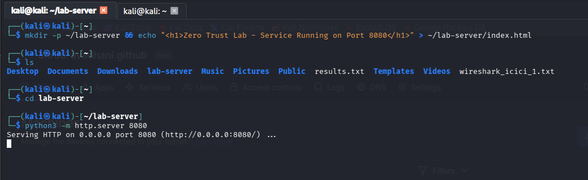

---

### Step 2 — Verify the web server works

Open your browser and visit your Tailscale IP on port 8080:

```
http://100.x.x.x:8080
```

Replace `100.x.x.x` with your actual Tailscale IP from `tailscale ip`. You should see:

```
Zero Trust Lab - Service Running on Port 8080
```

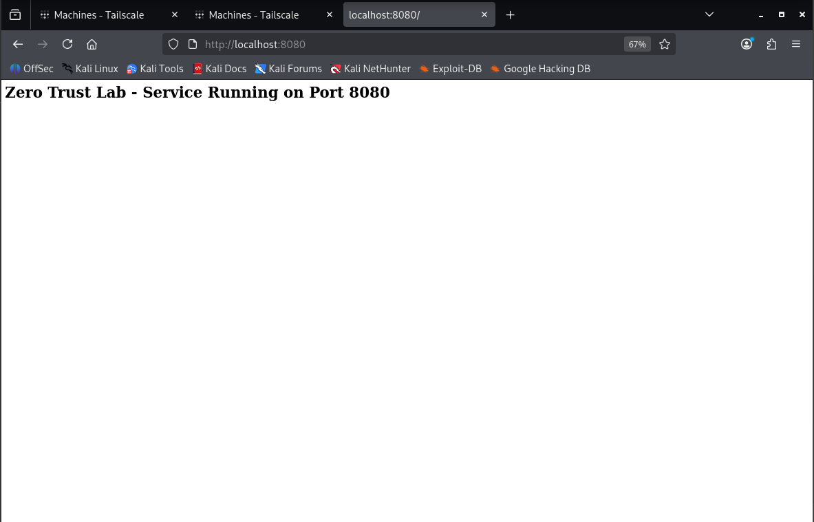

---

### Step 3 — View the default Tailscale ACL

Open your browser and go to:

```
https://login.tailscale.com/admin/acls
```

You will see the default ACL:

```json
{
  "grants": [
    {
      "src": ["*"],
      "dst": ["*"],
      "ip": ["*"]
    }
  ]
}
```

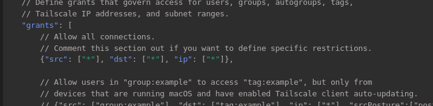

!!! warning "What this means"
Everyone can reach everything on every port. This is the equivalent of having no security at all — classic perimeter thinking.

---

### Step 4 — Write the micro-segmentation ACL

Update the ACL to allow access on port 8080 only:

```json
{
  "grants": [
    {
      "src": ["*"],
      "dst": ["*"],
      "ip": ["8080"]
    }
  ],
  "ssh": [
    {
      "action": "check",
      "src": ["autogroup:member"],
      "dst": ["autogroup:self"],
      "users": ["autogroup:nonroot", "root"]
    }
  ]
}
```

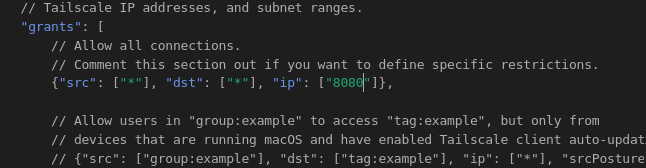

Click **Save**.

| Part             | Meaning                                    |
| ---------------- | ------------------------------------------ |
| `"src": ["*"]`   | From any authenticated user on the tailnet |
| `"dst": ["*"]`   | To any device on the tailnet               |
| `"ip": ["8080"]` | But ONLY on port 8080                      |
| Everything else  | Implicitly blocked                         |

!!! info "Key concept"
In Zero Trust, the default is **DENY**. You explicitly allow only what is needed. Everything not mentioned is automatically blocked.

---

### Step 5 — Test port 8080 is allowed

Visit your web server again via Tailscale IP:

```
http://100.x.x.x:8080
```

It should still load successfully.

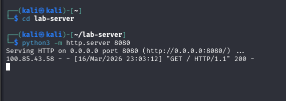

---

### Step 6 — Test other ports are blocked

Open a new terminal and run:

```bash
curl -v http://100.x.x.x:9090 --max-time 5
```

Expected output:

```
* Trying 100.x.x.x:9090...
* Connection timed out after 5001 milliseconds
* Closing connection 0
curl: (28) Connection timed out after 5000 milliseconds
```

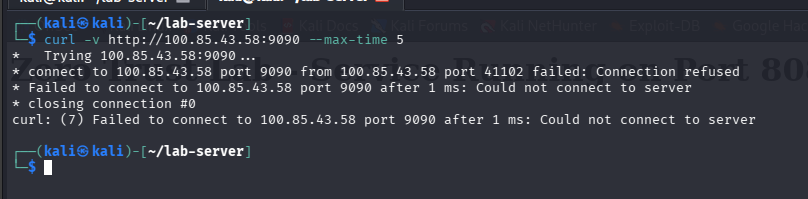

!!! info "The timeout is a success"
A timeout means the connection never went through. The ACL rule is working exactly as intended.

---

### What You Just Proved

| Port       | Result     | Reason                    |
| ---------- | ---------- | ------------------------- |
| 8080       | Accessible | Explicitly allowed in ACL |
| 9090       | Blocked    | Not in ACL, default deny  |
| All others | Blocked    | Not in ACL, default deny  |

> 🎉 **Milestone 2 Complete!** Even authenticated users on your private network can only reach the specific service you explicitly allowed. Lateral movement is now impossible.

---

## Milestone 3 — Least Privilege

### What This Milestone Covers

Even authenticated users with network access should only be able to do exactly what their job requires — nothing more. This is the **Principle of Least Privilege**.

In this milestone we will create a `junior-admin` user representing a low-privilege employee, configure a sudoers rule giving them exactly one permission, and prove they can restart the ssh service but cannot read sensitive files or install software.

---

### Step 1 — Create the junior-admin user

```bash
sudo useradd -m -s /bin/bash junior-admin
```

Set a password:

```bash
sudo passwd junior-admin
```

!!! tip ""
Use a simple password like `Junior@123` for this lab environment.

Verify the user was created:

```bash
cat /etc/passwd | grep junior-admin
```

Expected output:

```
junior-admin:x:1001:1001::/home/junior-admin:/bin/bash
```

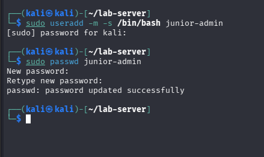

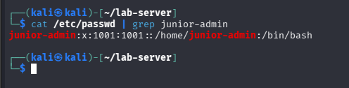

---

### Step 2 — Understand the sudoers file

The `/etc/sudoers` file controls who can run which commands as root. The syntax is:

```
username    ALL=(ALL)    NOPASSWD: /path/to/command
```

| Part               | Meaning                         |
| ------------------ | ------------------------------- |
| `username`         | Which user this rule applies to |
| `ALL=`             | On any machine                  |
| `(ALL)`            | Can run as any user             |
| `NOPASSWD:`        | Without entering a password     |
| `/path/to/command` | ONLY this specific command      |

!!! warning "Always use visudo"
Never edit `/etc/sudoers` directly with a text editor. `visudo` checks for syntax errors before saving — a syntax error in sudoers can lock you out of sudo completely.

---

### Step 3 — Add the least privilege rule

Open the sudoers file safely:

```bash
sudo visudo
```

Scroll to the very bottom and add this line:

```bash
junior-admin ALL=(ALL) NOPASSWD: /usr/sbin/service ssh restart
```

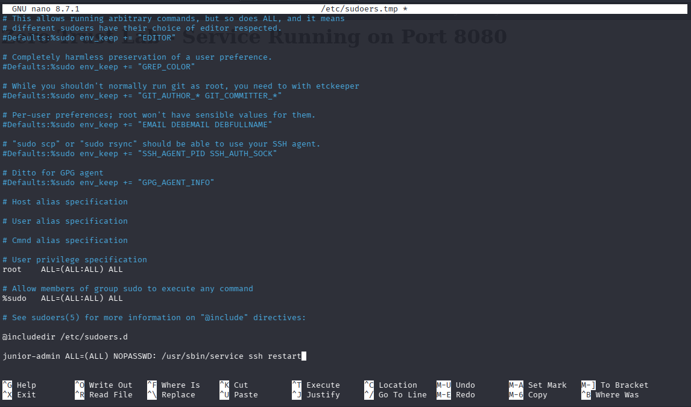

Save and exit:

- **Nano:** `Ctrl + X` → `Y` → `Enter`
- **Vim:** `Esc` → `:wq` → `Enter`

---

### Step 4 — Switch to junior-admin and test

Switch to the junior-admin user:

```bash
su - junior-admin
```

Your prompt should change to:

```
junior-admin@kali:~$
```

---

**Test 1 — junior-admin CAN restart ssh**

```bash
sudo service ssh restart && service ssh status
```

Expected output:

```
● ssh.service - OpenBSD Secure Shell server
     Loaded: loaded (/lib/systemd/system/ssh.service)
     Active: active (running) since ...
```

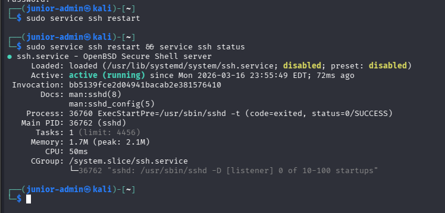

---

**Test 2 — junior-admin CANNOT read sensitive files**

```bash
sudo cat /etc/shadow
```

Expected output:

```
Sorry, user junior-admin is not allowed to execute
'/usr/bin/cat /etc/shadow' as root on kali.
```

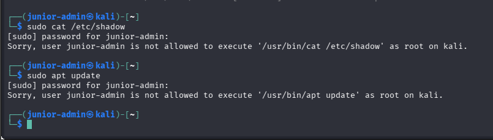

---

**Test 3 — junior-admin CANNOT install software**

```bash
sudo apt update
```

Expected output:

```
Sorry, user junior-admin is not allowed to execute
'/usr/bin/apt update' as root on kali.
```

---

### Step 5 — Switch back to your main user

```bash
exit
```

Your prompt should return to:

```
kali@kali:~$
```

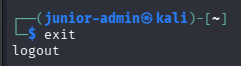

---

### What You Just Proved

| Action                     | User         | Result  | Reason                     |
| -------------------------- | ------------ | ------- | -------------------------- |
| `sudo service ssh restart` | junior-admin | Allowed | Explicitly in sudoers rule |
| `sudo cat /etc/shadow`     | junior-admin | Blocked | Not in sudoers rule        |
| `sudo apt update`          | junior-admin | Blocked | Not in sudoers rule        |

> 🎉 **Milestone 3 Complete!** A junior employee can do exactly their job — restart a service when needed — but cannot access sensitive data or make system-wide changes.

---

## Milestone 4 — GenAI as Security Co-Pilot

### What This Milestone Covers

Security analysts deal with thousands of log lines every day. Manually reading every line is slow, error-prone, and exhausting. Generative AI can act as a co-pilot — reading logs instantly, explaining what happened, and flagging suspicious activity in plain English.

In this milestone we will read the authentication logs from our lab session, paste them into Claude or ChatGPT, and ask the AI to analyse what security events occurred.

!!! info "This is a real technique"
AI doesn't replace the analyst — it speeds up the investigation so the analyst can focus on decisions, not manual log reading. This is how modern security teams work today.

---

### Step 1 — View your authentication logs

On Kali Linux, authentication events are stored in the systemd journal. Run this to see all sudo-related activity from the last hour:

```bash
sudo journalctl _COMM=sudo --since "1 hour ago"
```

You will see entries recording every sudo command that was run during your lab — including the junior-admin permission grants and denials.

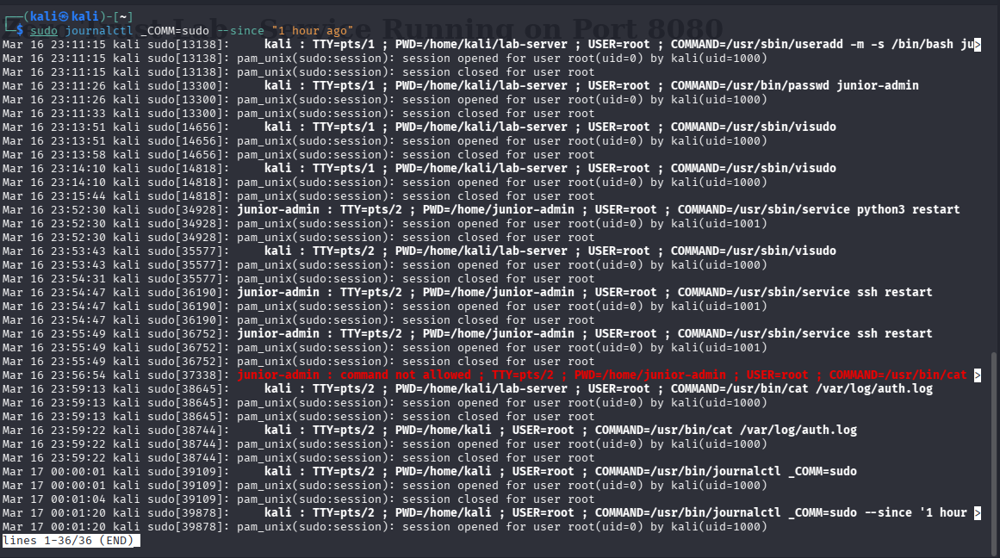

!!! info "Why no auth.log?"
Kali Linux uses `systemd-journald` instead of the traditional `auth.log` file. The `journalctl` command is the modern equivalent and contains the same information.

---

### Step 2 — Copy the log output

Run the command again and select all the output text with your mouse. Copy it.

```bash
sudo journalctl _COMM=sudo --since "1 hour ago"
```

---

### Step 3 — Open Claude or ChatGPT

Open a new browser tab and go to `https://claude.ai` or `https://chatgpt.com`.

---

### Step 4 — Paste this prompt

Copy this entire prompt, paste it into the AI chat, then paste your log lines after it:

```
You are a security analyst. I am a Junior Security Analyst
learning about Zero Trust Architecture.

Please analyse the following Linux authentication logs from
my lab session and explain:
1. What security events occurred
2. Which events show successful privilege use
3. Which events show blocked/denied access attempts
4. What this tells us about the Principle of Least Privilege
5. Are there any suspicious or concerning entries?

Here are the logs:

[PASTE YOUR LOG LINES HERE]
```

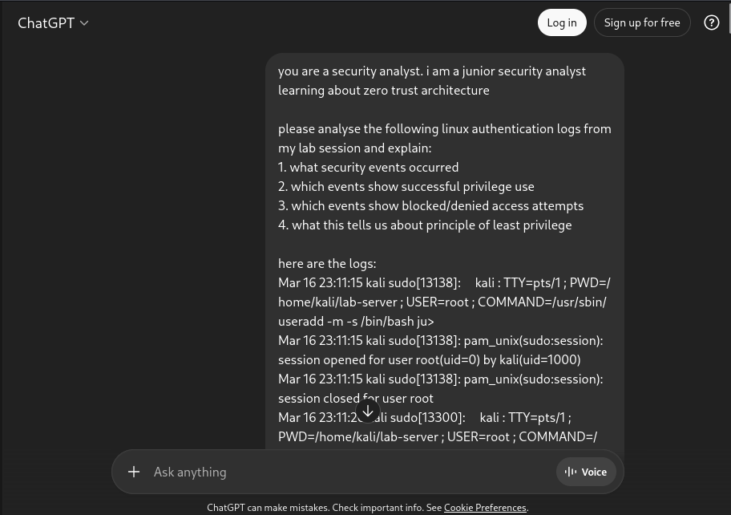

---

### Step 5 — Review the AI's response

The AI will analyse your logs and explain which commands were run with sudo, which were allowed vs denied, what the pattern tells us about access control, and any anomalies.

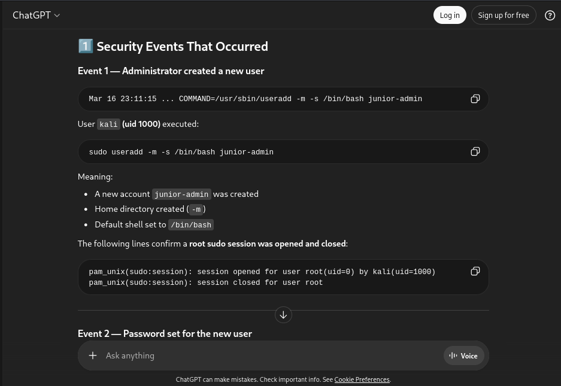

---

### What good AI log analysis looks like

| Log entry type                          | What it means                                          |
| --------------------------------------- | ------------------------------------------------------ |
| `COMMAND=/usr/sbin/service ssh restart` | junior-admin restarted ssh — allowed by sudoers        |
| `command not allowed`                   | junior-admin tried something outside their permissions |
| `sudo: pam_unix(sudo:auth)`             | A sudo authentication event occurred                   |
| `session opened for user root`          | A sudo command successfully ran as root                |
| `session closed for user root`          | The sudo session ended                                 |

---

### Using AI as a Security Co-Pilot — Best Practices

!!! tip "Be specific in your prompts"
The more context you give the AI, the better its analysis. Tell it what you were doing, what users were involved, and what you're looking for.

!!! tip "Always verify AI findings"
AI can make mistakes. Use it to speed up your analysis but always verify important findings yourself.

!!! warning "Never paste real production logs into public AI tools"
In a real company, logs may contain sensitive information. Use private/enterprise AI tools or anonymise logs before pasting.

!!! tip "Iterate on your prompts"
If the first response isn't detailed enough, ask follow-up questions like "Can you explain the denied entries in more detail?" or "What would an attacker learn from these logs?"

---

### What You Just Proved

| Traditional approach                | AI-assisted approach                      |
| ----------------------------------- | ----------------------------------------- |
| Manually read hundreds of log lines | AI reads and summarises instantly         |
| Easy to miss patterns               | AI identifies patterns across all entries |
| Time consuming                      | Results in seconds                        |
| Requires deep log expertise         | AI explains in plain English              |

> 🎉 **Milestone 4 Complete!** You have used AI as a real security tool — not just a chatbot.

---

## Trust Boundary Diagram

This diagram shows how your Zero Trust setup controls access at every layer — from network identity all the way down to individual user permissions.

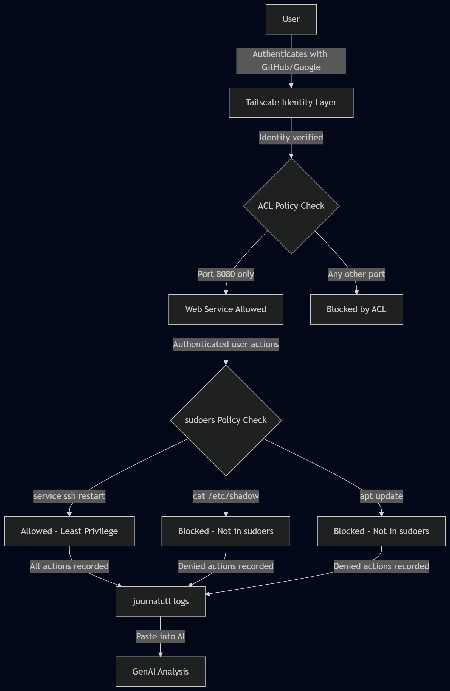

**Boundary 1 — Network layer (Tailscale)**  
No one can reach your machine without first authenticating with a verified identity. IP addresses mean nothing here.

**Boundary 2 — Service layer (ACL rules)**  
Even authenticated users can only reach port 8080. All other ports are silently blocked regardless of who is asking.

**Boundary 3 — Privilege layer (sudoers)**  
Even users with network access can only perform the specific actions their role requires. Everything else is denied.

!!! info "Defence in depth"
Multiple independent layers of security. An attacker would need to break through all three layers, not just one.

---

## Test Your Understanding

**Q1. What is the main difference between Traditional Perimeter Security and Zero Trust Architecture?**  
Traditional Perimeter Security trusts everyone inside the network — once you're past the firewall, you can reach anything. Zero Trust trusts no one by default — every access request must be verified regardless of where it comes from.

**Q2. In your Tailscale ACL, what happens to traffic on port 443 (HTTPS)?**  
It is blocked. In Zero Trust, the default is DENY. Only port 8080 was explicitly allowed in the ACL. Any port not mentioned is automatically blocked — including port 443.

**Q3. Why did we use `visudo` instead of directly editing `/etc/sudoers` with a text editor?**  
`visudo` checks the sudoers file for syntax errors before saving. A syntax error in `/etc/sudoers` can completely lock you out of sudo — meaning you cannot run any admin commands. `visudo` prevents this by validating the file first.

**Q4. What would happen if `junior-admin` tried to run `sudo reboot`?**  
It would be blocked. The sudoers rule only allows `junior-admin` to run `/usr/sbin/service ssh restart`. Any other command — including `sudo reboot` — would return "Sorry, user junior-admin is not allowed to execute this command."

**Q5. Why should you never paste real production logs into a public AI tool like ChatGPT?**  
Production logs may contain sensitive information such as usernames, IP addresses, hostnames, service names, and access patterns. Pasting these into a public AI tool means that data leaves your organisation and could be exposed in a data breach or used to train AI models. Always use enterprise AI tools or anonymise logs before analysis.

**Q6. What does the `--operator=$USER` flag do in `sudo tailscale up --operator=$USER`?**  
It grants your normal (non-root) user the ability to control Tailscale without needing `sudo` every time. Without this flag, only root can run Tailscale commands. `$USER` automatically fills in your current username.

---

## References

- [NIST SP 800-207 — Zero Trust Architecture](https://csrc.nist.gov/publications/detail/sp/800/207/final)
- [Tailscale Documentation](https://tailscale.com/kb)
- [Tailscale ACL Reference](https://tailscale.com/kb/1018/acls)
- [Linux sudoers Manual](https://www.sudo.ws/docs/man/sudoers.man/)
- [MITRE ATT&CK — Lateral Movement](https://attack.mitre.org/tactics/TA0008/)

---
