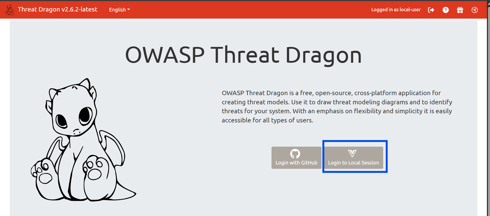
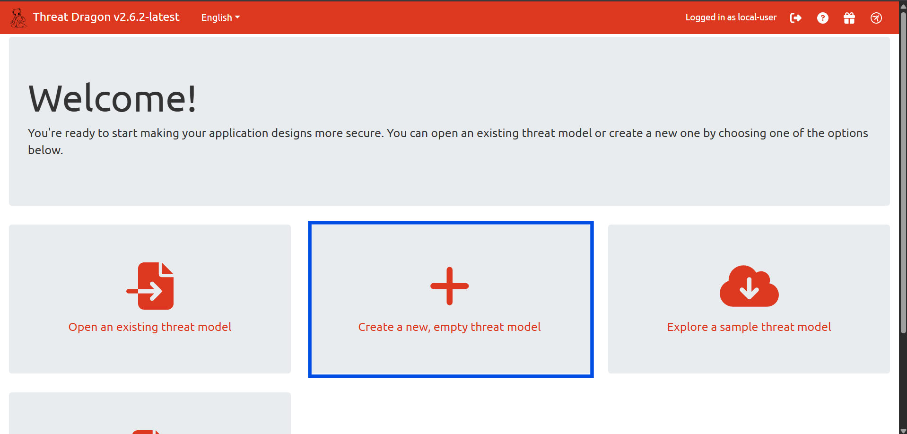

# Threat Modeling with OWASP Threat Dragon

> **Lab Type:** Hands-on Security Analysis  
> **Tool:** OWASP Threat Dragon v2.6  
> **Framework:** STRIDE  
> **System:** Hospital Management System (HMS)  
> **Author:** Karrthik Adabettu  
> **Reviewer:** Dhruti Avadhani

---

## What This Lab Is About

Hospitals store some of the most sensitive data that exists — patient diagnoses, medication histories, personal identifiers. A breach in a Hospital Management System isn't just a data leak, it can directly harm people.

This lab walks through how a security analyst thinks _before_ a system gets attacked. Instead of waiting for something to go wrong, we map out the system, figure out where the weak points are, and document how to fix them — all before a single line of production code is deployed.

The tool we use is **OWASP Threat Dragon**, a free, open-source threat modeling tool built by the Open Web Application Security Project. The methodology we follow is **STRIDE** — a six-category framework developed by Microsoft that gives us a structured checklist of the types of attacks that can happen to any system.

---

## Learning Objectives

By the end of this lab you will be able to:

- Understand what threat modeling is and why it matters in software security
- Identify the components of a system using a Data Flow Diagram (DFD)
- Apply the STRIDE framework to classify security threats
- Use OWASP Threat Dragon to document threats and mitigations
- Produce a threat model report as a security deliverable

---

## Tools and Prerequisites

| Requirement         | Details                                                                         |
| ------------------- | ------------------------------------------------------------------------------- |
| OWASP Threat Dragon | Web-based, no install needed — [threatdragon.com](https://www.threatdragon.com) |
| Browser             | Chrome or Firefox recommended                                                   |
| Knowledge needed    | None — this lab is beginner-friendly                                            |
| Time required       | ~2 to 3 hours                                                                   |

---

## Milestone 0 — Understanding the Concepts

Before touching any tool, let's get the terminology straight. Every new term here comes with a real-world analogy so it actually makes sense.

### What is Threat Modeling?

Think of it like a fire safety inspection — but for software. Before a building opens to the public, inspectors walk through every room and ask: _where could a fire start, how would it spread, and what stops it?_ Threat modeling does the exact same thing for a software system. You study it before it gets attacked, map out the weak spots, and document fixes.

### What is a Data Flow Diagram (DFD)?

A DFD is a map of how data moves through your system. Think of it like a metro map — each station is a process (something the software does), the trains are data flows (information moving around), the depots are data stores (databases), and the passengers who get on and off at the terminals are actors (the people using the system from outside).

### What is a Trust Boundary?

An invisible wall between parts of your system that have different levels of trust. The classic example: in an airport, everything past security is trusted (boarding gates, staff areas), everything before it is not. In a software DFD, the trust boundary separates the open internet (untrusted) from your internal server (trusted). Any data that crosses this wall needs to be checked.

### What is STRIDE?

STRIDE is a checklist of six attack types. For every component in your system, you ask — does each of these six apply?

| Letter | Threat Type            | Simple Definition                           | Hospital Example                                       |
| ------ | ---------------------- | ------------------------------------------- | ------------------------------------------------------ |
| **S**  | Spoofing               | Pretending to be someone you're not         | Attacker logs in using a stolen doctor's password      |
| **T**  | Tampering              | Changing data without permission            | Hacker modifies a patient's medication record          |
| **R**  | Repudiation            | Denying you did something                   | Doctor claims they never wrote a prescription          |
| **I**  | Information Disclosure | Data leaking to people who shouldn't see it | Patient records exposed over an unencrypted connection |
| **D**  | Denial of Service      | Crashing or overwhelming the system         | Attacker floods the booking system with fake requests  |
| **E**  | Elevation of Privilege | Gaining access you shouldn't have           | A patient accesses the admin panel                     |

---

## Milestone 1 — Setting Up OWASP Threat Dragon

### Step 1 — Open the tool

Go to [https://www.threatdragon.com](https://www.threatdragon.com) in Chrome or Firefox. Click **Get Started**.



### Step 2 — Select Local Session

When asked how to store your work, click **Local Session**. This means no account, no login — everything saves as a `.json` file to your computer.

!!! warning "Important"
Every time you click Save, Threat Dragon downloads an updated `.json` file. This is your save file. Don't delete it — it's proof you used the tool.



### Step 3 — Create a New Model

Click **New Model**. Fill in the form:

```
Title:       Hospital Management System – Threat Model
Owner:       Your Name
Reviewer:    Dhruti Avadhani
Description: Threat model for an HMS covering patient records,
             doctor access, appointment booking, and admin portal.
```

Click **Save**.

### Step 4 — Add a Diagram

Click **+ Add a new diagram**. Name it `HMS Data Flow Diagram`, select **STRIDE** as the type, and click Save. Then click the diagram name to open the canvas editor.


---

## Milestone 2 — Defining the System Scope

Before drawing anything, you need to know what you're modeling. This is called defining the scope — it's the equivalent of deciding which floors of a building the fire inspector will check.

### The Hospital Management System

A Hospital Management System is software used by hospitals to manage patient records, doctor appointments, prescriptions, and administrative tasks. It connects multiple types of users to sensitive medical data.

### Components We Are Modeling

**Actors** — people who interact with the system from outside:

- **Patient** — books appointments, views their own records
- **Doctor** — views patient records, writes prescriptions
- **Nurse** — views records for assigned patients
- **Admin** — full system access, manages users and reports

**Processes** — actions the software performs:

- 1.0 Login / Authentication
- 2.0 View Patient Records
- 3.0 Book Appointment
- 4.0 Write Prescription
- 5.0 Admin Panel

**Data Stores** — where data is permanently saved:

- DS1: Patient Records Database
- DS2: Appointment Database
- DS3: Prescription Database
- DS4: User Credentials Database

**Trust Boundary** — one boundary enclosing all processes and data stores, labeled `Internal Server Boundary`. All actors sit outside this boundary.

### What Is Out of Scope

- Physical security of the hospital building
- Network infrastructure (routers, firewalls)
- Third-party systems like insurance APIs or lab equipment

---

## Milestone 3 — Drawing the Threat Model in Threat Dragon

This is the core of the lab. Open the canvas editor and follow these steps exactly.

### Step 1 — Place the Actors

Find the **Actor** shape in the left sidebar (rectangle with a double border). Drag four onto the canvas and label them: Patient, Doctor, Nurse, Admin. Place them on the left side.

### Step 2 — Place the Processes

Find the **Process** shape (circle or rounded rectangle). Drag five onto the center of the canvas:

```
1.0 Login / Authentication
2.0 View Patient Records
3.0 Book Appointment
4.0 Write Prescription
5.0 Admin Panel
```

### Step 3 — Place the Data Stores

Find the **Data Store** shape (two parallel horizontal lines). Drag four onto the right side:

```
DS1: Patient Records DB
DS2: Appointment DB
DS3: Prescription DB
DS4: User Credentials DB
```

### Step 4 — Draw the Arrows

Hover over any shape's edge until a small dot appears. Click and drag to the destination to draw an arrow (data flow). Label each one:

| From                   | Arrow Label          | To                     |
| ---------------------- | -------------------- | ---------------------- |
| Patient                | Username + Password  | 1.0 Login              |
| Doctor                 | Username + Password  | 1.0 Login              |
| 1.0 Login              | Verify credentials   | DS4: Credentials DB    |
| Doctor                 | Patient ID           | 2.0 View Records       |
| 2.0 View Records       | Read record          | DS1: Patient DB        |
| Patient                | Appointment request  | 3.0 Book Appointment   |
| 3.0 Book Appointment   | Save appointment     | DS2: Appointment DB    |
| Doctor                 | Prescription details | 4.0 Write Prescription |
| 4.0 Write Prescription | Store prescription   | DS3: Prescription DB   |
| Admin                  | Admin commands       | 5.0 Admin Panel        |
| 5.0 Admin Panel        | Read/Write           | DS1: Patient DB        |

### Step 5 — Draw the Trust Boundary

Find the **Trust Boundary** shape (dashed rectangle). Draw it as a large box enclosing all five processes and all four data stores. Leave all actors outside it. Label it `Internal Server Boundary`.

### The Completed Diagram


---

## Milestone 4 — Identifying Threats Using STRIDE

With the diagram drawn, click on each component and add threats via the **Threats tab** on the right panel. Click **Add Threat** and fill in the fields.

Here are all eight threats identified for this system:

### Threat Analysis Table

| ID  | STRIDE                 | Component            | Threat                                                                                      | Mitigation                                                                                   | Status    |
| --- | ---------------------- | -------------------- | ------------------------------------------------------------------------------------------- | -------------------------------------------------------------------------------------------- | --------- |
| T1  | Spoofing               | 1.0 Login            | Attacker uses stolen doctor credentials to log in and access patient records                | MFA on all logins; account lockout after 5 failed attempts; CAPTCHA                          | Mitigated |
| T2  | Tampering              | DS1: Patient DB      | Insider modifies a patient's allergy or medication record in the database                   | Audit logs on all DB writes; Role-Based Access Control; encrypt records at rest              | Mitigated |
| T3  | Repudiation            | 4.0 Prescription     | Doctor denies prescribing a medication — no audit trail exists to disprove the claim        | Immutable audit log with doctor ID, timestamp, and digital signature on every write          | Mitigated |
| T4  | Information Disclosure | 2.0 View Records     | Patient records transmitted over HTTP instead of HTTPS — readable by a network sniffer      | Enforce HTTPS (TLS 1.2+) on all connections; reject HTTP; use HSTS headers                   | Mitigated |
| T5  | Denial of Service      | 3.0 Book Appointment | Attacker sends thousands of automated booking requests, crashing the appointment system     | Rate limiting (5 requests/min per IP); CAPTCHA on the booking form; Web Application Firewall | Mitigated |
| T6  | Elevation of Privilege | 5.0 Admin Panel      | Patient manipulates a URL parameter to reach the Admin Panel and modify other users' data   | Server-side role validation on every request; never trust client-side role claims            | Mitigated |
| T7  | Information Disclosure | DS4: Credentials DB  | Database breach exposes plain-text passwords, instantly compromising all accounts           | Hash all passwords with bcrypt or Argon2; enforce minimum password complexity                | Mitigated |
| T8  | Tampering              | DS2: Appointment DB  | Staff member directly queries the database and changes appointment times, bypassing the app | Restrict direct DB access; all changes must go through the application layer only            | Mitigated |

### Threat List in Threat Dragon


---

## Milestone 5 — Using Generative AI as a Security Co-Pilot

One of the most practical skills in modern security work is knowing how to use AI tools to accelerate analysis. Here's how AI was used to support this threat model, and the exact prompts used.

### How AI Was Used

AI was not used to replace the thinking — the DFD, the scope definition, and the threat identification were all done manually in Threat Dragon. AI was used to:

- Deepen the explanation of each mitigation
- Generate beginner-friendly analogies for STRIDE categories
- Cross-check whether any threats were missed
- Summarise the findings into a report-ready format

### Prompt 1 — Threat Completeness Check

Used after completing the 8 threats to verify nothing obvious was missed.

```
I created a threat model for a Hospital Management System using OWASP
Threat Dragon and the STRIDE framework. The system has these components:

Actors: Patient, Doctor, Nurse, Admin
Processes: Login/Authentication, View Patient Records, Book Appointment,
           Write Prescription, Admin Panel
Data Stores: Patient Records DB, Appointment DB, Prescription DB,
             User Credentials DB

I identified these threats: [paste your 8 threats here]

Review my threat list. Are there any significant STRIDE threats I missed
for this type of system? List any gaps and explain why they matter.
```

**Sample AI Output:**

The AI flagged two additional considerations worth noting:

> _Session Hijacking (Information Disclosure + Spoofing overlap): If session tokens are not properly invalidated after logout, an attacker who captures a session token (via XSS or network interception) can reuse it to impersonate a logged-in doctor or admin. Mitigation: use short-lived session tokens, regenerate on login, invalidate on logout, and set the HttpOnly and Secure flags on cookies._
>
> _Insecure Direct Object Reference on Patient Records (Elevation of Privilege): If the "View Patient Records" endpoint accepts a patient ID in the URL without checking whether the logged-in user has permission to view that specific patient, any authenticated user can access any record by guessing IDs. Mitigation: enforce ownership checks server-side — confirm the requesting user has an explicit right to the specific record being requested._

Both are valid and have been noted as additional threats to address in a follow-up review cycle.

---

### Prompt 2 — Mitigation Explanation for Non-Technical Stakeholders

Used to generate plain-English explanations of technical mitigations.

```
I am writing a threat modeling lab manual for a cybersecurity internship.
I have identified this threat in a Hospital Management System:

Threat: An attacker uses a stolen doctor's password to log in and access
patient records (STRIDE category: Spoofing).

Mitigation: Multi-Factor Authentication (MFA), account lockout after 5
failed attempts, CAPTCHA.

Explain each mitigation in plain English using a real-world analogy.
The audience has no technical background. Keep it to 3-4 sentences per
mitigation, and make it conversational — not robotic.
```

**Sample AI Output:**

> _Multi-Factor Authentication is like a bank vault that needs both a key and a fingerprint to open — even if someone steals the key, they still can't get in without the fingerprint. In software terms, after you enter your password, MFA asks for a second proof (like a code sent to your phone). A stolen password alone is useless._
>
> _Account lockout is like a gym locker that jams itself after too many wrong combination attempts, forcing you to get a staff member to reset it. After 5 wrong passwords, the system locks the account and alerts the admin. Brute-force attacks — where software tries thousands of password combinations — become pointless._
>
> _CAPTCHA is the "are you a robot?" puzzle at the entrance. Automated attack scripts can try millions of passwords per second, but they can't solve a visual puzzle the way a human can. It's a simple speedbump that stops the vast majority of automated attacks._

---

### Prompt 3 — Generate a Lab Summary

```
I completed a threat modeling lab for a Hospital Management System using
OWASP Threat Dragon and the STRIDE framework. I identified 8 threats:
2 Spoofing, 2 Tampering, 1 Repudiation, 2 Information Disclosure,
1 Denial of Service, 1 Elevation of Privilege. All 8 are marked as
Mitigated with specific technical controls documented.

Write a 2-paragraph summary of findings in a lab report style.
First paragraph: what was found and the overall risk picture.
Second paragraph: recommended next steps for the development team.
Keep it direct and factual — not overly formal, not casual.
```

---

## Lab Summary

Eight threats were identified across the Hospital Management System's core components. The most critical cluster around the authentication layer and patient data access — spoofing via credential theft and privilege escalation through broken access control represent the highest-impact risks, since either one gives an attacker direct access to sensitive medical records. The information disclosure threats (unencrypted transmission, plain-text password storage) are also high priority because they're frequently exploited in healthcare breaches. All eight threats have documented mitigations ranging from MFA and HTTPS enforcement to immutable audit logging and server-side role validation.

The immediate next step for any team implementing this system is to treat the mitigations in this document as minimum requirements, not optional recommendations. Beyond that, a formal penetration test should be scheduled after the first production deployment to validate that the controls work as intended. Threat models should also be updated whenever a new feature is added — security analysis isn't a one-time exercise, it's a discipline.

---

## Test Your Understanding

**Q1. What is the difference between a Process and a Data Store in a DFD?**  
A Process is something the software _does_ — an action, like "Login" or "Book Appointment." A Data Store is somewhere data _lives_ permanently, like a database. A process handles data temporarily; a data store keeps it.

**Q2. Why are Actors placed outside the Trust Boundary?**  
Because actors are external to the system — they're users on the internet or other outside systems. The trust boundary marks where your server begins. You don't control what happens outside it, which is exactly why data crossing that boundary needs to be validated.

**Q3. What STRIDE category would you use for "a patient reads another patient's medical records"?**  
Information Disclosure (I). The data is being read by someone who shouldn't have access to it.

**Q4. Why isn't it enough to just identify threats — why do mitigations matter?**  
Identifying threats without mitigations is like a fire inspector writing a report that says "the building could catch fire" and then leaving. The mitigation is the fix — the sprinkler system, the fire exit, the alarm. Without it, the threat model is just a list of problems with no solutions.

**Q5. What does "Mitigated" status mean in Threat Dragon?**  
It means a specific control has been identified and documented that reduces or eliminates the risk from that threat. It doesn't necessarily mean the fix is already implemented — it means the fix is known and planned.

---

## References

- [OWASP Threat Dragon Official Site](https://www.threatdragon.com)
- [OWASP Threat Dragon Documentation](https://owasp.org/www-project-threat-dragon/)
- [Microsoft STRIDE Threat Modeling](https://learn.microsoft.com/en-us/azure/security/develop/threat-modeling-tool-threats)
- [OWASP Top 10 — A07: Identification and Authentication Failures](https://owasp.org/Top10/A07_2021-Identification_and_Authentication_Failures/)
- [NIST Guidelines on Healthcare Cybersecurity](https://www.nist.gov/healthcare)
