# Reconnaissance & OSINT — Part 2: Metadata Extraction & Maltego (60 Minutes)

> Lab Type: Reconnaissance / OSINT  
> Tool: ExifTool, mat2, theHarvester, Maltego CE  
> Duration: 60 Minutes  
> System: Kali Linux (attacker), public internet targets (no dedicated victim VM)

---

## Lab Overview

You have recently joined the Security Operations Center (SOC) team of a startup organization. Before any active engagement begins, your team runs passive reconnaissance to understand what an organization already exposes publicly — through document metadata and through entity relationships an OSINT tool like Maltego can surface without ever touching the target's network directly.

In this lab, you will extract hidden metadata from publicly available documents and images to fingerprint an organization's users and software stack, then use Maltego CE to build an entity relationship graph from a single domain, pivoting across DNS, mail infrastructure, and public email addresses.

---

## Learning Objectives

By the end of this lab you will be able to:

- Extract and interpret metadata from images, PDFs, and Office documents using ExifTool
- Harvest domain-linked metadata and subdomains at scale using theHarvester
- Sanitize document metadata using mat2 as a defensive control
- Detect metadata leakage that persists through image editing (thumbnail mismatch)
- Set up and operate Maltego CE, including account registration and licensing
- Build and pivot across an entity relationship graph from a domain seed
- Distinguish a genuine null/zero-result finding from a broken tool or misconfiguration

---

## Scenario

Your target for the Maltego and domain-harvesting portions of this lab is a public `.edu`/`.gov` domain — these organizations publish documents and infrastructure records that are meant to be public, which keeps this lab free of the authorization concerns that come with scanning a private company's domain without permission. For the metadata extraction demos, you will use a mix of self-created files and known-good public samples, since random internet files frequently have their metadata stripped before you ever get to inspect them.

---

## Metadata Extraction

### Objective

Extract metadata from images and documents using both automated and manual methods, and understand what each finding reveals about the target organization.

### Steps

1. Install the required tools:
   `sudo apt update && sudo apt install -y exiftool mat2 metagoofil exiv2`

   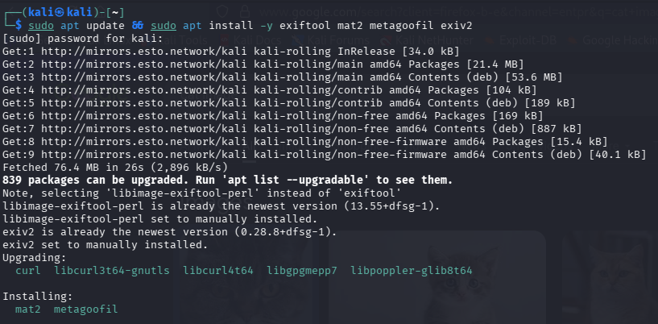

2. Extract metadata from an image:
   `exiftool sample_image.jpg`

   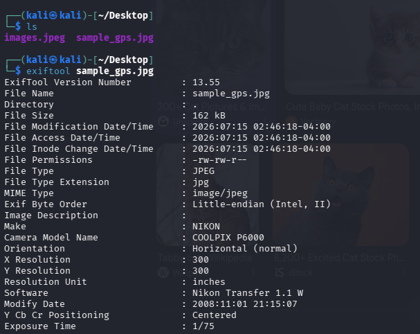

!!! warning
If you run this on a random downloaded image (Google Images, WhatsApp, a social media save), you will likely get a near-empty result — no GPS, no Make/Model, no DateTimeOriginal. This is not a tool error. Most websites and messaging apps strip EXIF metadata automatically on upload or send. Use a known-good test image instead: `wget https://raw.githubusercontent.com/ianare/exif-samples/master/jpg/gps/DSCN0010.jpg -O sample_gps.jpg` — this repo is maintained specifically for testing EXIF tools and reliably returns GPS/camera metadata.

3. Isolate GPS fields only:
   `exiftool -gpslatitude -gpslongitude -n sample_gps.jpg`

   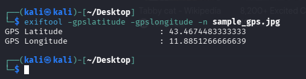

4. Extract metadata from a PDF/DOCX:
   `exiftool sample_document.pdf`

   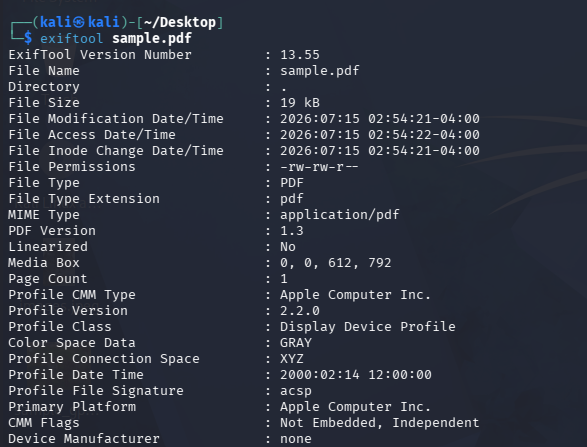

!!! warning
Same problem as image files — random internet documents are frequently re-hosted or CMS-processed, stripping the original Author/Producer fields. Either create your own file with metadata you control (LibreOffice Writer → File → Properties → set Author/Company manually, save as `.docx`, export as `.pdf`), or use a real published document from a `.gov`/`.edu` domain, which generally retains metadata. Example that worked reliably — `exiftool 341167.pdf` returned `Author: USDA FSIS`, `Producer: Adobe PDF Library 9.0`, `Creator Tool: Adobe InDesign CS4`.

5. Pull only the fields relevant to fingerprinting, instead of the full dump:
   `exiftool -Author -Creator -Producer -CreateDate 341167.pdf`

6. Run domain-based metadata harvesting:
   `mkdir -p results`
   `metagoofil -d targetdomain.edu -t pdf,doc,docx,xls,xlsx -l 50 -n 20 -o results/ -f results/report.html`

!!! warning
`metagoofil` does not create the output directory automatically — without `mkdir -p results` first, it crashes with `FileNotFoundError: [Errno 2] No such file or directory: 'results/report.html'`.

!!! warning
Even after fixing the directory issue, `metagoofil` commonly returns `0 files found` across every file type with no error message. This is a known, ongoing limitation — it scrapes Google/Bing directly, and both engines now actively block this kind of automated scraping. Do not spend time debugging this; it is not a misconfiguration on your part.

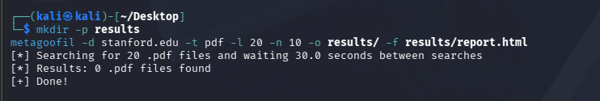

7. Use theHarvester instead — actively maintained and pre-installed on Kali:
   `theHarvester -d targetdomain.edu -b duckduckgo,crtsh -l 50`

!!! warning
Running with `-b all` hits several paid modules (SecurityScorecard, BuiltWith, Shodan) that need API keys configured in `/etc/theHarvester/api-keys.yaml`, producing `Missing API key` warnings. This is not a failure — theHarvester skips these gracefully — but `-b all` is slow (~5 minutes) and noisy. Scope the source list down instead.

!!! warning
`-b bing,duckduckgo,crtsh` returns `The following engines are not supported: {'bing'}`. In theHarvester 4.10.1+, Bing was moved to a key-required source. Drop `bing` from the list.

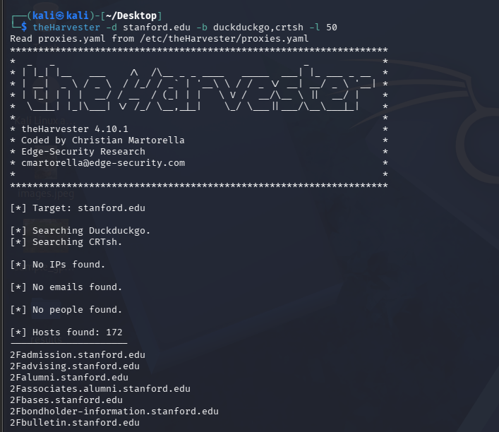

On this run, theHarvester's `crtsh` source (certificate transparency logs) returned 172 hosts with no IPs, emails, or people found — that is the expected behavior for this source, which surfaces subdomains only. Some entries may show a `2F` prefix artifact (`2Fadmission.targetdomain.edu`) — leftover URL-encoding from the scrape, cosmetic only.

8. Inspect a document's metadata before stripping it:
   `mat2 --show sample.docx`

   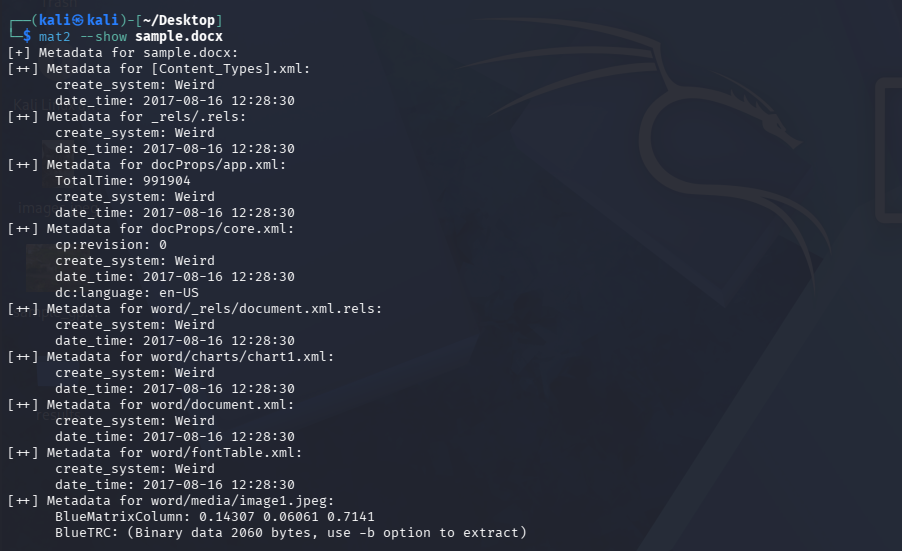

!!! warning
`mat2 --show` walks every internal component of a `.docx` (a zip archive internally), including embedded images with their own ICC color-profile metadata. The label `create_system: Weird` is not an error — it is mat2's internal label for a zip field it can't map to a known OS identifier, and appears on almost every `.docx`. Focus on the `docProps/core.xml` and `docProps/app.xml` sections for the meaningful fields.

9. Strip the metadata:
   `mat2 sample.docx`

   

!!! warning
`mat2` runs silently on success — no confirmation message is printed. It creates `<original>.cleaned.<ext>`. Verify with `ls -l sample.cleaned.docx`, or run `mat2 --show` on the cleaned file to confirm the metadata is actually gone.

10. Cross-verify with a manual Google dork instead of relying on automation alone:
    `site:*.edu filetype:pdf`

    

11. Download a result manually and extract its metadata:
    `wget "<url of a result from step 10>"`
    `exiftool -Author -Creator -Producer -CreateDate sample.pdf`

    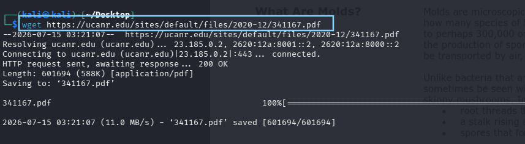
    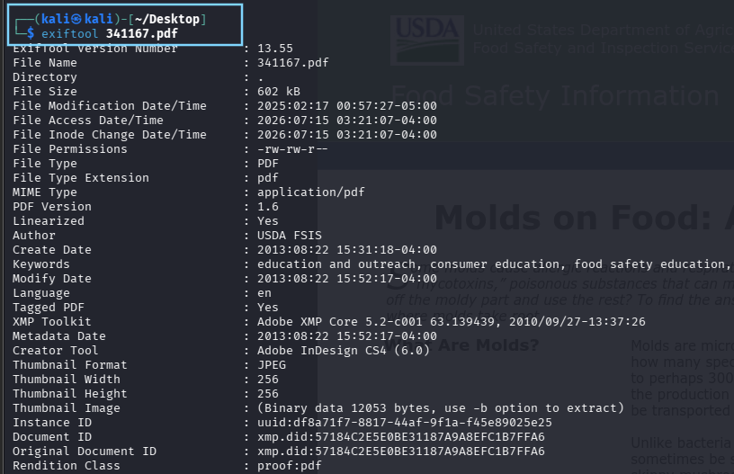

    Consistent Author/Producer fields between the automated pull and this manual dork confirm the fingerprint is reliable, not a one-off.

12. Extract an embedded thumbnail to check for thumbnail mismatch:
    `exiftool -b -ThumbnailImage sample_edited.jpg > thumbnail_out.jpg`

    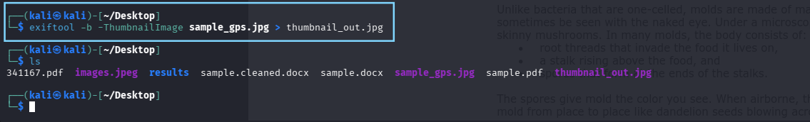

!!! warning
This only works on images that actually contain an embedded thumbnail — typically camera/phone-originated JPEGs. A random web-downloaded image will likely have no thumbnail data at all. Use a sample from the `exif-samples` repo, or a photo transferred directly from a phone without going through WhatsApp/social media, which strip this data.

13. Compare the visible image against the embedded thumbnail:
    `xdg-open sample_edited.jpg && xdg-open thumbnail_out.jpg`

    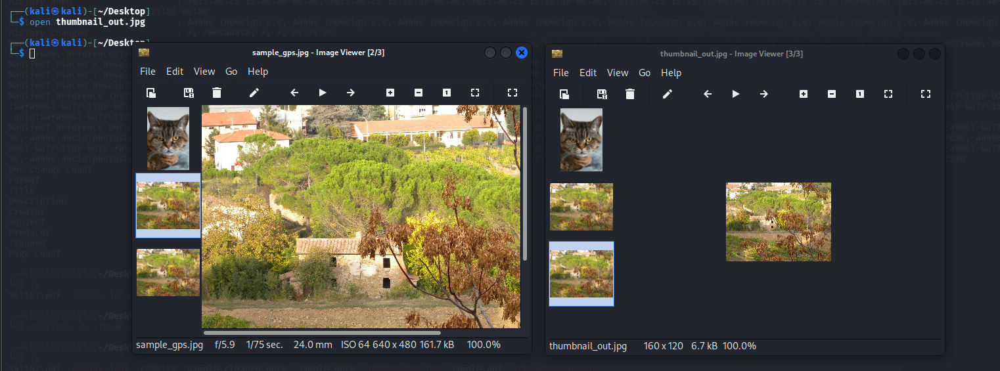

### Discussion Questions

??? question "Why does a manually created document with known metadata matter more for this lab than a random downloaded one?"

    A file with metadata you set yourself lets you verify the extraction tool is actually working correctly, since you know exactly what should appear. A random internet file gives no such ground truth — a blank result could mean the tool failed or the file simply never had metadata to begin with.

??? question "Why is theHarvester preferred over metagoofil here despite metagoofil being the more commonly referenced tool in older tutorials?"

    metagoofil scrapes Google/Bing search results directly, and both engines have clamped down on this kind of automated scraping, making it unreliable in 2026. theHarvester is actively maintained and aggregates multiple free sources (crt.sh, DuckDuckGo, etc.) that still work without API keys.

---

## Maltego OSINT

### Objective

Set up Maltego CE and build a domain-seeded entity relationship graph, pivoting from a single domain through DNS, mail infrastructure, and public email addresses.

### Steps

1. Launch Maltego:
   `maltego`

!!! warning
`maltego -version` is not a valid flag on this build and errors with `Unknown option -version` after printing a wall of JDK detection logs. This is harmless — the JDK checks confirm Java is working. Just launch normally with `maltego`.

2. Complete the first-run Configuration Wizard (10 steps). On **Login Link Options**, click **Browser Login** — this opens `identity.maltego.com` in your browser. Register a new account if needed.

!!! warning
New Maltego CE accounts require a one-time OTP sent to a real phone number as part of anti-spam verification. This is a standard part of Maltego's signup flow. If you'd rather not use a personal number, check whether your team has a shared lab account instead.

!!! warning
On the Activation / License Key screen, do not manually enter or purchase a license key. For Community Edition, the free license is auto-detected once you're logged in — click **Next**. If it keeps prompting for a key, log out and back in to refresh the session.

Click **Next** through the remaining wizard steps (data source selection, T&Cs) with defaults left as-is, then **Finish** to open the application.

3. Start a new graph and add a Domain entity: **File → New Graph**, then drag **Domain** from the Entity Palette (under **Infrastructure**) onto the canvas. Double-click it and set the value to your target domain.

   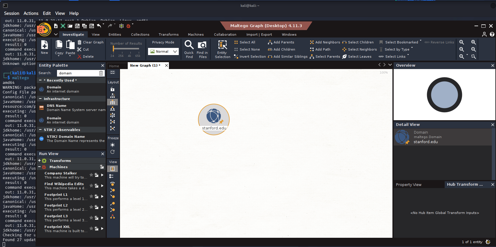

!!! warning
The interface looks overwhelming on first open. You only need three panels for this lab — the canvas, the Entity Palette (left), and the Machines panel (right, after running a machine). Ignore the transform hub prompts and tutorial windows.

4. Run the built-in footprinting machine: right-click the Domain entity → **Run Machine** → **Footprint L1**.

   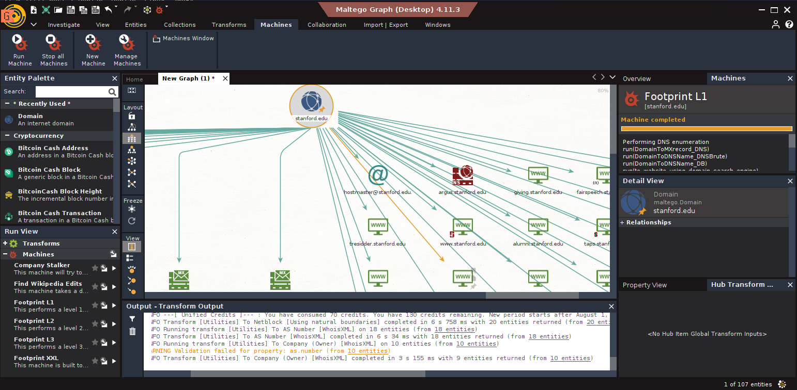

!!! warning
After running a machine you'll see a "credits consumed" message (e.g. "70 consumed, 130 remaining"). This is normal — Maltego CE gives a monthly credit allowance, and this message repeats on every subsequent transform line restating your current balance, not consuming more each time. Avoid re-running Footprint L1 repeatedly, and skip L2/L3 entirely for this lab — unnecessary and more expensive. 100+ entities from a single L1 run is a good, expected result.

5. Chain manual transforms from the Domain entity: right-click → **Transforms** → **To DNS Name - MX (mail server)**, then right-click each resulting MX entity → **To IP Address [DNS]**.

   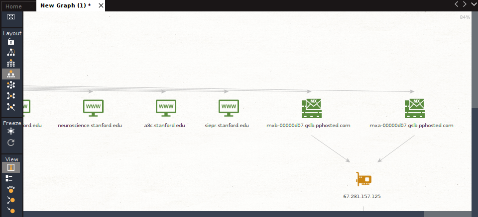

6. Search for public emails tied to the domain: right-click the Domain entity → **Transforms** → **To Email Addresses [Search Engine]**.

   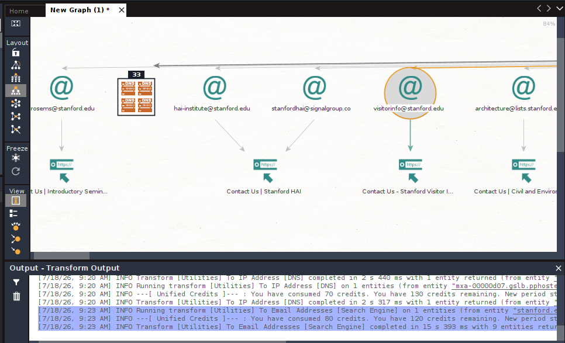

!!! warning
The canvas gets visually dense after Footprint L1 plus several transforms. Use **Ctrl+Shift+F** (Fit Graph to Screen) or switch the Layout panel to **Hierarchical** or **Block** to reorganize it into something readable.

7. Attempt person attribution on a discovered email: right-click an email entity → **Transforms** → **To Person [PGP]**.

!!! warning
Running this on a generic/departmental email (e.g. `visitorinfo@targetdomain.edu`) typically completes with no entity count — meaning zero results. This is expected, not a failure: departmental inboxes aren't tied to an individual's PGP key. University domains typically expose only role-based contact emails, making person-level attribution genuinely difficult without additional pivot sources outside this lab's scope.

8. Fit the graph to screen and export it: **Import | Export → Export → CSV / GraphML**.

   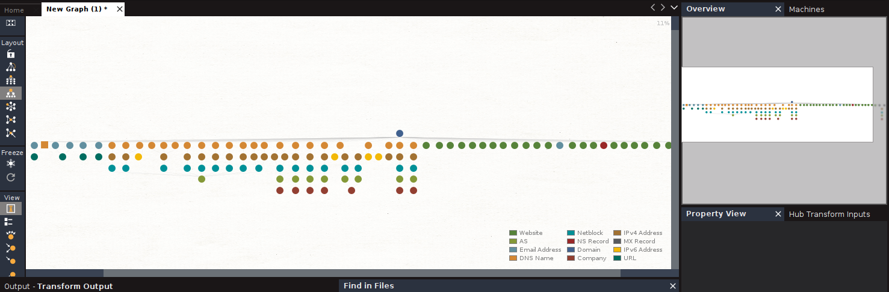
   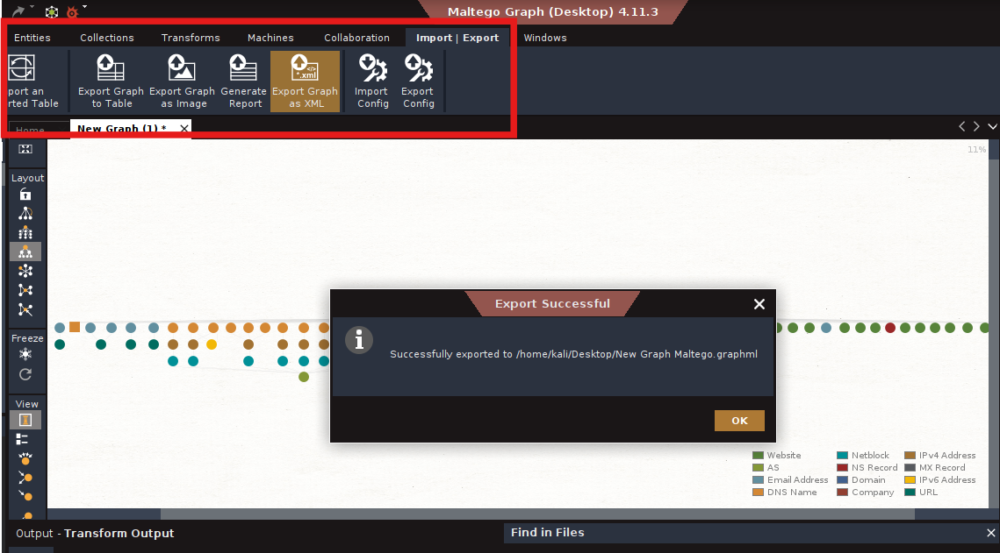

!!! warning
Attempting **To Website** directly on an Email entity (rather than a Person entity) returns `(No Transforms)`. Website/social transforms are only available on Person entities — the correct chain is Email → To Person → (only if a Person entity is returned) → To Website. If step 7 returned no Person entity, this pivot cannot proceed further for this target — document the null result rather than treating it as a dead end in your setup.

### Discussion Questions

??? question "Why does Footprint L1 alone return over 100 entities without any manual transforms?"

    Footprint L1 is a pre-built machine that chains several transforms automatically — DNS enumeration, subdomain brute-forcing, and search-engine-based discovery — in a single click, which is why it returns significantly more than any single manual transform.

??? question "Why treat a null result from To Person [PGP] as a valid finding rather than a failed step?"

    A null result here reflects something true about the target's real-world exposure — that its public-facing emails are role-based rather than individually attributable. Reporting that limitation accurately is part of an honest OSINT assessment, not a gap in the work.

---

## Learning Outcomes

Having completed this lab, you have:

- Extracted and interpreted file/document metadata using both automated (theHarvester) and manual (dork + ExifTool) methods
- Recognized when metadata is unavailable due to platform stripping versus genuine absence, and sourced suitable test files accordingly
- Detected metadata leakage that persists through image editing (thumbnail mismatch)
- Sanitized metadata as a defensive control using mat2
- Set up Maltego CE from scratch, including account verification and licensing
- Built and pivoted across a domain-seeded entity relationship graph
- Interpreted null/zero-result transforms as legitimate findings rather than errors

---

## Challenge Yourself: AI-fication

Take your metadata findings and Maltego export from this lab and feed them into an LLM of your choice (Claude, ChatGPT, or Groq `llama-3.3-70b` for a free/fast option). Experiment with prompts like:

1. **Software/infrastructure fingerprinting** — "Here is metadata extracted from documents on [target domain]: [paste your Author/Producer/Creator fields]. Based on this, what does it suggest about the software stack used internally by this organization?"

2. **Correlation across sources** — "Here is data from a Maltego OSINT scan on [target domain]: [paste your entity summary — MX records, IPs, emails found]. Cross-reference this with the document metadata above. Are there any patterns connecting the two?"

3. **Target profile draft** — "Based on all the above findings, draft a short 3-4 sentence OSINT target-profile summary as a human analyst would write it for a recon report — likely attack surface, exposure level, and recommended next steps."

!!! warning
Maltego's own transform engine and ExifTool/theHarvester should still do the actual entity discovery and extraction — the LLM's role here is interpretation and correlation after the fact, not a replacement for the tools themselves.
