# Vulnerability Scanning — Nmap Advanced Scanning & Nessus (40 Minutes)

> Lab Type: Vulnerability Scanning  
> Tool: Nmap, Nessus  
> Duration: 40 Minutes  
> System: Kali Linux (attacker), Metasploitable2 (target)

---

## Lab Overview

You have recently joined the Security Operations Center (SOC) team of a startup organization. Part of your job is running periodic vulnerability assessments against internal hosts before attackers find the same weaknesses first.

In this lab, you will perform a deep network/service scan with Nmap, then run an authenticated vulnerability scan with Nessus against the same host, and compare what each tool actually confirms as exploitable.

---

## Learning Objectives

By the end of this lab you will be able to:

- Perform advanced Nmap scans (full port range, service/version detection, OS fingerprinting)
- Use Nmap's NSE vulnerability scripts to confirm exploitable findings
- Install, license, and run an authenticated Nessus scan
- Compare automated scanner output against each other rather than trusting either blindly
- Identify which external hosts are legitimately safe to point a scanner at

---

## Scenario

Your target is a Metasploitable2 VM — an intentionally vulnerable Linux box used industry-wide for exactly this kind of practice. You will scan it from a Kali attacker VM on an isolated host-only network, so nothing you do here can reach a real production system by accident.

---

## Environment Setup

### Objective

Get both VMs talking to each other on an isolated network before scanning anything.

### Steps

1. In VMware, set **both** the Kali VM and the Metasploitable2 VM's Network Adapter to the same **Host-only** network. Never Bridged, and never mixed modes between the two VMs.

!!! warning
If one VM is set to Host-only and the other to NAT, they sit on different subnets and can't reach each other — you'll get `Network is unreachable` even though both VMs are running fine. Check **VM → Settings → Network Adapter** on both and make sure the radio button selection matches exactly.

2. Boot both VMs and note their IPs:
   `ip a`

   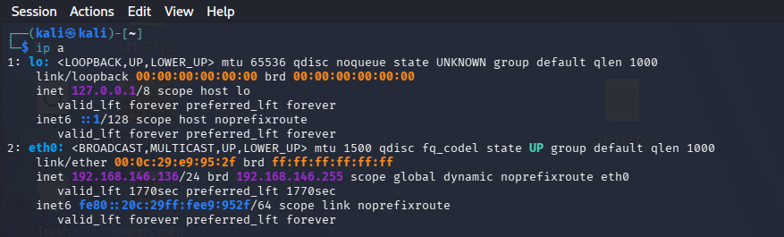
   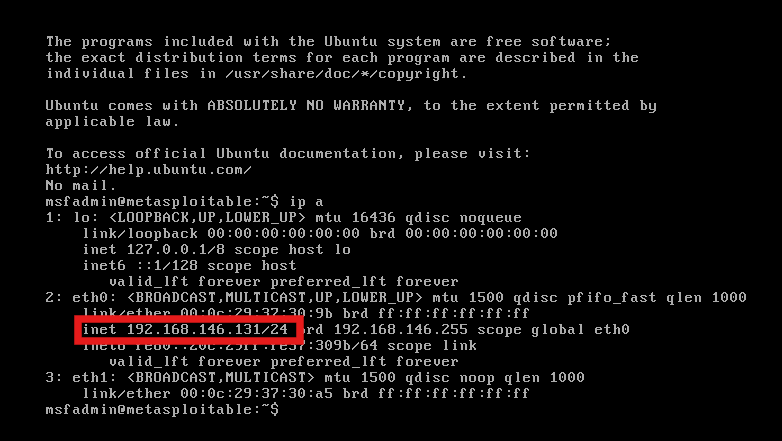

3. Confirm they can see each other from Kali:
   `ping -c 3 <target-ip>`

!!! warning
A VM rebuild (reinstalling Kali, for example) can land you on a different default Host-only subnet than before. Always re-run `ip a` on both VMs after any rebuild and use whatever IP you actually get — don't reuse an old IP from a previous session.

---

## Host Discovery and Full Port Scanning

### Objective

Confirm the target is alive, then enumerate every open port, service, and version on it.

### Steps

1. Sweep the subnet to confirm which hosts are up:
   `nmap -sn <your-subnet>/24`

   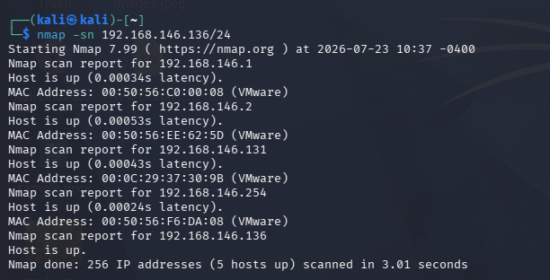

2. Run the full scan against the confirmed target IP:
   `sudo nmap -sV -sC -O -p- -T4 <target-ip>`

!!! warning
Running this without `sudo` produces repeated `Operation not permitted` errors and the scan won't complete — `-O` and raw packet crafting need root. Prefix every Nmap command in this lab with `sudo` so you don't lose a 15-minute scan halfway through.

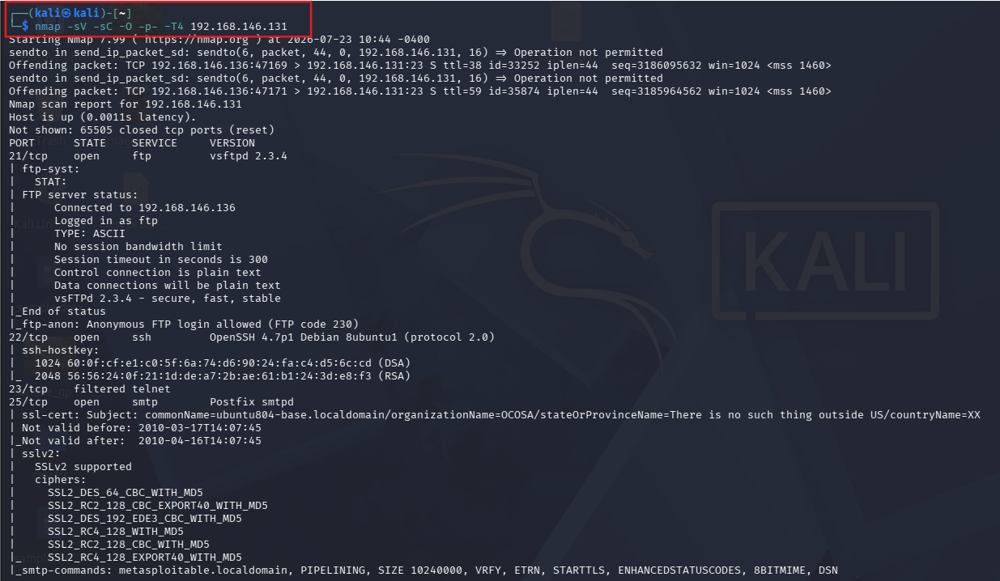

On this run, Metasploitable2 came back with a long list of intentionally vulnerable services, including `vsftpd 2.3.4` (port 21), `Samba 3.0.20-Debian` (139/445), `distccd` (3632), and `UnrealIRCd` (6667/6697) — all classic Metasploitable2 findings.

3. Two useful permutations depending on the situation:

   `sudo nmap -sS -p- -T4 <target-ip>` — SYN/"stealth" scan, faster and quieter since it never completes the TCP handshake.

   `sudo nmap -Pn -sV -sU --top-ports 20 <target-ip>` — skips host-discovery ping and scans UDP instead of TCP, useful for hosts that drop ICMP or for services like DNS/SNMP that TCP scans miss.

   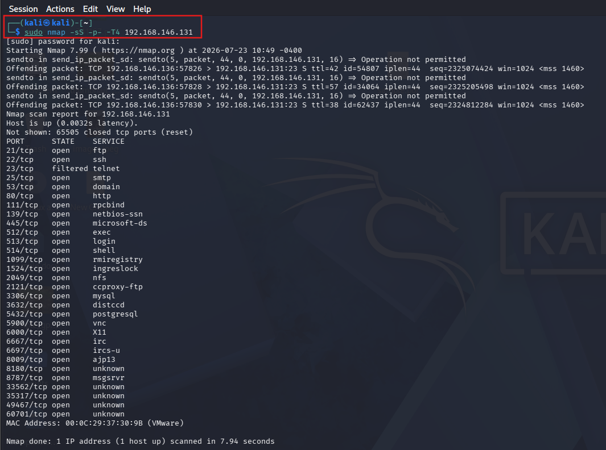

### Discussion Questions

??? question "Why does `-p-` take so much longer than a default scan?"

    The default scan only checks the top 1000 most common ports. `-p-` checks all 65,535, so it has 65x more ports to probe — the tradeoff is completeness versus time.

??? question "Why does `-O` require root privileges?"

    OS fingerprinting relies on crafting and reading raw IP/TCP packets to analyze how the target's network stack responds to unusual probes. Raw socket access is restricted to root on Linux.

---

## Nmap Vulnerability Scripts

### Objective

Move from "what's open" to "what's actually exploitable" using Nmap's NSE vuln script category.

### Steps

1. Run the vuln script set and save the output to a file, since it can be hundreds of lines long:
   `sudo nmap --script vuln <target-ip> -oN vuln_scan.txt`

2. Instead of scrolling, search the saved file directly for the findings you care about:
   `grep -n "vsftpd-backdoor\|unrealircd-backdoor\|rmi-vuln-classloader" vuln_scan.txt`

   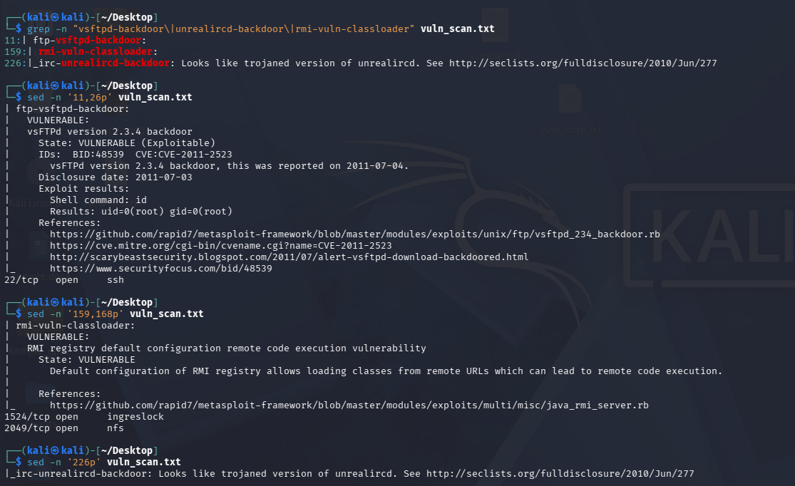

3. On this run, Nmap confirmed four exploitable findings:

| Finding                      | Port     | Evidence                                                      |
| ---------------------------- | -------- | ------------------------------------------------------------- |
| vsFTPd 2.3.4 backdoor        | 21       | Nmap ran `id` through the backdoor and got `uid=0(root)` back |
| UnrealIRCd trojaned backdoor | 6667     | Flagged as a known trojaned build                             |
| RMI registry classloader RCE | 1099     | Default config allows loading classes from remote URLs        |
| SSL POODLE / Logjam          | 25, 5432 | Weak SSLv3/export-grade cipher support                        |

### Discussion Questions

??? question "Why does the vsftpd finding matter more than a simple open-port listing?"

    Nmap didn't just detect the version — the `ftp-vsftpd-backdoor` script actually exploited the backdoor and returned command output (`id`), proving remote code execution rather than just guessing from a version banner.

??? question "Why save scan output to a file instead of reading it live?"

    Vuln scans against a target this loaded with services can produce hundreds of lines. Saving to a file lets you `grep` for specific findings instead of scrolling, and gives you a permanent record for your report.

---

## Nessus Setup and Authenticated Scanning

### Objective

Install and license Nessus, then run an authenticated scan against the same target for comparison against Nmap.

### Steps

1. Register for a free Nessus Essentials activation code and download the Debian build from `tenable.com/downloads/nessus`.

!!! warning
Nessus is not pre-installed on Kali and is not open-source — unlike Nmap, Metasploit, or Burp Community, it's Tenable's commercial product (free tier capped at 16 IPs, license required). This is a deliberate one-off exception for this specific lab.

2. Confirm the actual downloaded filename before installing:
   `ls ~/Downloads`

!!! warning
`Nessus-<version>-debian10_amd64.deb` is a placeholder pattern, not a literal filename — running it as typed fails with `command not found`. Use the exact filename `ls` shows you.

3. Install and start the service:
   `sudo dpkg -i Nessus-<actual-filename>.deb`  
   `sudo systemctl start nessusd`  
   `sudo systemctl enable nessusd`

!!! warning
If another `apt`/`dpkg` process is still running in the background, this fails with `dpkg frontend lock was locked`. Don't force-remove the lock file — check `ps aux | grep apt`, wait for it to finish or kill the stuck process, then run `sudo dpkg --configure -a` before retrying.

4. Open `https://localhost:8834`, choose **Nessus Essentials**, paste your activation code, and create an admin user.

!!! warning
Plugin downloads need internet access. If your VM is on Host-only (as set up above for scope compliance), the download fails with `Download Failed`. Temporarily switch the adapter to **NAT**, confirm connectivity (`ping -c 3 8.8.8.8`), let plugins finish downloading, then switch back to Host-only before scanning the target.

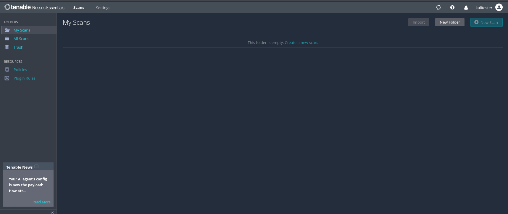

5. Back on Host-only, re-confirm the target is reachable, then create the scan: **New Scan → Basic Network Scan**, target = `<target-ip>`, Save, Launch.

   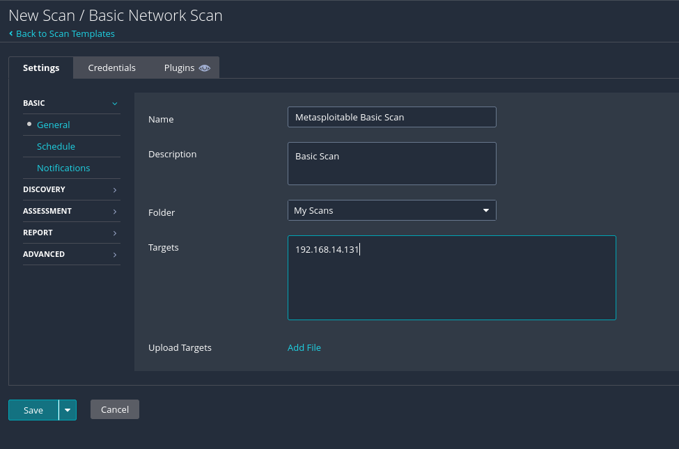
   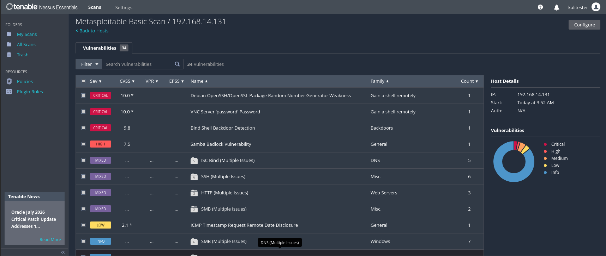

6. Review results sorted by severity, or search directly for a known term (e.g. `backdoor`) instead of scrolling a mixed list.

   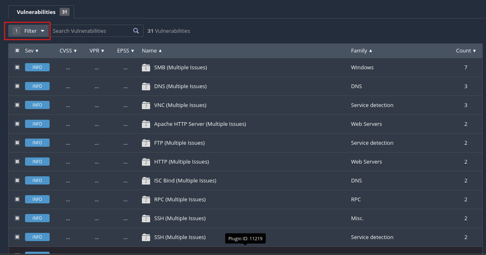

   On this run, Nessus found 31 vulnerabilities total, with one confirmed **Critical**: a Bind Shell Backdoor Detection on port 1524 — Nessus ran `id` through the same unauthenticated shell Nmap had listed as "Metasploitable root shell" and got `uid=0(root)` back.

   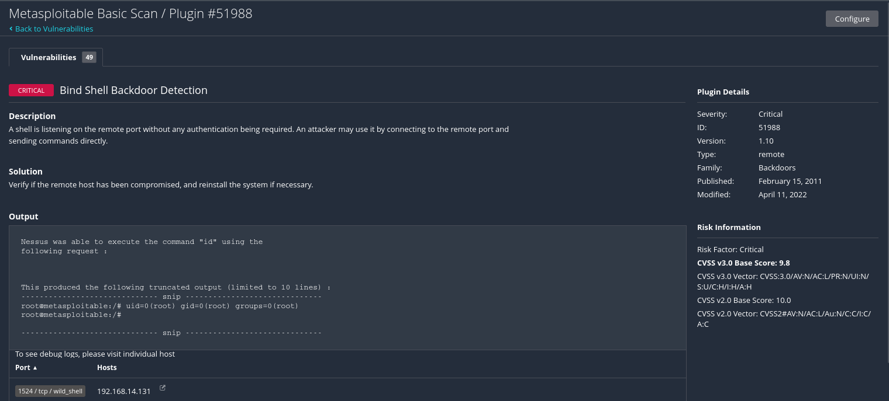

### Discussion Questions

??? question "Why is Nessus treated as an exception to using open-source, Kali-native tools?"

    Nessus fills a different role than the rest of the toolkit — authenticated, policy-driven vulnerability scanning with a maintained plugin feed — that the open-source alternatives on Kali don't fully replicate. It's included deliberately for this lab despite being commercial software.

??? question "Why would a Basic Network Scan miss findings that Nmap's vuln scripts caught?"

    Nessus's default policy is tuned for broad, low-noise coverage across many hosts rather than aggressively confirming every possible exploit. Nmap's vuln scripts are narrow, purpose-built checks for specific known issues, so they can catch things a general-purpose default policy passes over.

---

## Cross-Referencing Nmap and Nessus

### Objective

Compare both tools' results on the same four tracked findings to understand each scanner's strengths.

| Finding                    | Nmap `--script vuln`              | Nessus (Basic Network Scan)                  |
| -------------------------- | --------------------------------- | -------------------------------------------- |
| vsftpd 2.3.4 backdoor (21) | Confirmed exploitable, root shell | Passive version detection only               |
| Root bind shell (1524)     | Listed as open service            | Confirmed exploitable, root shell (Critical) |
| UnrealIRCd backdoor (6667) | Confirmed                         | Not detected                                 |
| RMI classloader RCE (1099) | Confirmed exploitable             | Passive detection only                       |

Nmap's targeted NSE scripts confirmed all four findings as actively exploitable, while Nessus's default policy only actively verified one of the four. This isn't a Nessus shortcoming so much as a policy-design tradeoff — in a real assessment, you'd want both tools, or a more aggressive Nessus scan policy, rather than relying on either one alone.

### Discussion Questions

??? question "If Nmap outperformed Nessus here, why use Nessus at all?"

    Nessus adds authenticated scanning, CVSS scoring, a maintained plugin feed, and compliance-oriented reporting that raw Nmap output doesn't provide on its own. The two tools complement each other rather than compete.

---

## External / Authorized Website Scanning

### Objective

Practice scanning a real, internet-facing host — but only ones that explicitly permit it.

### Steps

1. Run a light scan against Nmap's own sanctioned test host:
   `nmap -sV -sC scanme.nmap.org`

!!! warning
The Nmap project permits scanning `scanme.nmap.org`, but asks users to keep it light — no more than about a dozen scans a day, and avoid `-p-` or `--script vuln` against it.

2. A second legitimately open target, useful for outbound-port testing rather than vuln scanning: `portquiz.net`, which listens on every TCP port by design — e.g. `nmap portquiz.net -p1-1000`.

!!! warning
Outside of hosts that explicitly publish permission like these two, absence of a "keep out" notice does not mean a site is authorized to scan. Never point a scanner at a real company's site or anything you don't own without written permission.

### Discussion Questions

??? question "Why is scanme.nmap.org a rare exception to normal scanning rules?"

    Its operators explicitly and publicly consented to being scanned for testing purposes, which is the one thing that makes unsolicited scanning legal — authorization from the target's owner.

---

## Learning Outcomes

Having completed this lab, you have:

- Run a full-port, service/version, and OS-fingerprinting Nmap scan against a live target
- Used Nmap's NSE vulnerability scripts to confirm, not just guess at, exploitable findings
- Installed, licensed, and configured an authenticated Nessus scan
- Cross-referenced two different scanners' results and understood why they diverged
- Identified which external hosts can legitimately be scanned without authorization concerns
