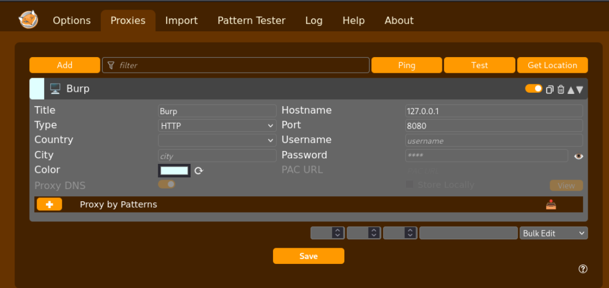
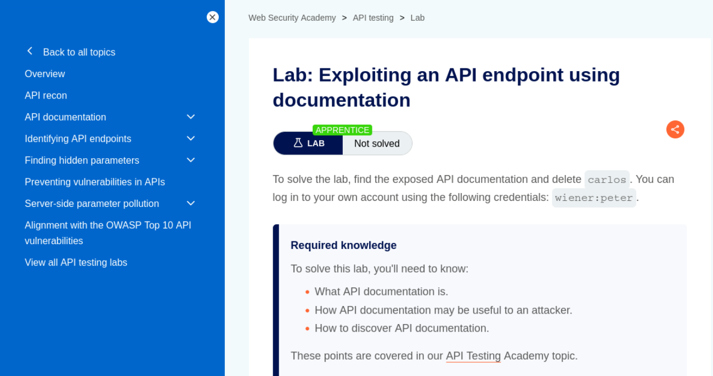
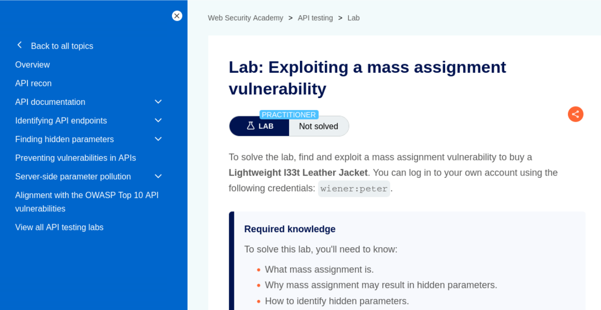
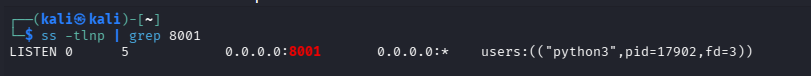
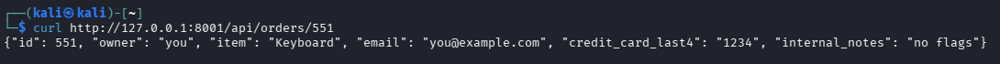
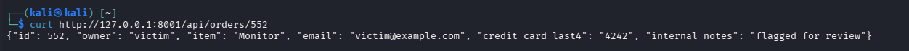
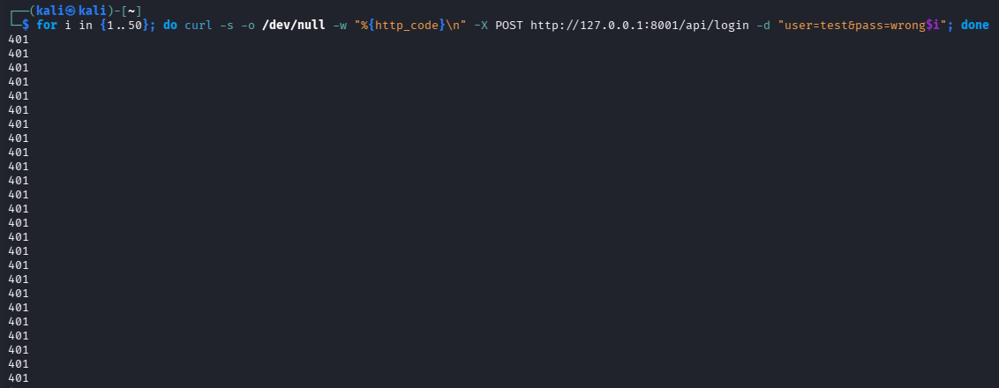

# Web App & API Security — API Security (25–30 Minutes + Bonus)

> Lab Type: Web App & API Security  
> Tool: Burp Suite Community  
> Duration: 25–30 Minutes (+30–40 Minutes Bonus)  
> System: Any browser + Burp Suite (Bonus section additionally needs Kali Linux + curl)

---

## Lab Overview

Rounding out the Web App & API Security series, this lab shifts from browser-facing bugs to the API layer directly. REST APIs are frequently the weakest-checked part of an application — the same frontend might carefully hide a field or restrict a link, while the underlying API happily returns it to anyone who asks with the right ID or the right hidden parameter. In this lab you will work through two PortSwigger Web Security Academy labs covering API endpoint discovery via exposed documentation and exploitation of a mass assignment vulnerability, using nothing but a browser and Burp Suite. A bonus section at the end revisits the original locally-hosted lab — a custom "orders" API demonstrating BOLA, excessive data exposure, and missing rate limiting — for anyone who wants further hands-on practice beyond the two core labs.

---

## Learning Objectives

By the end of this lab you will be able to:

- Discover exposed, undocumented API endpoints by manipulating a known request's path in Burp Repeater
- Use exposed API documentation to interact with functionality not exposed through the normal UI
- Identify a hidden parameter by comparing a `GET` response's JSON structure against a `POST` request's structure
- Exploit a mass assignment vulnerability by injecting a hidden parameter the server wasn't expecting a client to control
- *(Bonus)* Map API findings to their corresponding OWASP API Security Top 10 categories

---

## Setting Up Burp Suite

### Objective

Configure Burp Suite to intercept traffic to the PortSwigger Academy lab instances. Unlike the bonus section, no local VM or target app setup is required — PortSwigger provisions a unique, isolated instance of the vulnerable app automatically when you open each lab link.

### Configure Your Browser to Proxy Through Burp

**Option A — Burp's embedded browser (recommended, zero config):**

Open Burp Suite → **Proxy → Intercept** → click **Open Browser**. This launches a pre-configured Chromium instance that routes through Burp automatically — no proxy setup needed.


**Option B — Your own browser via FoxyProxy:**

If you'd rather use your everyday browser:

1. Install the **FoxyProxy** extension (Firefox or Chrome).
2. Add a new proxy profile: IP `127.0.0.1`, Port `8080` (Burp's default listener).
3. Enable the FoxyProxy profile before browsing to the lab.
4. In Burp, go to **Proxy → Options** and confirm a listener is active on `127.0.0.1:8080`.
5. Visit `http://burpsuite` in the proxied browser and install Burp's CA certificate if prompted, so HTTPS traffic can be intercepted without warnings.



!!! tip "Both labs live in Repeater, not Intruder"
    Unlike the authentication labs, neither lab here needs a brute-force attack — both are about manually editing a single intercepted request (a URL path or a JSON body) and resending it in **Repeater**.

### Discussion Questions

??? question "Why doesn't this lab need a local VM or target app, unlike the bonus section?"

    PortSwigger hosts and provisions a fresh, isolated instance of each vulnerable application in the cloud the moment you open the lab. Burp Suite here is purely the interception/manipulation tool acting on that remote instance — nothing needs to be installed or run locally except Burp itself.

---

## Lab 1: Exploiting an API Endpoint Using Documentation

### Objective

Discover exposed API documentation by trimming a known API request's path down, then use that documentation to call an undocumented admin function.

### Navigate to the Lab

From the Academy homepage ([portswigger.net/web-security](https://portswigger.net/web-security)): **All topics** → **API testing** → scroll to **"Exploiting an API endpoint using documentation"** in the labs list. Direct link: [Exploiting an API endpoint using documentation](https://portswigger.net/web-security/api-testing/lab-exploiting-api-endpoint-using-documentation).

Test credentials are provided directly on the lab page: `wiener:peter`.



!!! tip "No extra setup beyond Burp"
    The key move in this lab is sending a request to Repeater and then progressively shortening its path (`/api/user/wiener` → `/api/user` → `/api`) to see what each level exposes.

Full exploitation steps are provided on PortSwigger's own lab page (linked above).

### Discussion Questions

??? question "Why is exposed API documentation a security risk in itself, even if every endpoint it documents requires authentication?"

    Documentation reveals the full attack surface at once — every endpoint, parameter, and HTTP method the API supports — turning what would otherwise require slow, manual endpoint discovery into a direct reference. In this lab specifically, the documentation also happened to expose an interactive interface for calling endpoints the normal UI never links to, like the account deletion function.

---

## Lab 2: Exploiting a Mass Assignment Vulnerability

### Objective

Identify a hidden parameter by comparing a `GET` and `POST` request's JSON structure, then inject that parameter to apply an unauthorized discount.

### Navigate to the Lab

From the Academy homepage ([portswigger.net/web-security](https://portswigger.net/web-security)): **All topics** → **API testing** → scroll to **"Exploiting a mass assignment vulnerability"** in the labs list (same topic page as Lab 1, further down). Direct link: [Exploiting a mass assignment vulnerability](https://portswigger.net/web-security/api-testing/lab-exploiting-mass-assignment-vulnerability).

Test credentials are provided directly on the lab page: `wiener:peter`.



!!! tip "Look for a field present in one direction but not the other"
    The hidden parameter here shows up in the server's `GET /api/checkout` response but is absent from the client's `POST /api/checkout` request body — that asymmetry is the tell that the server accepts a field the client-side flow never normally sends.

Full exploitation steps are provided on PortSwigger's own lab page (linked above).

### Discussion Questions

??? question "What makes a parameter 'hidden' in a mass assignment context, and how do you find one without documentation to read?"

    A hidden parameter is one the server will accept and act on, but that the client-side application never sends under normal use — so it's invisible if you only look at outgoing requests. The technique used here — diffing a `GET` response against the corresponding `POST` request for fields present in one but not the other — is exactly how you find these without any documentation: the server often reflects back more structure than the client ever submits.

??? question "Why is mass assignment considered an API-specific risk rather than a general web vulnerability?"

    It stems from a common API implementation pattern: binding an incoming request body directly to an internal object or database model, rather than explicitly whitelisting which fields a client is allowed to set. Traditional web forms are more likely to be built field-by-field, but APIs — especially ones built with frameworks that auto-bind JSON to models — are structurally more prone to accidentally exposing internal fields like `chosen_discount` or a role flag to client control.

---

## Try It Yourself: Custom "Orders" API — BOLA, Data Exposure & Rate Limiting (Bonus, Local Lab)

The following is a self-contained, locally-hosted bonus lab covering three further OWASP API Security Top 10 issues using a custom Python "orders" API — good further practice once the two PortSwigger labs above are done.

### Environment Setup

Create the vulnerable "orders" API — a small stdlib-only Python script, no installs required:

```bash
mkdir -p ~/api-lab && cd ~/api-lab
nano vuln_api.py
```

The script exposes `GET /api/orders/<id>` with no ownership check on the ID (the BOLA bug), returns full record objects including fields a UI would never render (excessive data exposure), and a `POST /api/login` with no throttling of any kind (missing rate limiting).

Paste the following into `vuln_api.py`:

```python
#!/usr/bin/env python3
# Deliberately vulnerable "orders" API — BOLA + excessive data exposure
from http.server import BaseHTTPRequestHandler, HTTPServer
from urllib.parse import urlparse
import json, re, time

# Fake "orders" data — note the extra fields a real UI would never render
ORDERS = {
    551: {"id": 551, "owner": "you", "item": "Keyboard",
          "email": "you@example.com", "credit_card_last4": "1234",
          "internal_notes": "no flags"},
    552: {"id": 552, "owner": "victim", "item": "Monitor",
          "email": "victim@example.com", "credit_card_last4": "4242",
          "internal_notes": "flagged for review"},
}

LOGIN_ATTEMPTS = []  # no rate limiting tracked here on purpose

class Handler(BaseHTTPRequestHandler):
    def do_GET(self):
        m = re.match(r"^/api/orders/(\d+)$", urlparse(self.path).path)
        if m:
            order_id = int(m.group(1))
            # VULNERABLE: any authenticated caller can request any order ID,
            # no check that order_id belongs to the requester (BOLA)
            order = ORDERS.get(order_id)
            if order:
                self.send_response(200)
                self.send_header("Content-Type", "application/json")
                self.end_headers()
                # VULNERABLE: returns full record, including fields
                # a real UI would never display (excessive data exposure)
                self.wfile.write(json.dumps(order).encode())
            else:
                self.send_response(404)
                self.end_headers()
            return
        self.send_response(404)
        self.end_headers()

    def do_POST(self):
        if urlparse(self.path).path == "/api/login":
            # VULNERABLE: no rate limiting / lockout on repeated attempts
            LOGIN_ATTEMPTS.append(time.time())
            self.send_response(401)
            self.end_headers()
            self.wfile.write(b"invalid credentials")
            return
        self.send_response(404)
        self.end_headers()

HTTPServer(("0.0.0.0", 8001), Handler).serve_forever()
```

Run it:

```bash
python3 vuln_api.py
```

!!! warning
    `serve_forever()` blocks the terminal on purpose — the prompt not returning is expected, not a hang. Use a second terminal for the test commands below.

Confirm it's listening before assuming it's broken:

```bash
ss -tlnp | grep 8001
```



Baseline request against your own order:

```bash
curl http://127.0.0.1:8001/api/orders/551
```



??? question "Why use a custom stdlib script instead of a full vulnerable-API lab like OWASP crAPI?"

    crAPI is a multi-container docker-compose stack, which trades a large chunk of setup time for realism you don't need to demonstrate BOLA, excessive data exposure, and missing rate limiting — all three are reproducible in a script small enough to read end to end in under a minute, with nothing extra installed.

### Testing BOLA and Excessive Data Exposure

Request an order that isn't yours, using the exact same request shape as the baseline:

```bash
curl http://127.0.0.1:8001/api/orders/552
```

If it returns another user's order data purely because the number in the URL changed, that confirms BOLA — the API isn't verifying resource ownership, it's just trusting whatever ID it's given.



Compare both responses (551 and 552) against what a real order-history UI would ever render — normally just `item` and maybe `owner`. Both responses also include `email`, `credit_card_last4`, and `internal_notes`, none of which have any reason to be in the payload at all. That's excessive data exposure — no separate request needed, it's visible directly in the screenshots already captured.

??? question "Why is BOLA considered API1 on the OWASP API Security Top 10?"

    It's both extremely common and extremely easy to exploit — no special tooling is needed, just changing an ID in a URL — while the impact is a full breach of every other user's data the endpoint touches. That combination of low exploitation cost and high impact puts it at the top of the list.

??? question "Why is trimming a UI's display fields not a fix for excessive data exposure?"

    The vulnerability lives in the API response itself, not in what the frontend chooses to render. Anyone who inspects network traffic (or just calls the API directly, as done here) sees every field regardless of what the UI hides. The fix has to happen server-side, by only ever including fields the response schema explicitly allows.

### Rate Limiting Check

Fire a batch of requests at the login endpoint:

```bash
for i in {1..50}; do curl -s -o /dev/null -w "%{http_code}\n" -X POST http://127.0.0.1:8001/api/login -d "user=test&pass=wrong$i"; done
```

Review the output. Every line returning `401` with no `429 Too Many Requests` or lockout response anywhere in the run confirms rate limiting is absent.



??? question "Why does missing rate limiting matter most on a login endpoint specifically?"

    A login endpoint with no throttling is directly enabling credential stuffing and brute-force attacks — an attacker can try thousands of password guesses per minute with nothing slowing them down. The same issue on a low-stakes endpoint is far less severe than on the one gatekeeping account access.

### Extending the Findings

Add a third order to `ORDERS` in `vuln_api.py` with a different `owner` value, restart the script, and confirm you can pull it the same way as order 552 — reinforcing that BOLA isn't specific to one hardcoded ID, it's structural to how the endpoint is written.

Request an ID that doesn't exist at all:

```bash
curl -i http://127.0.0.1:8001/api/orders/999
```

Compare this 404 response against the 200 responses from valid IDs — note that the response shape itself (200 vs 404) already tells an attacker whether an ID is valid before they've extracted any data from it, which is useful for enumerating valid order IDs at scale.

Time a small sequential sweep to see how easily every order in the system could be pulled without ever being "yours":

```bash
for i in {550..555}; do echo "ID $i:"; curl -s http://127.0.0.1:8001/api/orders/$i; echo; done
```

This is effectively the same BOLA bug, just automated into a full enumeration instead of a single manual request — worth including as a note in your writeup on why BOLA findings are rarely limited to "one exposed record" in practice.

??? question "Why does a sequential ID sweep matter more than a single BOLA finding?"

    A single confirmed BOLA request proves the flaw exists, but a sweep demonstrates the actual blast radius — every sequentially-ID'd record in the system is exposed the same way, not just the one ID tested manually. It's the difference between "this record leaked" and "every record like it leaks."

---

## Expected Deliverables

| #   | Deliverable                                        | How to Obtain                                              |
| --- | ----------------------------------------------------- | ------------------------------------------------------------ |
| 1   | Lab 1 page screenshot (API-via-documentation)        | PortSwigger lab landing page                                   |
| 2   | Lab 2 page screenshot (mass assignment)              | PortSwigger lab landing page                                   |
| 3   | *(Bonus)* API running + baseline request              | Terminal output for both                                     |
| 4   | *(Bonus)* BOLA confirmed                              | curl output for order 552                                    |
| 5   | *(Bonus)* Rate limit test output                      | Terminal output of the 50-request loop                        |

---

## Learning Outcomes

Having completed this lab, you have:

- Discovered exposed API documentation by manipulating a request's path in Burp Repeater
- Used that documentation to call an undocumented admin function
- Identified a hidden parameter by diffing a `GET` response against a `POST` request's JSON structure
- Exploited a mass assignment vulnerability by injecting a server-accepted, client-unsent parameter
- *(Bonus)* Confirmed BOLA, excessive data exposure, and missing rate limiting against a custom API, and mapped each to its OWASP API Security Top 10 category (API1, API3, API4)
