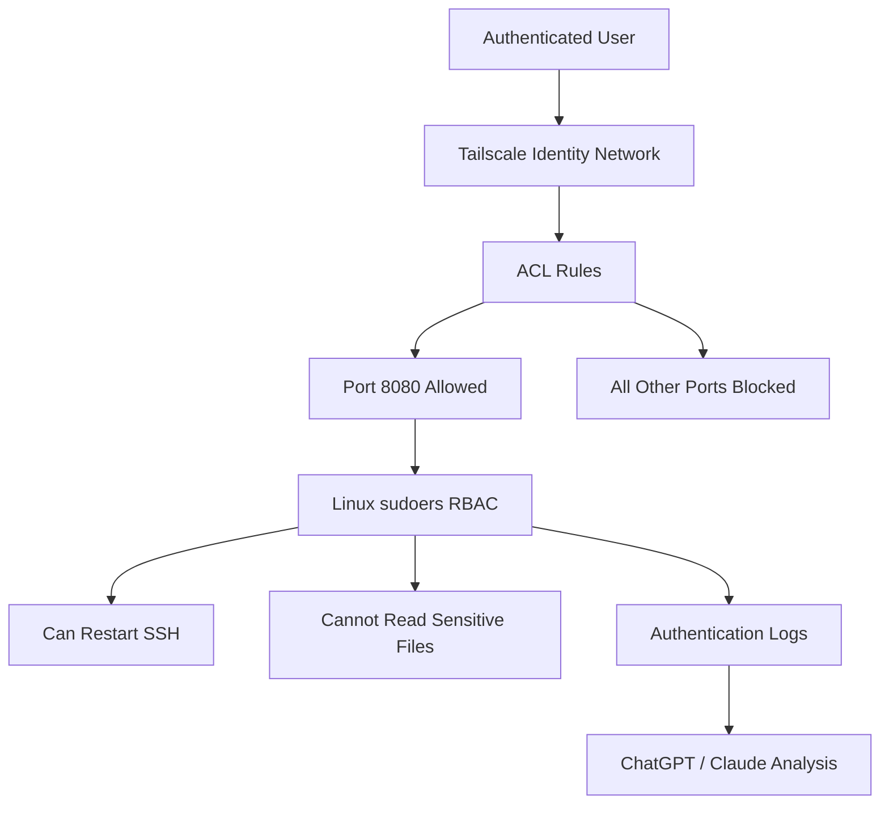

# Zero Trust & Identity Lab

> Beginner Friendly • 2 Hours • Hands-on Security Lab  
> Author: Dhruti Avadhani

---

## Lab Overview

This lab demonstrates how modern Zero Trust Architecture replaces traditional perimeter-based security using:

- Identity-based networking
- Micro-segmentation
- Least privilege access control
- AI-assisted log analysis

By the end of this lab, you will build a functioning Zero Trust environment using Linux and Tailscale.

---

## Learning Objectives

After completing this lab, you will be able to:

- Configure identity-based networking with Tailscale
- Implement micro-segmentation using ACLs
- Restrict user privileges using Linux sudoers
- Analyse authentication logs with Generative AI
- Understand Zero Trust concepts from NIST SP 800-207

---

## Technologies Used

| Component | Technology | Purpose |
|---|---|---|
| Identity Network | Tailscale | Identity-based connectivity |
| Access Control | Tailscale ACLs | Micro-segmentation |
| RBAC | Linux sudoers | Least privilege |
| Log Analysis | ChatGPT / Claude | AI-assisted security analysis |
| Operating System | Kali Linux | Lab environment |

---

# Understanding Zero Trust

## Traditional Security vs Zero Trust

| Traditional Perimeter Security | Zero Trust Architecture |
|---|---|
| Trust users inside network | Trust nobody by default |
| IP-based access | Identity-based access |
| Broad permissions | Least privilege |
| Easy lateral movement | Micro-segmentation |
| Single trust boundary | Continuous verification |

---

## Core Principle

!!! quote
    **"Never Trust. Always Verify."**

In Zero Trust:
- Every request must be authenticated
- Every action must be authorised
- Every connection is continuously validated

---

# Lab Architecture



---

# Lab Environment

## Requirements

| Requirement | Details |
|---|---|
| OS | Kali Linux / Ubuntu / Debian |
| Account | GitHub or Google |
| Network | Internet access |
| Skill Level | Beginner |
| Time Required | ~2 hours |

---

!!! warning
    Use a personal GitHub or Google account for Tailscale authentication.

---

# Milestone 1 — Identity-Centric Connectivity

## Goal

Replace traditional IP-based trust with identity-based networking using Tailscale.

---

## Step 1 — Update Your System

```bash
sudo apt update
sudo apt upgrade -y
```

Expected output:

```text
Reading package lists... Done
All packages are up to date.
```

---

## Step 2 — Enable IP Forwarding

```bash
echo 'net.ipv4.ip_forward = 1' | sudo tee -a /etc/sysctl.conf

sudo sysctl -p
```

Expected output:

```text
net.ipv4.ip_forward = 1
```

---

!!! tip
    IP forwarding allows Linux to route packets between interfaces.

---

## Step 3 — Install Tailscale

```bash
curl -fsSL https://tailscale.com/install.sh | sh
```

Expected output:

```text
Installation complete!
```

---

## Step 4 — Authenticate with Your Identity

```bash
sudo tailscale up --operator=$USER
```

Tailscale will generate a login URL.

Open it in your browser and authenticate using:
- GitHub
- Google

---

## Step 5 — Verify Connection

```bash
tailscale status
```

```bash
tailscale ip
```

Expected output:

```text
100.x.x.x
```

---

!!! success
    Your machine is now connected to an identity-based network.

---

## What You Achieved

| Before | After |
|---|---|
| IP-based trust | Identity-based trust |
| Anyone with IP can connect | Only authenticated users can connect |
| Limited visibility | Identity-linked activity logging |

---

# Milestone 2 — Micro-segmentation

## Goal

Allow access ONLY to port 8080 while blocking all other lateral movement.

---

## Step 1 — Create a Web Server

```bash
mkdir -p ~/lab-server

echo "<h1>Zero Trust Lab</h1>" > ~/lab-server/index.html
```

---

## Step 2 — Start the Server

```bash
cd ~/lab-server

python3 -m http.server 8080
```

Expected output:

```text
Serving HTTP on 0.0.0.0 port 8080
```

---

## Step 3 — Test the Web Service

Open:

```text
http://100.x.x.x:8080
```

You should see:

```text
Zero Trust Lab
```

---

## Step 4 — Configure Tailscale ACLs

Go to the Tailscale ACL dashboard and replace the default ACL with:

```json
{
  "grants": [
    {
      "src": ["*"],
      "dst": ["*"],
      "ip": ["8080"]
    }
  ]
}
```

---

## ACL Explanation

| ACL Component | Meaning |
|---|---|
| `"src"` | Source user |
| `"dst"` | Destination device |
| `"ip"` | Allowed port |
| Unlisted ports | Blocked automatically |

---

!!! info
    Zero Trust follows a default DENY model.

---

## Step 5 — Verify Allowed Port

```bash
curl http://100.x.x.x:8080
```

Expected output:

```html
<h1>Zero Trust Lab</h1>
```

---

## Step 6 — Verify Blocked Port

```bash
curl -v http://100.x.x.x:9090 --max-time 5
```

Expected output:

```text
Connection timed out
```

---

!!! success
    Micro-segmentation is now enforced.

---

## What You Achieved

| Port | Result |
|---|---|
| 8080 | Allowed |
| 9090 | Blocked |
| Other Ports | Blocked |

---

# Milestone 3 — Least Privilege

## Goal

Allow a junior administrator to restart SSH — but nothing else.

---

## Step 1 — Create User

```bash
sudo useradd -m -s /bin/bash junior-admin
```

Set password:

```bash
sudo passwd junior-admin
```

---

## Step 2 — Edit sudoers Safely

```bash
sudo visudo
```

Add:

```text
junior-admin ALL=(ALL) NOPASSWD: /usr/sbin/service ssh restart
```

---

!!! warning
    Always use `visudo` instead of directly editing `/etc/sudoers`.

---

## Step 3 — Switch User

```bash
su - junior-admin
```

---

## Step 4 — Test Allowed Command

```bash
sudo service ssh restart
```

Expected:
- Command succeeds

---

## Step 5 — Test Blocked Command

```bash
sudo cat /etc/shadow
```

Expected output:

```text
Sorry, user junior-admin is not allowed to execute this command.
```

---

## Step 6 — Test Package Installation Block

```bash
sudo apt update
```

Expected:
- Access denied

---

!!! success
    Least privilege is now enforced.

---

## What You Achieved

| Command | Result |
|---|---|
| Restart SSH | Allowed |
| Read `/etc/shadow` | Blocked |
| Install packages | Blocked |

---

# Milestone 4 — Generative AI as Security Co-pilot

## Goal

Use AI to analyse Linux authentication logs.

---

## Step 1 — View Authentication Logs

```bash
sudo journalctl _COMM=sudo --since "1 hour ago"
```

---

## Step 2 — Copy the Logs

Copy the command output.

---

## Step 3 — Open ChatGPT or Claude

Paste the following prompt:

```text
You are a security analyst.

Please analyse these Linux authentication logs and explain:

1. Successful privilege usage
2. Denied access attempts
3. Suspicious activity
4. Least privilege enforcement
5. Any security concerns

Logs:

[PASTE LOGS HERE]
```

---

## Expected AI Analysis

The AI should identify:
- Successful sudo actions
- Blocked commands
- User privilege boundaries
- Security patterns
- Potential concerns

---

!!! warning
    Never upload real production logs into public AI systems.

---

## Why AI Helps Security Teams

| Traditional Analysis | AI-Assisted Analysis |
|---|---|
| Manual review | Automated summarisation |
| Time consuming | Faster investigations |
| Hard to identify patterns | Pattern recognition |
| Requires deep expertise | Plain-English explanations |

---

# Trust Boundaries

## Three Layers of Protection

=== "Layer 1 — Identity"

    Users must authenticate before accessing the network.

=== "Layer 2 — ACL Enforcement"

    Only explicitly allowed services are reachable.

=== "Layer 3 — Least Privilege"

    Users can perform only approved actions.

---

# Check Your Understanding

??? question "Why is Zero Trust safer than perimeter security?"

    Zero Trust validates every request regardless of network location.

??? question "Why was port 9090 blocked?"

    Only port 8080 was explicitly allowed in the ACL.

??? question "Why use visudo?"

    `visudo` validates syntax before saving changes.

??? question "What would happen if junior-admin ran sudo reboot?"

    The action would be denied because it is not allowed in sudoers.

??? question "Why should production logs not be pasted into public AI tools?"

    Logs may contain sensitive or confidential organisational data.


# Final Summary

Congratulations! You successfully built a functioning Zero Trust lab environment.

## Skills Demonstrated

- Identity-based networking
- Micro-segmentation
- Role-based access control
- Least privilege
- Linux administration
- AI-assisted log analysis

---

!!! success
    Lab Complete — Zero Trust & Identity Lab