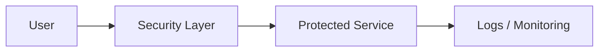

# 🔐 {{ LAB TITLE }}

!!! abstract "Lab Overview"
    **Difficulty:**  
    **Estimated Time:**  
    **Domain:**  
    **Tools Used:**  

---

# 🎯 Learning Objectives

- Objective 1
- Objective 2
- Objective 3

---

# 🧠 Scenario

!!! info "Business Context"
    Explain the real-world scenario.

---

# 🏗️ Architecture Overview

## Trust Boundary Diagram



---

# ⚙️ Lab Environment Setup

## 🖥️ Requirements

| Component | Requirement |
|---|---|
| OS | |
| RAM | |
| Tools | |

---

## 📦 Install Dependencies

```bash
# commands
```

---

## 🔧 Verify Installation

```bash
# verification commands
```

---

# 🚀 Milestone 1 — {{ TITLE }}

## 📘 Objective

Explain what the learner will do.

---

## 🛠️ Steps

### Step 1 — Setup

```bash
# commands
```

### Step 2 — Configure

```bash
# commands
```

### Step 3 — Validate

```bash
# commands
```

---

## ✅ Expected Output

```text
expected output
```

---

## 🧠 Check Your Understanding

??? question "Why is this important?"
    Answer/explanation.

---

# 🚀 Milestone 2 — {{ TITLE }}

## 📘 Objective

---

## 🛠️ Steps

### Step 1

```bash
# commands
```

---

## ✅ Expected Output

```text
expected output
```

---

## 🧠 Check Your Understanding

??? question "Question?"
    Answer.

---

# 🚀 Milestone 3 — {{ TITLE }}

## 📘 Objective

---

## 🛠️ Steps

```bash
# commands
```

---

## ✅ Validation

```bash
# test commands
```

---

# 🤖 GenAI Security Co-Pilot

!!! tip "Using AI Effectively"
    Explain how the learner should use ChatGPT/Claude/LLMs.

---

## Example Prompt

```text
Analyze the following logs and identify suspicious behavior.
```

---

## Example Output

```text
AI-generated explanation
```

---

# 🔍 Troubleshooting

| Problem | Solution |
|---|---|
| Issue | Fix |
| Issue | Fix |

---

# 🧹 Cleanup

```bash
# cleanup commands
```

---

# 📚 Key Takeaways

- Takeaway 1
- Takeaway 2
- Takeaway 3

---

# 📖 Further Reading

- NIST SP 800-207
- OWASP
- MITRE ATT&CK

---

# ✅ Lab Completion Checklist

- [ ] Environment configured
- [ ] Security controls applied
- [ ] Validation successful
- [ ] Logs analyzed
- [ ] Cleanup completed
